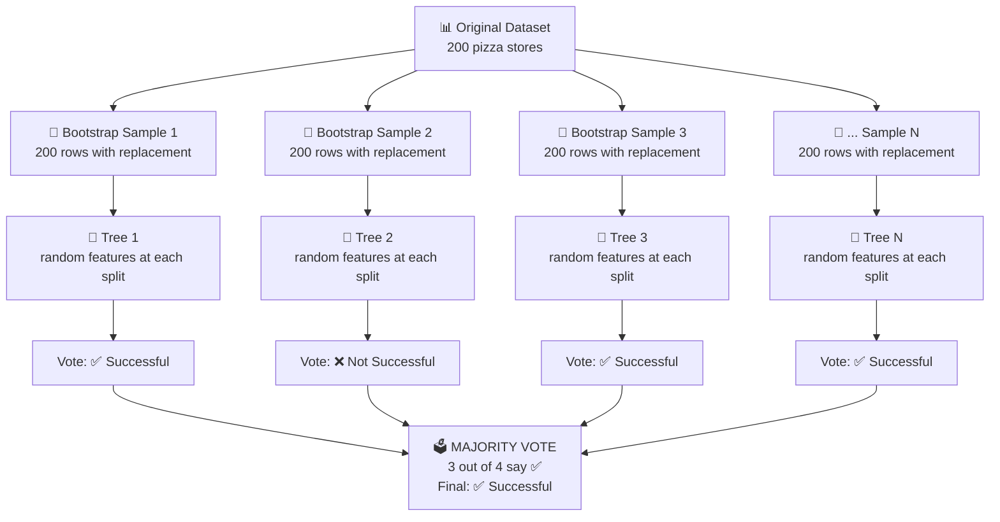
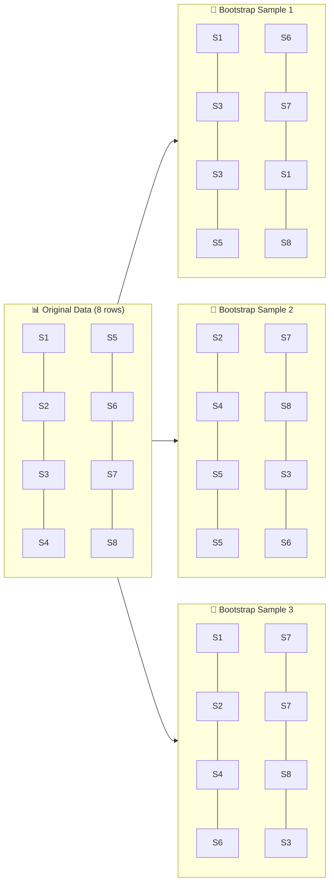
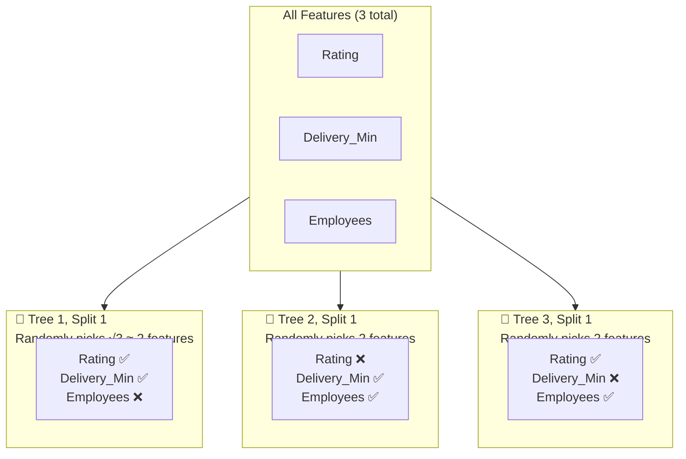
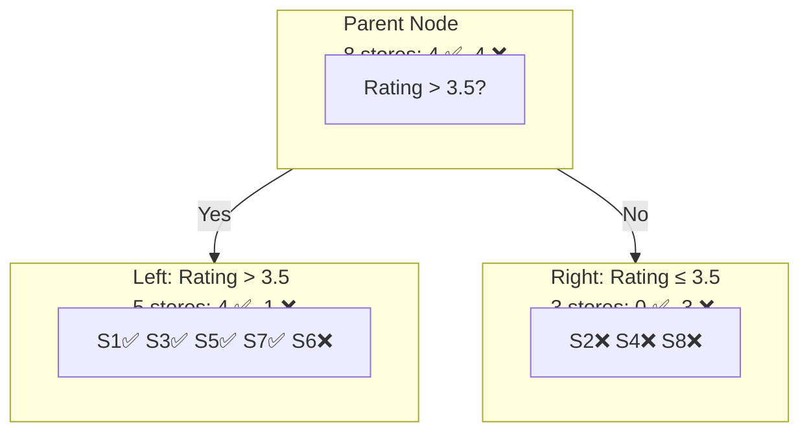
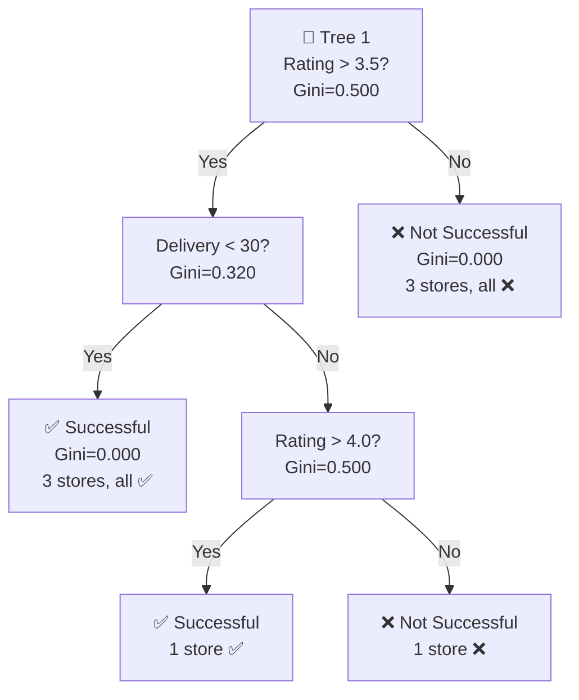
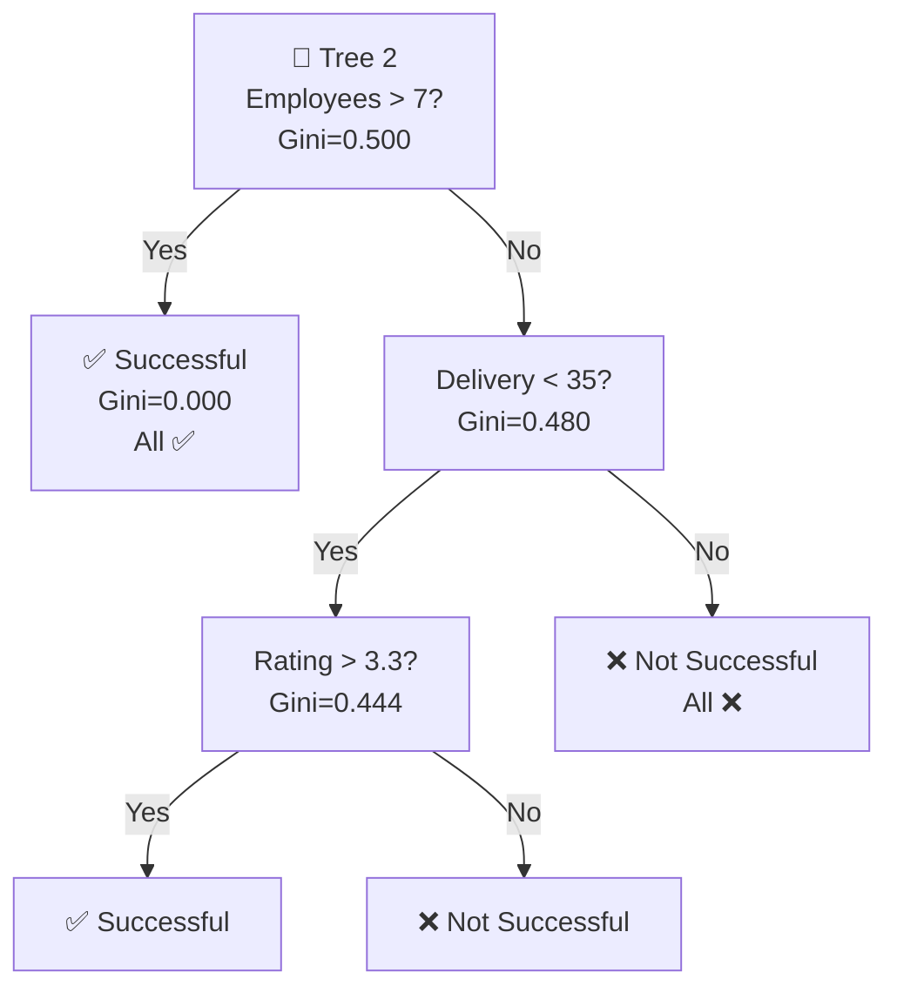
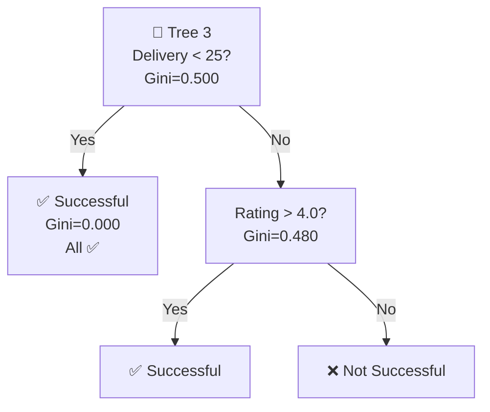
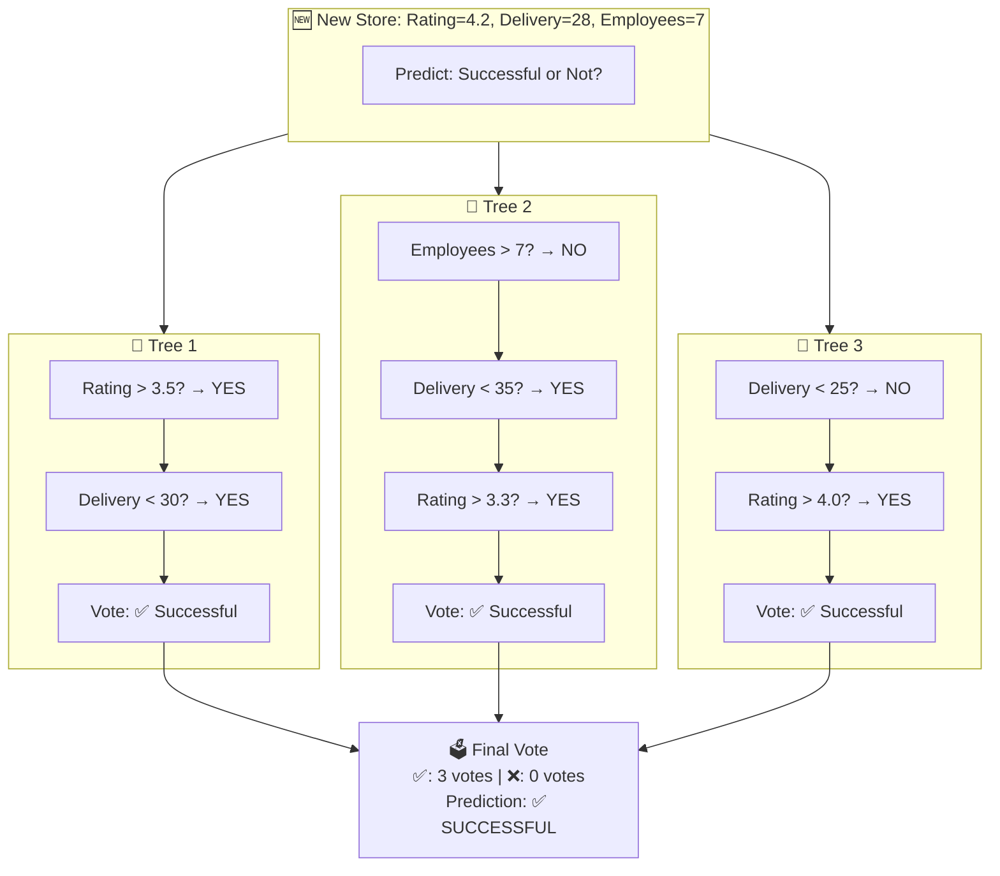
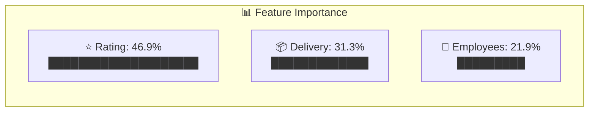
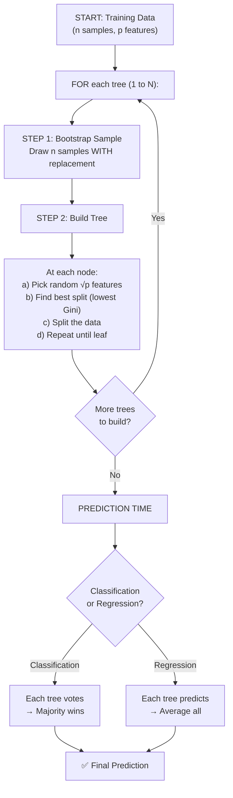

# Random Forest: Complete Visual & Math Guide

## What is Random Forest?

Random Forest = **Many Decision Trees** voting together to make a prediction.

One tree can be wrong. But if 100 trees vote, the majority is usually right.

---

## The Big Picture



---

## Step-by-Step Walkthrough

### Our Pizza Store Data

| Store | Rating | Delivery_Min | Employees | Successful? |
|-------|--------|-------------|-----------|-------------|
| S1    | 4.5    | 20          | 10        | ✅ Yes      |
| S2    | 3.2    | 45          | 5         | ❌ No       |
| S3    | 4.8    | 18          | 12        | ✅ Yes      |
| S4    | 2.9    | 50          | 4         | ❌ No       |
| S5    | 4.1    | 25          | 8         | ✅ Yes      |
| S6    | 3.5    | 35          | 6         | ❌ No       |
| S7    | 4.3    | 22          | 9         | ✅ Yes      |
| S8    | 3.0    | 40          | 5         | ❌ No       |

---

## STEP 1: Bootstrap Sampling (Bagging)

"Bootstrap" = sample WITH replacement (same row can appear multiple times)



### Math: Bootstrap Sampling

Each sample has the same size as original (n=8), drawn WITH replacement.

```
Probability a specific row is picked in one draw = 1/n = 1/8 = 12.5%

Probability a specific row is NOT picked in one draw = 1 - 1/n = 7/8

Probability a specific row is NOT in the entire sample = (1 - 1/n)^n
  = (7/8)^8
  = 0.344
  = 34.4%

So about 1 - 0.344 = 63.2% of original rows appear in each sample.
The remaining ~36.8% are "Out-of-Bag" (OOB) — used for free validation!
```

---

## STEP 2: Random Feature Selection

This is what makes Random Forest different from regular Bagging.

At EACH split in EACH tree, only a random SUBSET of features is considered.



### Math: How Many Features?

```
For Classification: max_features = √(total features)
  √3 = 1.73 ≈ 2 features per split

For Regression: max_features = total_features / 3
  3/3 = 1 feature per split

Why? Forces trees to be DIFFERENT from each other.
If all trees use the same best feature, they'd all be identical!
```

---

## STEP 3: Build Each Decision Tree

Each tree finds the BEST split from its random feature subset.

### How a Single Split Works: Gini Impurity



### Math: Gini Impurity Calculation

**Gini Formula:** `Gini = 1 - Σ(pᵢ²)`

```
PARENT NODE: 4 Successful, 4 Not Successful (8 total)
  P(✅) = 4/8 = 0.5
  P(❌) = 4/8 = 0.5
  Gini = 1 - (0.5² + 0.5²)
  Gini = 1 - (0.25 + 0.25)
  Gini = 1 - 0.50
  Gini = 0.500  ← Maximum impurity (50/50 split)
```

**Try Split: Rating > 3.5**

```
LEFT CHILD (Rating > 3.5): S1✅, S3✅, S5✅, S7✅, S6❌ → 4 ✅, 1 ❌
  P(✅) = 4/5 = 0.8
  P(❌) = 1/5 = 0.2
  Gini_left = 1 - (0.8² + 0.2²)
  Gini_left = 1 - (0.64 + 0.04)
  Gini_left = 1 - 0.68
  Gini_left = 0.320

RIGHT CHILD (Rating ≤ 3.5): S2❌, S4❌, S8❌ → 0 ✅, 3 ❌
  P(✅) = 0/3 = 0.0
  P(❌) = 3/3 = 1.0
  Gini_right = 1 - (0.0² + 1.0²)
  Gini_right = 1 - 1.0
  Gini_right = 0.000  ← Pure node! All same class.
```

**Weighted Gini after split:**

```
Weighted_Gini = (n_left/n_total) × Gini_left + (n_right/n_total) × Gini_right
Weighted_Gini = (5/8) × 0.320 + (3/8) × 0.000
Weighted_Gini = 0.625 × 0.320 + 0.375 × 0.000
Weighted_Gini = 0.200 + 0.000
Weighted_Gini = 0.200
```

**Information Gain:**

```
Information_Gain = Parent_Gini - Weighted_Child_Gini
Information_Gain = 0.500 - 0.200
Information_Gain = 0.300  ← Higher = better split!
```

---

### Compare Multiple Splits

The tree tries ALL possible splits and picks the one with highest Information Gain:

| Split | Weighted Gini | Information Gain | Winner? |
|-------|--------------|-----------------|---------|
| Rating > 3.5 | 0.200 | 0.300 | ✅ Best |
| Delivery_Min > 30 | 0.278 | 0.222 | |
| Employees > 7 | 0.375 | 0.125 | |

Rating > 3.5 wins because it has the highest Information Gain (0.300).

---

## STEP 4: Complete Tree Example







Notice: Each tree uses DIFFERENT features and DIFFERENT split points because of:
1. Different bootstrap samples
2. Random feature selection at each split

---

## STEP 5: Prediction — Majority Vote

### New Store: Rating=4.2, Delivery=28min, Employees=7



### Math: Voting

```
For Classification (Majority Vote):
  Tree 1: ✅ Successful
  Tree 2: ✅ Successful  
  Tree 3: ✅ Successful

  Count(✅) = 3
  Count(❌) = 0
  
  P(Successful) = 3/3 = 100%
  
  Final Prediction: ✅ Successful (majority wins)

For Regression (Average):
  If predicting daily_sales:
  Tree 1: $520
  Tree 2: $480
  Tree 3: $510
  
  Prediction = (520 + 480 + 510) / 3 = $503.33
```

---

## STEP 6: Feature Importance

Random Forest tells you WHICH features matter most.

### Math: How Feature Importance is Calculated

```
For each feature, sum up the Gini decrease across ALL splits in ALL trees:

Feature Importance(Rating) = 
    Sum of (weighted Gini decrease at every split using Rating) / Total Gini decrease

Example:
  Tree 1, Split 1 (Rating > 3.5): Gini decrease = 0.300
  Tree 1, Split 3 (Rating > 4.0): Gini decrease = 0.100
  Tree 2, Split 2 (Rating > 3.3): Gini decrease = 0.150
  Tree 3, Split 2 (Rating > 4.0): Gini decrease = 0.200
  
  Total decrease for Rating = 0.300 + 0.100 + 0.150 + 0.200 = 0.750
  
  Total decrease ALL features = 0.750 + 0.500 + 0.350 = 1.600
  
  Importance(Rating) = 0.750 / 1.600 = 0.469 = 46.9%
  Importance(Delivery) = 0.500 / 1.600 = 0.313 = 31.3%
  Importance(Employees) = 0.350 / 1.600 = 0.219 = 21.9%
```



---

## Why Random Forest Works: The Math Behind It

### Variance Reduction

```
Single tree error = Bias² + Variance + Noise

Random Forest reduces VARIANCE by averaging:

Var(average of N trees) = Var(single tree) / N    (if trees are independent)

But trees aren't fully independent, so:

Var(RF) = ρ × σ² + (1-ρ)/N × σ²

Where:
  ρ = correlation between trees (lower is better)
  σ² = variance of a single tree
  N = number of trees

Random feature selection → lower ρ → lower variance → better predictions!
```

### Why Bagging + Random Features?

```
Problem with single tree:
  - High variance (small data change → completely different tree)
  - Overfits easily

Bagging (Bootstrap Aggregating):
  - Each tree sees different data → different trees
  - Averaging reduces variance
  - But if one feature dominates, all trees still look similar

Random Features (the "Random" in Random Forest):
  - Forces trees to use different features
  - Trees become more diverse (lower correlation ρ)
  - Even more variance reduction
```

---

## Complete Algorithm Summary



---

## Hyperparameters (What You Can Tune)

| Parameter | What it does | Default | Tune it |
|-----------|-------------|---------|---------|
| `n_estimators` | Number of trees | 100 | More trees = better but slower (try 100-500) |
| `max_depth` | How deep each tree grows | None (unlimited) | Limit to prevent overfitting (try 5-20) |
| `max_features` | Features per split | √p (classification) | Lower = more diverse trees |
| `min_samples_split` | Min samples to split a node | 2 | Higher = simpler trees |
| `min_samples_leaf` | Min samples in a leaf | 1 | Higher = prevents overfitting |
| `bootstrap` | Use bootstrap sampling? | True | Keep True |

---

## Random Forest vs Single Decision Tree

| Aspect | Single Tree | Random Forest |
|--------|------------|---------------|
| Bias | Low | Low (same) |
| Variance | HIGH | LOW ✅ |
| Overfitting | Prone | Resistant ✅ |
| Interpretability | Easy (visualize tree) | Harder (100 trees) |
| Speed | Fast | Slower |
| Accuracy | Lower | Higher ✅ |

---

## Python Code

```python
from sklearn.ensemble import RandomForestClassifier
from sklearn.model_selection import train_test_split
from sklearn.metrics import accuracy_score

# Split data
X_train, X_test, y_train, y_test = train_test_split(X, y, test_size=0.3, random_state=42)

# Create Random Forest
rf = RandomForestClassifier(
    n_estimators=100,      # 100 trees
    max_depth=5,           # each tree max 5 levels deep
    max_features='sqrt',   # √p features per split
    random_state=42
)

# Train
rf.fit(X_train, y_train)

# Predict
y_pred = rf.predict(X_test)

# Accuracy
print(f"Accuracy: {accuracy_score(y_test, y_pred):.2%}")

# Feature Importance
for feat, imp in sorted(zip(feature_names, rf.feature_importances_), key=lambda x: -x[1]):
    print(f"  {feat}: {imp:.3f}")
```

---

## Key Takeaways

1. **Random Forest = Many diverse trees voting together**
2. **Bootstrap sampling** → each tree sees different data
3. **Random feature selection** → each tree uses different features
4. **Gini impurity** → decides the best split at each node
5. **Majority vote** (classification) or **average** (regression) → final prediction
6. **More trees = better** (but diminishing returns after ~100-200)
7. **Feature importance** → tells you which features matter most

---

*This is the most commonly used ML algorithm in industry. Master it!*
