# CNNs (Convolutional Neural Networks): Visual Guide with Mermaid Diagrams

> Visual companion to `Documents/Deep_Learning/Next_Level/Phase4_CNNs_Complete_Guide.md`.
> Every diagram has explanatory text — what it shows, why it matters, and how to read it.

---

## 1. Why CNNs — Regular Neural Networks Fail on Images

A regular fully connected neural network treats every pixel independently. The numbers: 224×224 is the standard input size for ImageNet models (a widely-used benchmark). ×3 means RGB color channels (red, green, blue). 150,528 = 224 × 224 × 3 total input values. A fully connected layer with 256 neurons would need 150,528 × 256 = 38.5 million weights — just for one layer. A 3×3 CNN filter has only 3 × 3 × 3 = 27 weights (3×3 spatial × 3 color channels). For a 224x224 RGB image, that means 150,528 inputs — one hidden layer would need 38.5 million parameters. Worse, flattening the image destroys spatial structure: nearby pixels that form edges and shapes become meaningless numbers in a long vector. CNNs solve both problems by using small sliding filters that share parameters and preserve spatial layout.

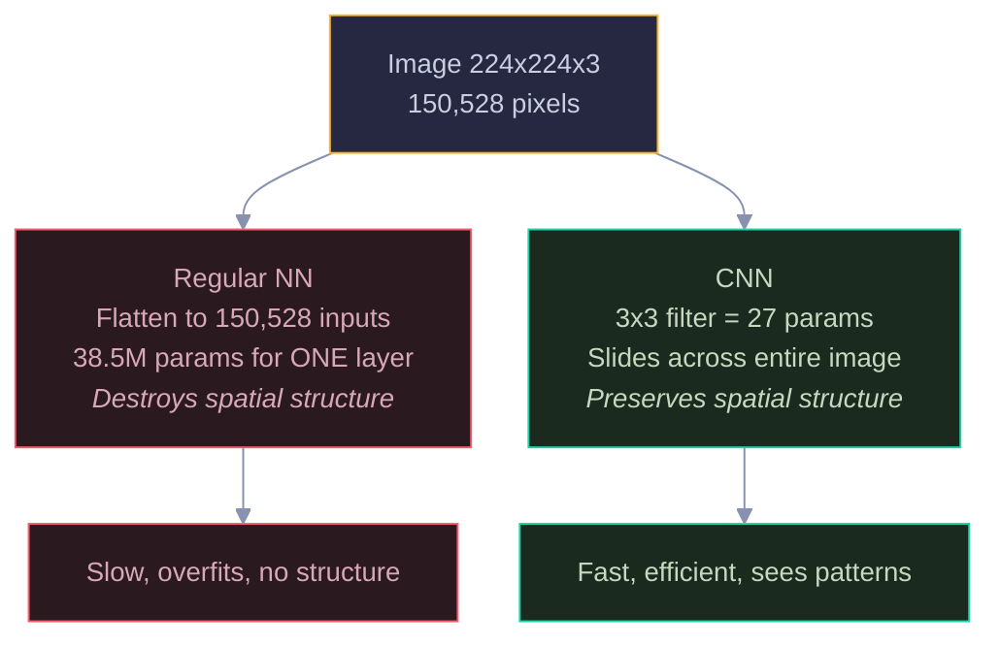

Yellow = the input image. Red = the regular NN approach (wasteful, breaks structure). Green = the CNN approach (efficient, preserves structure). A 3x3 filter has 27 parameters vs 38.5 million — thousands of times fewer, and it actually understands spatial relationships.

---

## 2. The Convolution Operation

A filter (kernel) is a small matrix of learnable weights, typically 3x3. It slides across the image one position at a time, computing a dot product at each location. The result is a feature map that highlights where a specific pattern (edge, corner, texture) appears. Different filters detect different patterns — one might find vertical edges, another horizontal edges.

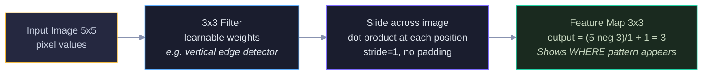

Yellow = raw input image. Blue = the filter (small, learnable). Purple = the sliding operation. Green = the output feature map. The output size formula is: (input neg filter + 2 x padding) / stride + 1. With 32 different filters, you get 32 feature maps — 32 different views of the image.

---

### Stride and Padding

Stride controls how far the filter moves each step. Padding adds zeros around the border to control output size. These two knobs let you decide how much the spatial dimensions shrink at each layer.

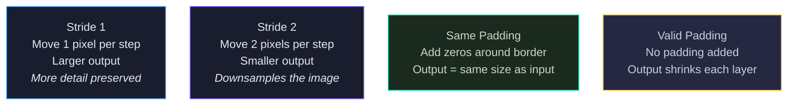

Blue = stride 1 (default, keeps detail). Purple = stride 2 (reduces size). Green = same padding (preserves dimensions). Yellow = valid padding (no padding, output shrinks). Most modern CNNs use stride 1 with same padding in conv layers, and use pooling or stride 2 to reduce dimensions.

---

## 3. Pooling — Reducing Size While Keeping Important Features

Max pooling takes the maximum value in each small region (typically 2x2). This reduces the spatial dimensions by half while keeping the strongest activations. It provides translation invariance — if a feature shifts by one pixel, the pooled output stays the same. It also reduces computation and helps prevent overfitting.

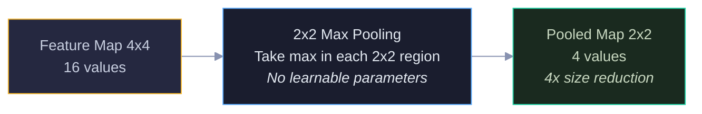

### Why Pooling Matters

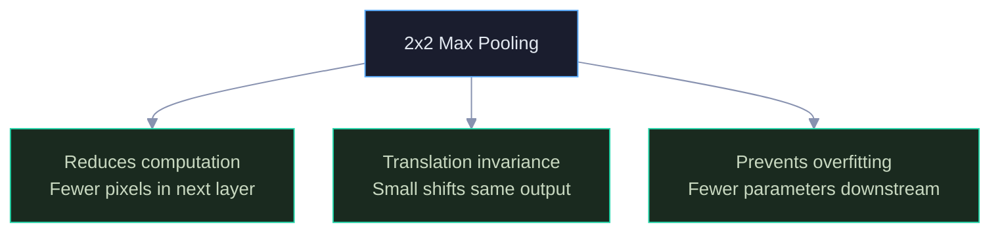

Blue = the pooling operation (no learned weights, just takes the max). Green = the three benefits. Pooling has zero learnable parameters — it's a fixed operation that compresses information.

---

## 4. Complete CNN Architecture

This is the standard CNN pipeline: convolution extracts features, ReLU adds nonlinearity, pooling reduces size. The filter counts (32, 64, 128) double at each layer — this is a common pattern. Early layers need fewer filters because they detect simple patterns (edges). Deeper layers need more filters because they detect complex combinations. The specific numbers (32, 64, 128) are conventions from VGG and ResNet — they work well in practice, though you could use 16, 32, 64 or other progressions. Stack these blocks to build increasingly abstract representations. Then flatten the 3D feature maps into a 1D vector and feed it to dense layers for classification.

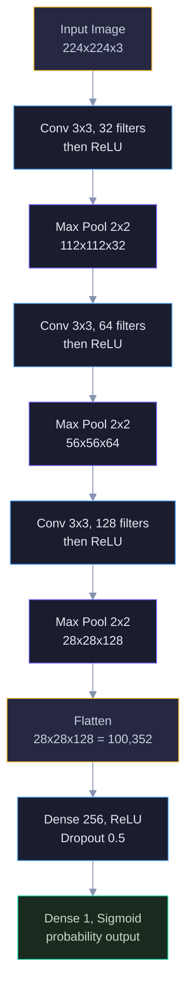

Yellow = input and flatten (data format changes). Blue = convolution layers (feature extraction). Purple = pooling layers (size reduction). Green = final output. Notice how spatial dimensions shrink (224 to 112 to 56 to 28) while depth grows (3 to 32 to 64 to 128) — the network trades spatial resolution for richer feature representations.

---

## 5. What Each Layer Learns — The Feature Hierarchy

CNNs build a hierarchy of features automatically. Early layers detect simple patterns like edges and corners. Middle layers combine those into shapes and textures. Deep layers recognize complex objects and parts. This is why CNNs work — they decompose visual recognition into a series of increasingly abstract steps.

```mermaid
%%{init: {'theme': 'dark', 'themeVariables': {'darkMode': true, 'background': '#0e1117', 'primaryColor': '#1a1d2e', 'primaryTextColor': '#e2e8f0', 'primaryBorderColor': '#2d3148', 'lineColor': '#8892b0', 'secondaryColor': '#252840', 'tertiaryColor': '#1a1d2e', 'fontSize': '14px', 'edgeLabelBackground': '#0e1117'}, 'flowchart': {'nodeSpacing': 30, 'rankSpacing': 40, 'padding': 15, 'htmlLabels': true}}}%%
graph LR
    PIXELS["Raw Pixels"] --> L1["Layer 1<br/>Edges, corners<br/><i>Simple patterns</i>"]
    L1 --> L2["Layer 2<br/>Shapes, textures<br/><i>Combinations of edges</i>"]
    L2 --> L3["Layer 3<br/>Parts, regions<br/><i>Cheese, crust, toppings</i>"]
    L3 --> L4["Layer 4<br/>Objects<br/><i>Whole pizza recognition</i>"]

    style PIXELS fill:#252840,stroke:#f5b731,color:#c8cfe0
    style L1 fill:#1a1d2e,stroke:#5eaeff,color:#e2e8f0
    style L2 fill:#1a1d2e,stroke:#7c6aff,color:#e2e8f0
    style L3 fill:#1a1d2e,stroke:#5eaeff,color:#e2e8f0
    style L4 fill:#1a2a1f,stroke:#22d3a7,color:#c8d8c0
```

Yellow = raw input. Blue/Purple = intermediate layers building up complexity. Green = final recognition. The key insight: nobody tells the network to learn edges first, then shapes, then objects. It discovers this hierarchy on its own through training. This is why the early layers of any CNN (trained on any image task) look remarkably similar — edges are universal.

---

## 6. Transfer Learning — Reuse What Others Trained

Training a CNN from scratch requires millions of images and days of GPU time. But someone already trained ResNet on 14 million ImageNet images. The early layers (edges, textures, shapes) are universal — they work for any image task. Transfer learning takes a pretrained network, freezes the universal layers, and only retrains the final classification layer for your specific task.

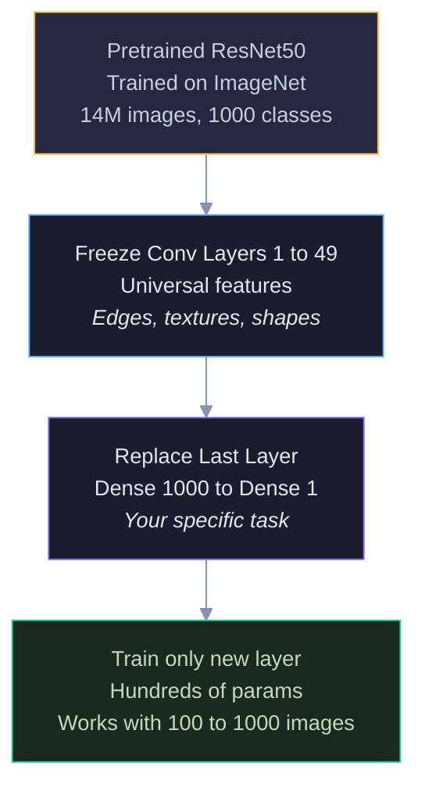

Yellow = pretrained model (someone else did the hard work). Blue = freeze universal layers (don't change them). Purple = replace the task-specific head. Green = train only the new layer (fast, needs little data).

### Fine-Tuning Steps

After the initial transfer, you can optionally unfreeze layers gradually to adapt the pretrained features to your specific domain.

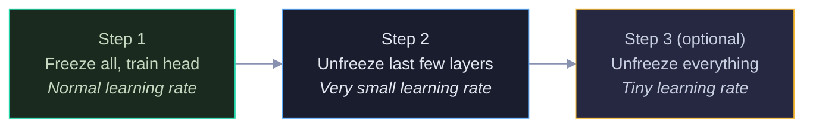

Green = start here (safest, fastest). Blue = optional improvement. Yellow = advanced, risk of destroying pretrained features if learning rate is too high. Each step uses a progressively smaller learning rate to avoid overwriting the useful pretrained weights.

---

## 7. Famous CNN Architectures

Each architecture introduced a key innovation that pushed the field forward. LeNet proved CNNs work. AlexNet proved they scale with GPUs. VGG showed depth matters. ResNet solved the depth limit with skip connections — the same idea later used in Transformers.

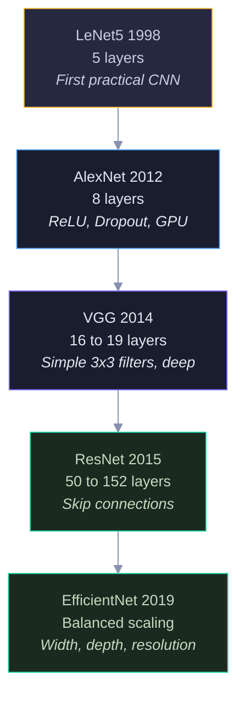

Yellow = the pioneer (LeNet). Blue/Purple = the breakthroughs (AlexNet, VGG). Green = the modern standards (ResNet, EfficientNet). ResNet's skip connections are the most important innovation — they allow gradients to flow directly through the network, enabling training of 100+ layer networks without vanishing gradients.

### ResNet Skip Connection

The key idea: instead of learning the full transformation, learn only the residual (the difference). If a layer has nothing useful to add, the skip connection lets the signal pass through unchanged.

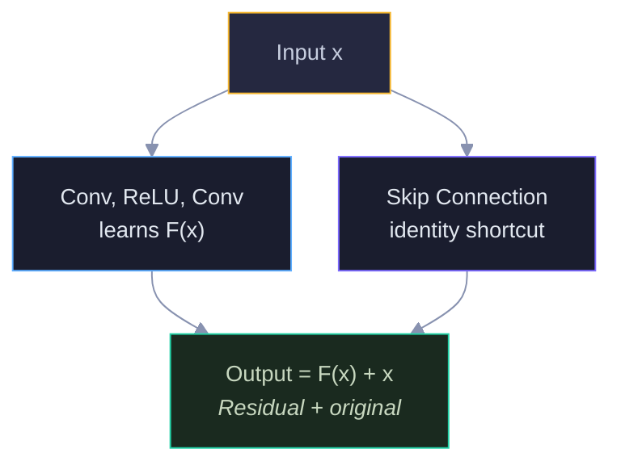

Yellow = input. Blue = the learned transformation. Purple = the skip (identity) path. Green = the sum of both. If F(x) learns nothing useful, output is just x — no harm done. This is why ResNets can be 152 layers deep without degradation.

---

## 8. Interview Decision Tree

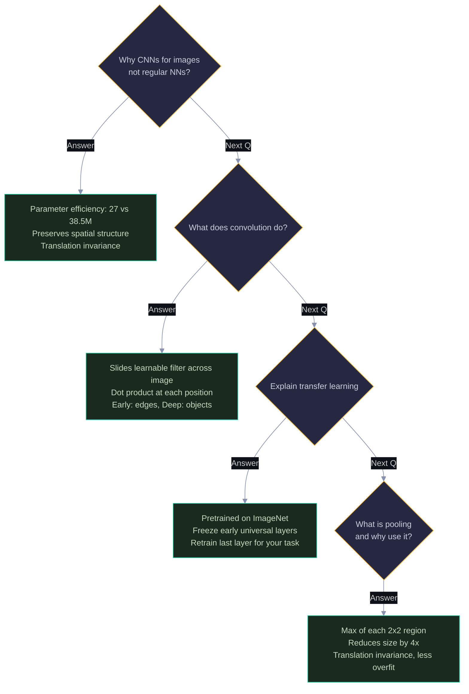

---

> 💡 **How to view:** GitHub (native), VS Code (Mermaid extension), Obsidian (built-in), or [mermaid.live](https://mermaid.live)
