# Neural Network Fundamentals: Visual Deep Dive

> Visual companion to `Documents/Deep_Learning/Basic/Neural_Network_Fundamentals_Deep_Dive.md`.
> Covers activation functions, vanishing gradients, initialization, batch norm, dropout, and loss functions.

---

## 1. Why Activation Functions Exist

Without activation functions, stacking layers is pointless — the result is always a single linear transformation. No curves, no complex patterns. Activation functions break this linearity, letting each layer transform data into a new space where the problem becomes easier.

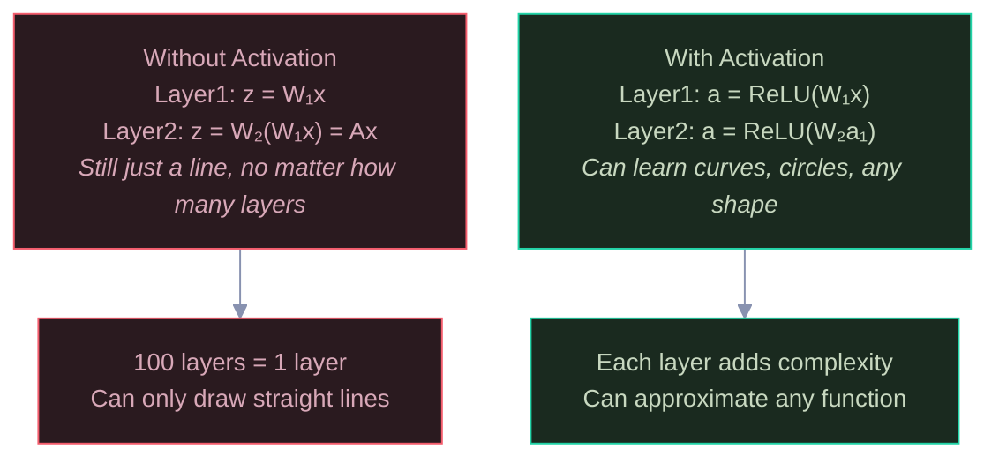

Red = without activation (useless depth). Green = with activation (meaningful depth). The math proves it: W₂(W₁x) = (W₂W₁)x = Ax — just one matrix, regardless of layers.

---

## 2. Activation Functions Compared

Each activation function has a specific shape, output range, and gradient behavior. Sigmoid squashes to (0,1) but its gradient maxes at 0.25 — causing vanishing gradients. Tanh centers at zero but still vanishes. ReLU has gradient exactly 1 for positive inputs — solving the vanishing problem. Leaky ReLU fixes the "dying neuron" issue where ReLU outputs zero forever.

```
  Sigmoid                    Tanh                      ReLU
  Output: (0, 1)             Output: (-1, 1)           Output: (0, ∞)
  Max gradient: 0.25         Max gradient: 1.0          Gradient: 0 or 1

  1.0 │      ___             1.0 │      ___             │        ╱
      │    ╱                     │    ╱                  │       ╱
  0.5 │───●                  0.0 │───●                   │      ╱
      │  ╱                       │  ╱                    │     ╱
  0.0 │_╱                  -1.0 │_╱                  0.0 │____●
      └──────→ z                 └──────→ z              └──────→ z

  Problem: gradient → 0       Better: centered           Best: gradient = 1
  for large z                 but still vanishes          for all positive z
```

### Which Activation Where?

The choice depends on the layer's role. Hidden layers need non-vanishing gradients (ReLU). Output layers need specific ranges — sigmoid for binary probability, softmax for multi-class probabilities, linear for regression.

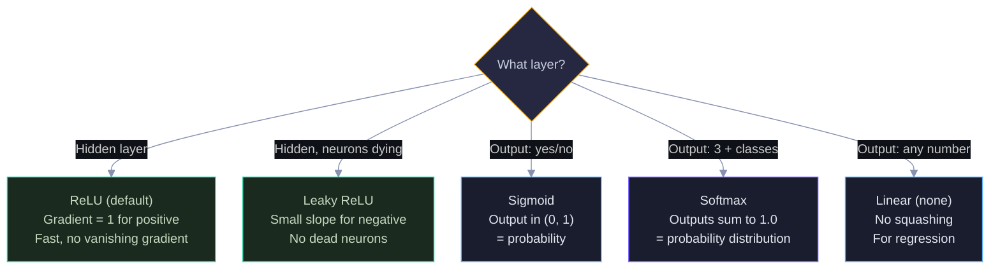

Yellow = decision point. Green = hidden layer choices (ReLU family). Blue/Purple = output layer choices (depends on task). Start with ReLU for hidden layers — only switch if you have a specific problem.

---

## 2.5 How Gradients Are Derived — The Math Behind Activations

Every gradient formula comes from basic calculus. You don't need to memorize them — you need to understand the 5 steps that derive any of them. Here's the sigmoid derivation as a visual chain, then the same logic applied to ReLU and tanh.

### The Sigmoid Gradient Derivation

The sigmoid gradient σ'(z) = σ(z) × (1 − σ(z)) is derived in 5 steps using just the power rule and chain rule. Each step transforms the expression into something simpler.

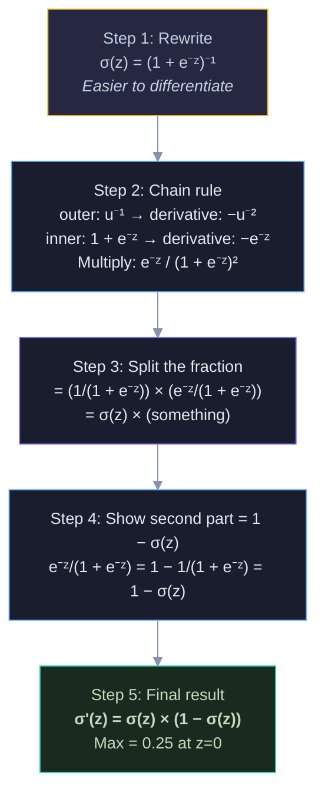

Yellow = start (rewrite). Blue/Purple = calculus steps (chain rule, split, simplify). Green = final result. The key insight: the maximum gradient is only 0.25 — this is why sigmoid causes vanishing gradients.

### All Three Gradients Compared

Each activation's gradient is derived differently but the results explain everything about their behavior in deep networks. The "typical" values come from what the gradient formula gives at common activation levels — most neurons don't sit at the perfect z=0 point.

```
Sigmoid derivation:                    Result: σ(z) × (1 − σ(z))
  Max gradient: 0.25 (at z=0)         Through 10 layers: 0.25¹⁰ = 0.000001
  Vanishes for large |z| ❌

Tanh derivation:                       Result: 1 − tanh²(z)
  Max gradient: 1.0 (at z=0)          Best case 10 layers: 1.0¹⁰ = 1.0
  But at typical activation            Typical neuron has tanh(z) ≈ 0.7
  (tanh(z) ≈ 0.7): gradient           so gradient ≈ 1 − 0.49 = 0.51
  = 1 − 0.49 = 0.51                   Through 10 layers: 0.51¹⁰ = 0.001
  Still vanishes for large |z| ❌      1000× shrinkage — better than sigmoid but still bad

ReLU derivation:                       Result: 0 or 1
  Gradient: exactly 1 for positive     Through 10 layers: 1¹⁰ = 1.0
  Never vanishes ✅                    Perfect gradient flow regardless of activation level
```

### Why This Matters: The Gradient Through 10 Layers

The derivation results directly explain why deep networks were impossible before ReLU. Each layer multiplies the gradient by the activation derivative. After 10 layers:

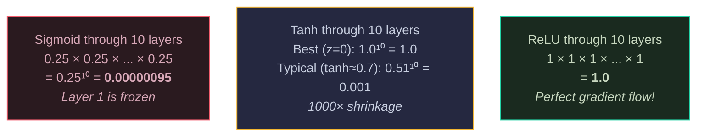

Red = sigmoid (gradient dies). Yellow = tanh (better but still problematic). Green = ReLU (gradient preserved perfectly). The entire history of deep learning activation functions is explained by these three derivation results.

### The 6 Calculus Rules Behind ALL Gradients

Every neural network gradient — sigmoid, tanh, ReLU, softmax, cross-entropy, everything — is built from just these 6 rules applied through the chain rule:

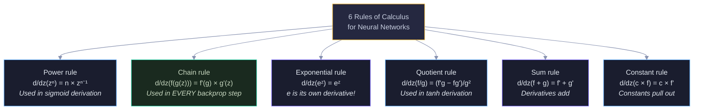

Yellow = the toolkit. Green = the chain rule (the most important — it connects everything). Blue/Purple = the other 5 rules. The chain rule is highlighted because backpropagation IS the chain rule applied through multiple layers.

---

## 3. The Vanishing Gradient Problem

This is the most important concept for understanding why deep networks were hard to train before ReLU. During backpropagation, gradients multiply through each layer. Sigmoid's max gradient is 0.25, so through 10 layers the gradient shrinks to 0.25¹⁰ ≈ 0.000001. Early layers get near-zero gradients and stop learning entirely.

```
  Gradient flowing backward through 5 sigmoid layers:

  Layer 5    Layer 4    Layer 3    Layer 2    Layer 1
  ∂L/∂a₅    × σ'(z₄)  × σ'(z₃)  × σ'(z₂)  × σ'(z₁)
  = 1.0      × 0.25    × 0.25    × 0.25    × 0.25
  = 1.0      = 0.25    = 0.063   = 0.016   = 0.004

  Layer 5 gets gradient 1.0    → learns fast
  Layer 1 gets gradient 0.004  → barely learns
  
  With 10 layers: 0.25¹⁰ = 0.00000095 → Layer 1 is FROZEN
```

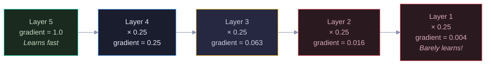

Color shows gradient health: green = strong, blue = weakening, yellow = weak, red = nearly dead. Each arrow multiplies by 0.25 (sigmoid's max gradient). By Layer 1, the gradient is 250× smaller than Layer 5.

### How ReLU Fixes It

With ReLU, the gradient is exactly 1 for positive inputs. No multiplication decay — the gradient passes through unchanged.

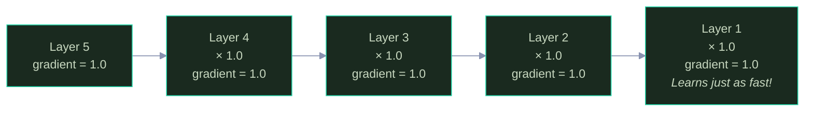

All green — every layer gets the same gradient strength. This is why ReLU enabled training of deep networks (50, 100, 152 layers) that were impossible with sigmoid.

---

## 4. All Solutions to Vanishing/Exploding Gradients

Six techniques work together to keep gradients healthy. ReLU fixes the activation problem. Proper initialization prevents bad starting conditions. Batch norm stabilizes each layer. Residual connections provide gradient highways. Gradient clipping prevents explosions. LSTM gates control flow in recurrent networks.

```mermaid
%%{init: {'theme': 'dark', 'themeVariables': {'darkMode': true, 'background': '#0e1117', 'primaryColor': '#1a1d2e', 'primaryTextColor': '#e2e8f0', 'primaryBorderColor': '#2d3148', 'lineColor': '#8892b0', 'secondaryColor': '#252840', 'tertiaryColor': '#1a1d2e', 'fontSize': '14px', 'edgeLabelBackground': '#0e1117'}, 'flowchart': {'nodeSpacing': 30, 'rankSpacing': 40, 'padding': 15, 'htmlLabels': true}}}%%
graph TD
    PROBLEM["⚠️ Vanishing/Exploding Gradients"] --> S1 & S2 & S3 & S4 & S5 & S6

    S1["ReLU activation<br/>Gradient = 1 for positive<br/><i>Fixes vanishing in hidden layers</i>"]
    S2["Proper initialization<br/>Xavier for sigmoid/tanh<br/>He/Kaiming for ReLU<br/><i>Stable variance from the start</i>"]
    S3["Batch Normalization<br/>Normalize to mean=0, var=1<br/><i>Prevents drift between layers</i>"]
    S4["Residual connections<br/>Skip paths: output = F(x) + x<br/><i>Gradient flows directly through</i>"]
    S5["Gradient clipping<br/>Cap gradient magnitude<br/><i>Prevents explosion in RNNs</i>"]
    S6["LSTM/GRU gates<br/>Learned gates control flow<br/><i>For recurrent networks</i>"]

    style PROBLEM fill:#2a1a1f,stroke:#f45d6d,color:#d8a8b8
    style S1 fill:#1a2a1f,stroke:#22d3a7,color:#c8d8c0
    style S2 fill:#1a1d2e,stroke:#5eaeff,color:#e2e8f0
    style S3 fill:#1a1d2e,stroke:#7c6aff,color:#e2e8f0
    style S4 fill:#1a2a1f,stroke:#22d3a7,color:#c8d8c0
    style S5 fill:#1a1d2e,stroke:#5eaeff,color:#e2e8f0
    style S6 fill:#1a1d2e,stroke:#7c6aff,color:#e2e8f0
```

Red = the problem. Green = the two most important solutions (ReLU and residual connections). Blue/Purple = supporting techniques. In practice, modern networks use all of these together.

---

## 5. Weight Initialization — Why Random Isn't Good Enough

Weights that are too large cause activations to saturate (sigmoid → 0 or 1, gradient → 0). Weights that are too small cause activations to collapse to zero (no signal). Xavier and He initialization set the initial variance so that activations stay in a healthy range across all layers.

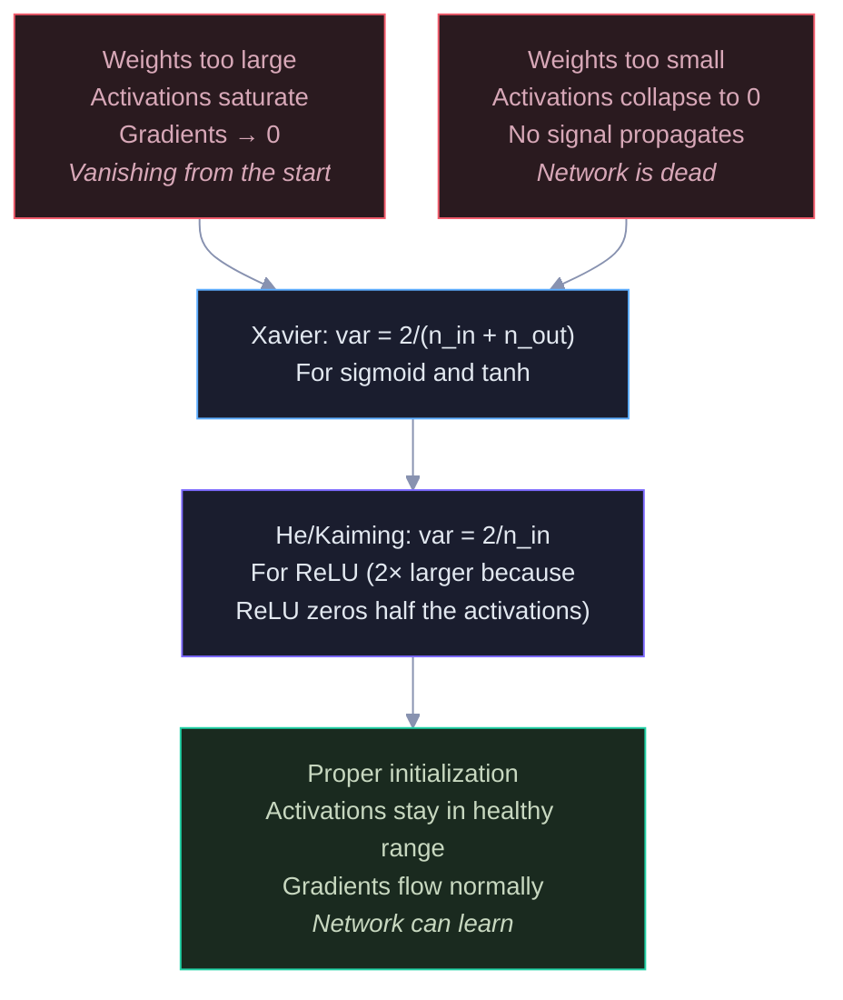

Red = bad initialization (too large or too small). Blue = Xavier (for sigmoid/tanh). Purple = He (for ReLU — needs 2× larger variance because ReLU zeros out negative half). Green = the result of proper initialization.

---

## 6. Batch Normalization — Stabilizing Training

Each layer's input distribution shifts as previous layers update their weights (internal covariate shift). Batch norm fixes this by normalizing activations to mean=0, variance=1 within each mini-batch, then applying learnable scale (γ) and shift (β). The learnable parameters mean the network can undo the normalization if it's not helpful — so batch norm can never hurt.

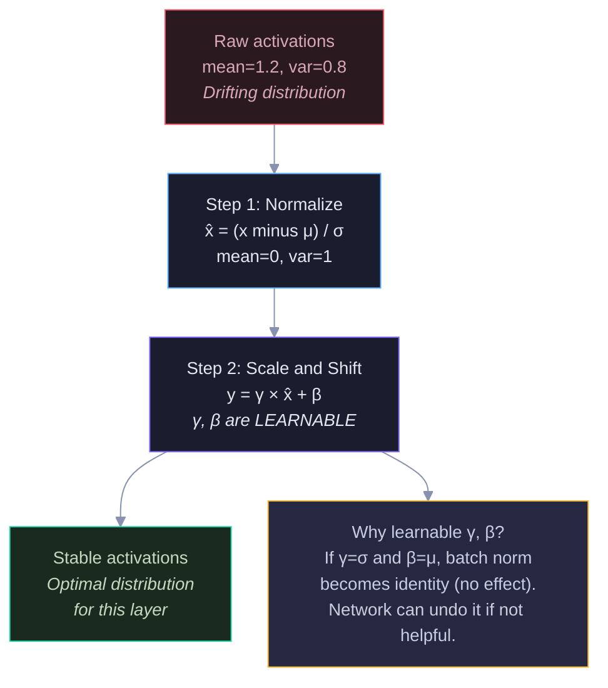

Red = unstable input (drifting distribution). Blue = normalize (force mean=0, var=1). Purple = learnable scale/shift (let network choose optimal distribution). Green = stable output. Yellow = why the learnable parameters matter.

### Benefits of Batch Norm

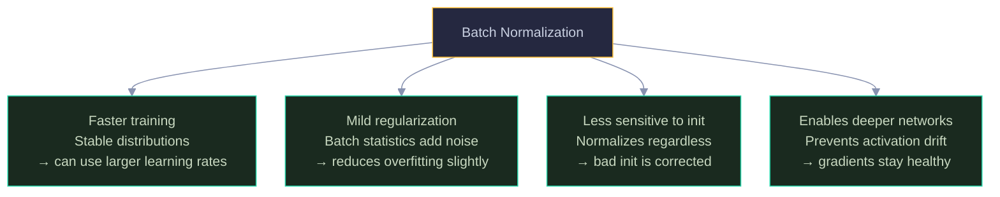

---

## 7. Dropout — An Ensemble for Free

During training, dropout randomly disables neurons with probability p (typically 0.5). This forces the network to develop redundant, independent features — no single neuron can be critical. At test time, all neurons are active. Mathematically, this approximates averaging 2^N different sub-networks (where N is the number of neurons) — a massive ensemble for free.

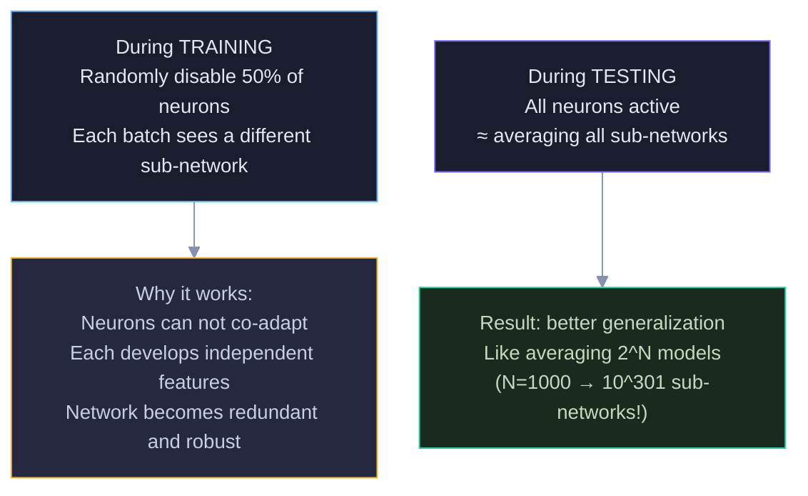

Blue = training mode (random disabling). Purple = test mode (all active). Yellow = the mechanism (prevents co-adaptation). Green = the result (massive implicit ensemble).

### Choosing Dropout Rate

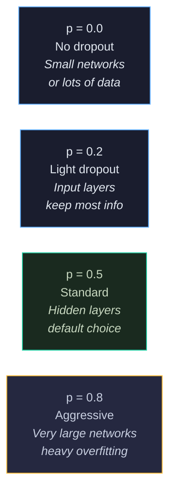

Green = the default starting point (p=0.5). Adjust based on overfitting severity.

---

## 8. Loss Functions — Matching Task to Loss

The loss function defines "how wrong is the model?" Different tasks need different loss functions. The choice is not arbitrary — each loss is mathematically derived from the probability distribution that matches the task.

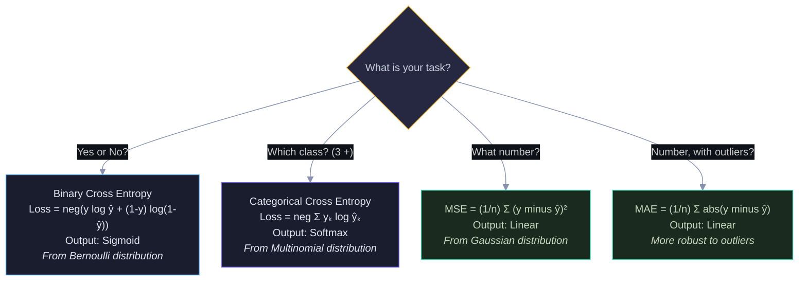

Yellow = start here (what's your task?). Blue = classification losses. Green = regression losses. Each loss is paired with a specific output activation — using the wrong combination (e.g., MSE with sigmoid) creates optimization problems.

---

## 9. Learning Rate — The Most Important Knob

The learning rate η controls step size during weight updates. Too large → overshoots and diverges. Too small → crawls and gets stuck. The right value depends on the optimizer, model size, and data. Start with 0.001 for Adam, 0.01 for SGD, and adjust based on the loss curve.

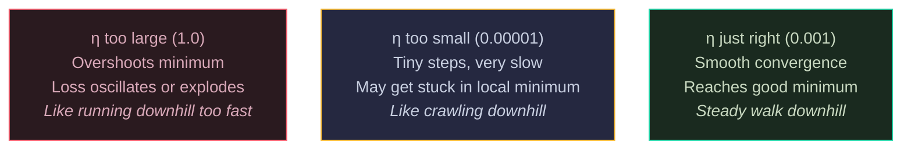

### Learning Rate Schedules

Instead of a fixed learning rate, modern training changes η over time. Start high (explore broadly), then decrease (fine-tune near the minimum).

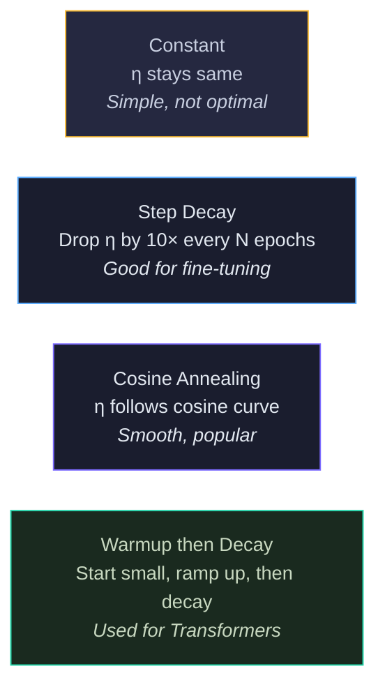

Yellow = simplest. Blue = common. Purple = modern. Green = state-of-the-art (warmup is essential for BERT/GPT training — random initial weights need gentle early updates).

---

## 10. Epochs, Batches, Iterations

These three terms confuse everyone. One epoch = one full pass through all data. One batch = one subset of data processed together. One iteration = one weight update (one batch). The diagram shows how they relate with concrete numbers.

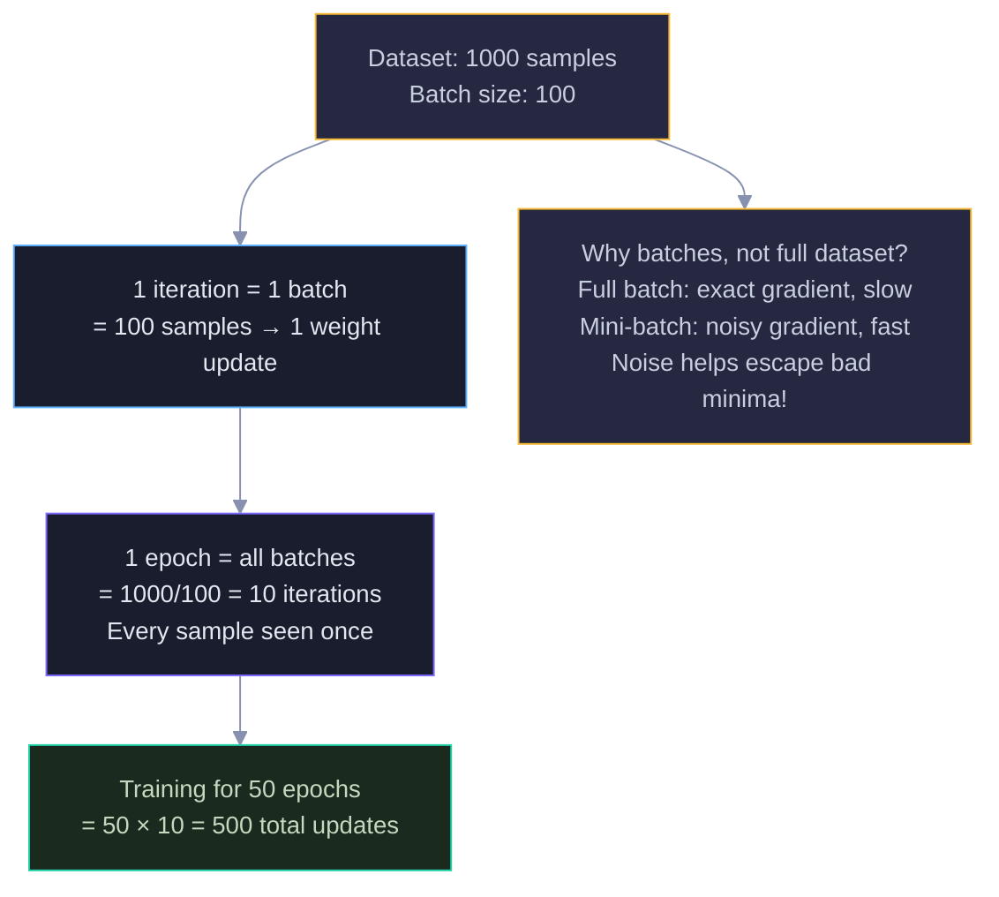

Yellow = the setup. Blue = one iteration. Purple = one epoch. Green = full training. The yellow "Why batches?" box explains the key insight: mini-batch noise is a feature, not a bug — it helps the model find better solutions.

---

## 11. Interview Decision Tree 🎯

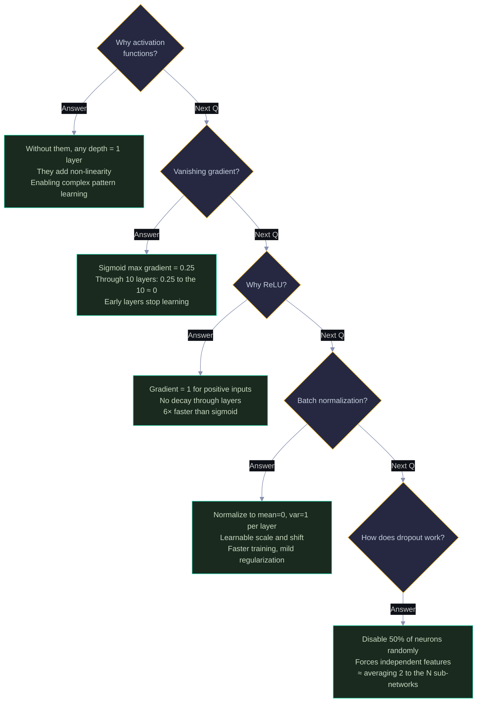

---

> 💡 **How to view:** GitHub (native), VS Code (Mermaid extension), Obsidian (built-in), or [mermaid.live](https://mermaid.live)
