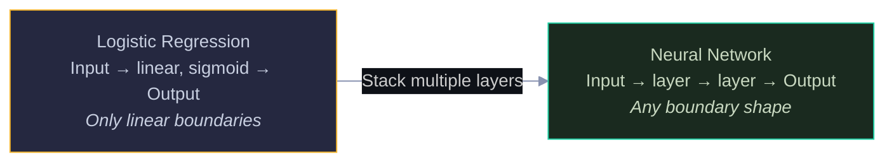
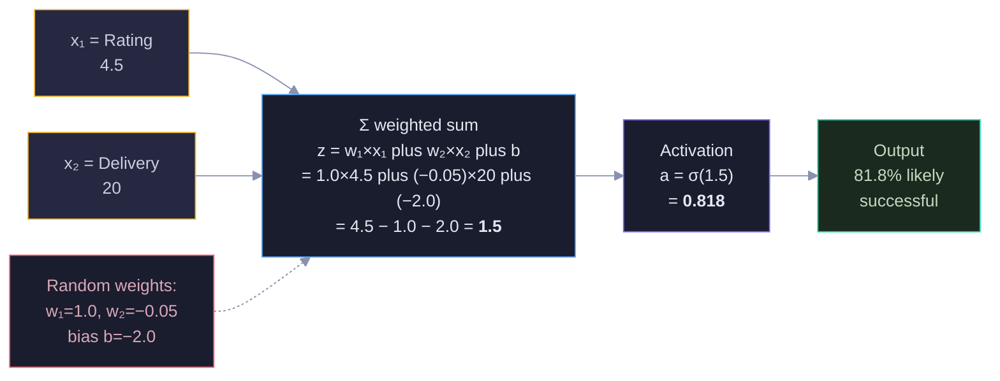
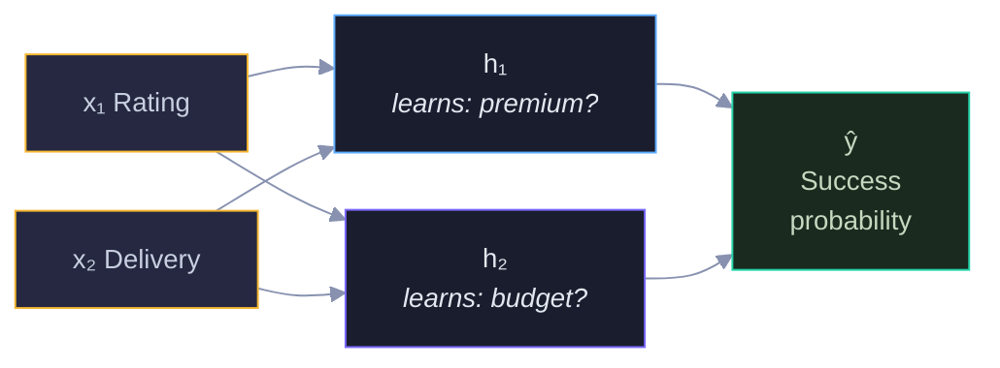
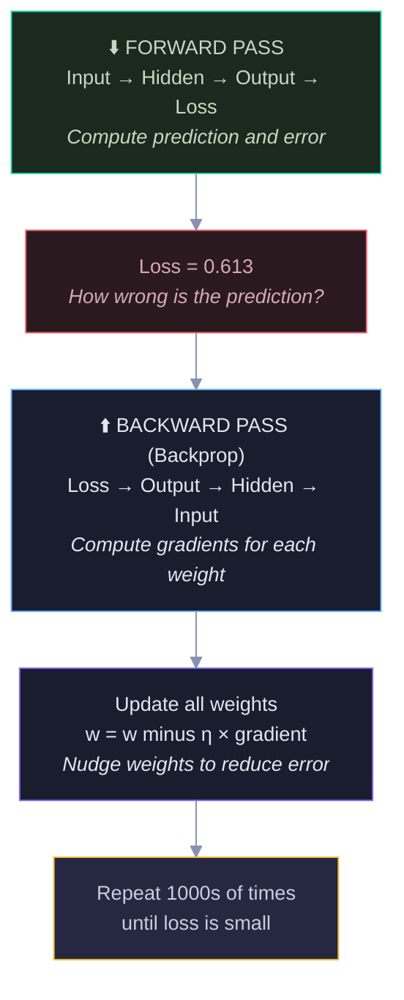
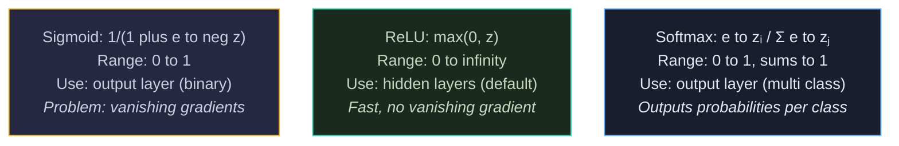
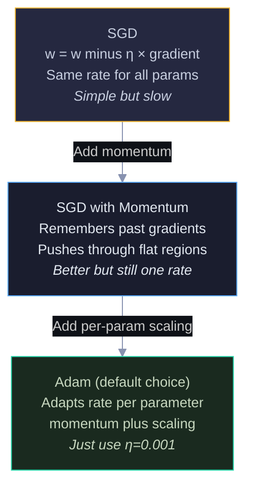
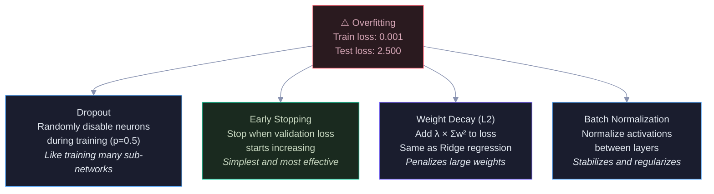
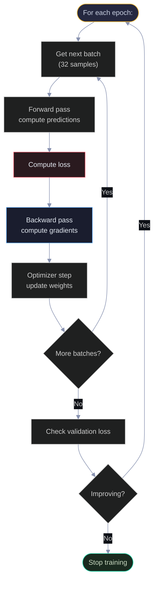
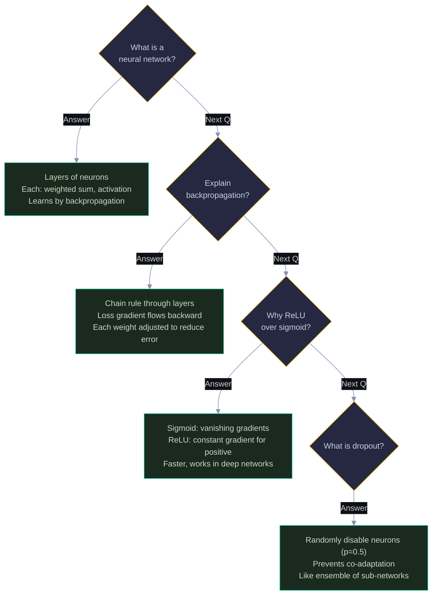

# Neural Networks: Visual Guide with Mermaid Diagrams

> Visual companion to `Documents/Deep_Learning/Basic/Phase4_Neural_Networks_Complete_Guide.md`.
> Every diagram has explanatory text — what it shows, why it matters, and how to read it.

---

## 1. From Logistic Regression to Neural Networks

A neural network is just many logistic regressions stacked together. Logistic regression can only learn straight-line boundaries. By stacking layers, a neural network can learn any shape of boundary — curves, circles, anything. The diagram shows this progression.

Yellow = what you already know. Green = the upgrade. Each layer transforms the data into a new representation where the problem becomes easier to solve.

---

## 2. A Single Neuron

A neuron does three things: multiply inputs by weights, add a bias, and apply an activation function. It's identical to logistic regression — the building block of all neural networks.

Before training, the network starts with **random weights**. These are just initial guesses — training will adjust them. For this example:

- **w₁ = 1.0** (weight for Rating — random starting value)
- **w₂ = −0.05** (weight for Delivery — random, slightly negative because longer delivery might hurt)
- **b = −2.0** (bias — random starting offset)

The neuron computes: z = w₁ × Rating + w₂ × Delivery + b, then applies the sigmoid function to squash the result into a probability between 0 and 1.

Yellow = inputs (our pizza store data). Red (dashed) = random initial weights (these get adjusted during training). Blue = weighted sum computation. Purple = sigmoid activation. Green = final output. The weights are random guesses — with training, w₁ would increase (higher rating = more successful) and w₂ would become more negative (longer delivery = less successful).

---

## 3. Network Architecture — Layers of Neurons

The 2-2-1 network: 2 inputs, 2 hidden neurons, 1 output. Every input connects to every hidden neuron (fully connected). The hidden layer learns intermediate features that the input layer can't represent directly.

Yellow = input layer (we choose these). Blue/Purple = hidden layer (network learns what these represent). Green = output. The hidden neurons might learn "is this a premium store?" and "is this a budget store?" — we don't tell it this, it discovers useful features on its own. This is representation learning.

---

## 4. Forward Pass vs Backward Pass

Training has two phases that repeat thousands of times. Forward pass computes the prediction. Backward pass computes how to fix the weights. The diagram shows both directions.

Green = forward (compute prediction). Red = loss (measure error). Blue = backward (compute gradients via chain rule). Purple = update (fix weights). Yellow = repeat. Backpropagation is just the chain rule applied through multiple layers — same math as logistic regression, more links in the chain.

---

## 5. Activation Functions

The activation function determines what a neuron outputs. Sigmoid was the original but causes vanishing gradients in deep networks. ReLU is the modern default — simple, fast, and gradient-friendly.

Yellow = sigmoid (classic, use for binary output only). Green = ReLU (modern default for hidden layers). Blue = softmax (for multi-class output). Rule of thumb: ReLU for hidden layers, sigmoid for binary output, softmax for multi-class output.

---

## 6. Optimizers — How Weights Get Updated

### Why we need smart optimizers

Basic gradient descent uses the same learning rate for every parameter. Adam adapts the rate per parameter — parameters with large gradients get smaller steps (prevents overshooting), parameters with small gradients get larger steps (prevents stalling).

Each step adds an improvement. In practice: just use Adam with learning rate 0.001. It works for almost everything.

---

## 7. Overfitting Solutions

Neural networks have millions of parameters and can memorize training data. These techniques prevent that.

Red = the problem. Green = early stopping (try first, simplest). Blue/Purple = other techniques to combine as needed. In practice, use early stopping always, add dropout for large networks, and weight decay for fine-tuning.

---

## 8. The Training Loop

The outer loop (epochs) repeats over the full dataset. The inner loop (batches) processes chunks of data. After each epoch, check validation loss — if it stops improving, stop training (early stopping).

---

## 9. Interview Decision Tree 🎯

---

> 💡 **How to view:** GitHub (native), VS Code (Mermaid extension), Obsidian (built-in), or [mermaid.live](https://mermaid.live)
