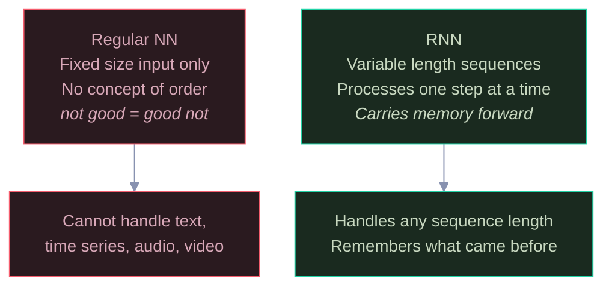
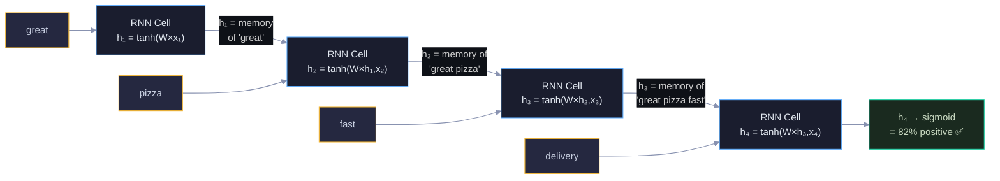
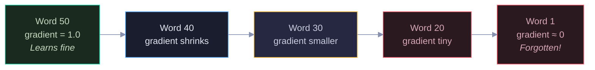
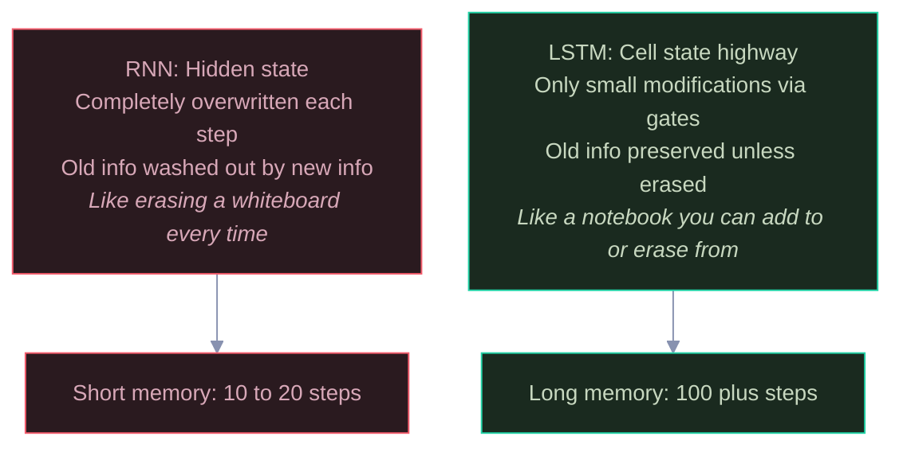
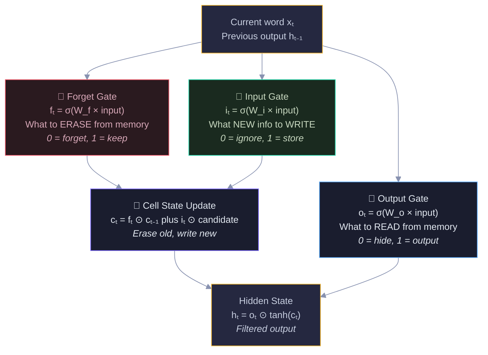
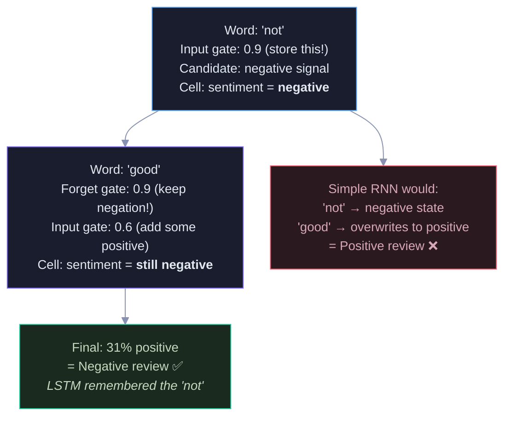
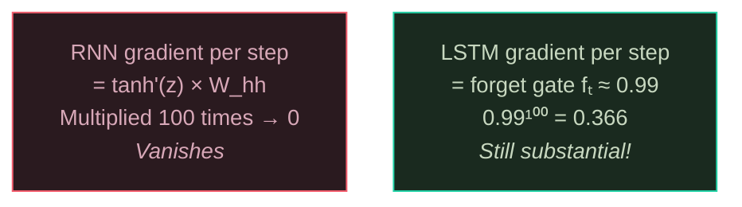
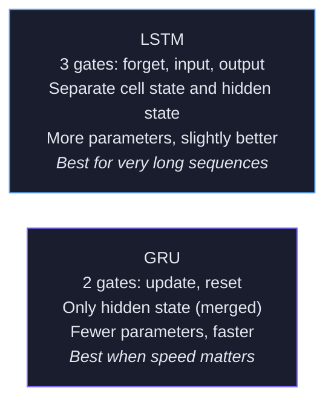
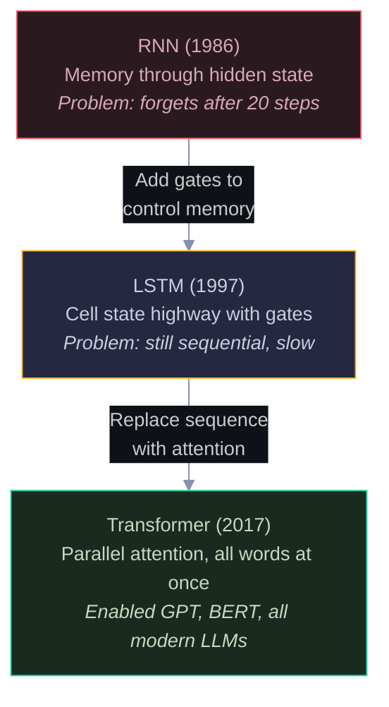
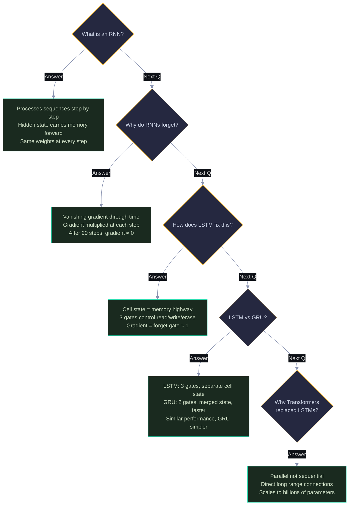

# RNNs & LSTMs: Visual Guide with Mermaid Diagrams

> Visual companion to `Documents/Deep_Learning/Next_Level/RNN_LSTM_Complete_Guide.md`.
> Every diagram has explanatory text — what it shows, why it matters, and how to read it.

---

## 1. Why We Need RNNs — Regular NNs Can't Handle Sequences

Regular neural networks need fixed-size input. But sentences have variable length — 4 words or 40 words. Worse, regular NNs treat inputs as a bag with no order. "Not good" and "good not" would be identical. RNNs solve this by processing one word at a time, carrying a hidden state (memory) from step to step.

Red = regular NN (can't do sequences). Green = RNN (designed for sequences). The hidden state is the key innovation — it's a vector that gets updated at each step, carrying information from all previous steps.

---

## 2. How an RNN Processes a Sequence

The RNN reads one word at a time, left to right. At each step, it combines the current word with its memory of all previous words to produce an updated memory. The same weights are used at every step (weight sharing) — so it works for any sequence length. The final hidden state summarizes the entire sentence.

Yellow = input words (one per step). Blue = RNN cells (same weights W at every step). The arrows between cells carry the hidden state h — each one accumulates more context. Green = final prediction using the last hidden state. The formula at each step: hₜ = tanh(W_hh × hₜ₋₁ plus W_xh × xₜ plus b).

---

## 3. The RNN's Fatal Flaw — Vanishing Gradients Over Time

An RNN processing a 100-word sentence is like a 100-layer deep network. The gradient must flow back through every time step. With tanh activation (max gradient = 1.0), the gradient shrinks at each step. After 20-30 steps, early words are effectively forgotten — the network can't learn that "not" (word 5) should affect "good" (word 8).

Green = recent words (strong gradient). Blue/Yellow = middle words (weakening). Red = early words (gradient dead). This is why a simple RNN can't understand "The pizza that we ordered last Tuesday from the new place was great" — by the time it reaches "great", it has forgotten "pizza."

---

## 4. LSTM — The Memory Highway

LSTM solves the vanishing gradient by adding a cell state — a separate memory highway. Information flows through the cell state with only small, controlled modifications via three gates. The key difference: in an RNN, the hidden state is completely overwritten each step. In an LSTM, the cell state is only slightly modified — old information is preserved unless explicitly erased.

Red = RNN approach (overwrite, forget). Green = LSTM approach (highway, preserve). The whiteboard vs notebook analogy captures it: an RNN erases and redraws every step, an LSTM writes in a notebook and only erases specific parts when needed.

---

## 5. The Three LSTM Gates

Each gate is a sigmoid layer outputting values between 0 (block everything) and 1 (let everything through). The forget gate decides what to erase from memory. The input gate decides what new information to write. The output gate decides what to read out. All three are learned during training — the network discovers what to remember and forget.

Yellow = inputs and output. Red = forget gate (erases). Green = input gate (writes). Blue = output gate (reads). Purple = cell state (the memory itself). The ⊙ symbol means element-wise multiplication — each gate controls each memory dimension independently.

---

## 6. LSTM in Action — "not good"

This traces how the LSTM handles negation. When it reads "not", the input gate stores a strong negative signal. When it then reads "good", the forget gate preserves the negation — the positive signal from "good" doesn't fully override the "not." A simple RNN would overwrite the "not" memory entirely.

Blue = "not" step (stores negation). Purple = "good" step (preserves negation via forget gate). Green = LSTM gets it right. Red = simple RNN fails (overwrites the negation). The forget gate value of 0.9 means "keep 90% of the old memory" — the negation survives.

---

## 7. Why LSTM Gradients Don't Vanish

The gradient through the cell state is just the forget gate value — near 1.0 for important memories. No tanh derivative, no weight matrix multiplication. The gradient flows through the cell state highway almost unchanged, even over 100 steps.

Red = RNN gradient (vanishes through multiplication of tanh derivatives and weights). Green = LSTM gradient (controlled by forget gate, stays near 1). The cell state acts as a gradient highway — information and gradients flow through with minimal loss.

---

## 8. GRU — The Simpler Alternative

GRU simplifies LSTM by merging the forget and input gates into one update gate, and removing the separate cell state. Fewer parameters, faster training, similar performance on most tasks. LSTM is slightly better for very long sequences where the separate cell state helps.

Blue = LSTM (more complex, slightly more powerful). Purple = GRU (simpler, faster, usually equivalent). In practice, try GRU first — if performance isn't good enough, switch to LSTM.

---

## 9. The Evolution: RNN → LSTM → Transformer

Each generation solved a limitation of the previous one. RNNs added memory but forgot long sequences. LSTMs added gates to control memory but were still sequential (slow). Transformers replaced sequential processing with parallel attention — every word sees every other word directly.

Red = RNN (limited memory). Yellow = LSTM (good memory, slow). Green = Transformer (unlimited memory, fast). Each arrow label tells you what problem was solved. Understanding this evolution is essential — interviewers love asking "why did Transformers replace LSTMs?"

---

## 10. Interview Decision Tree 🎯

---

> 💡 **How to view:** GitHub (native), VS Code (Mermaid extension), Obsidian (built-in), or [mermaid.live](https://mermaid.live)
