# Transformers and Attention: Visual Guide with Mermaid Diagrams

> Visual companion to `Documents/Deep_Learning/Pro/Phase4_Transformers_Complete_Guide.md`.
> Every diagram has explanatory text — what it shows, why it matters, and how to read it.

---

## 1. Why Transformers — The Evolution of Sequence Models

Bag of Words loses word order entirely. RNNs process words one at a time — slow and forgetful over long sequences. Transformers process all words simultaneously, letting every word directly attend to every other word. No sequential bottleneck, no forgetting, fully parallelizable.

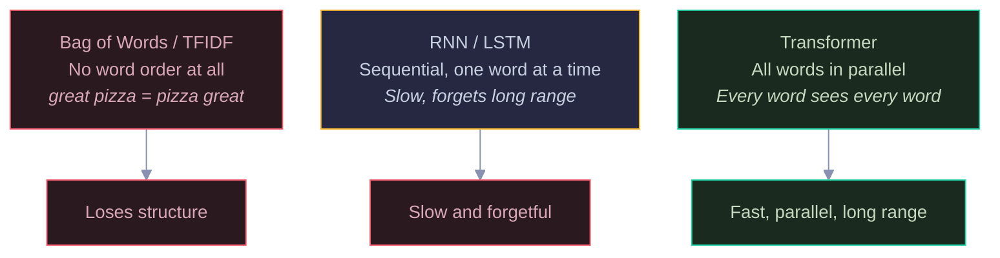

Red = broken approaches (BoW loses order, RNN is slow). Yellow = RNN (works but limited). Green = Transformer (solves all three problems). The key breakthrough: attention lets "slow" directly look at "delivery" even if they are 5 words apart, without processing every word in between.

---

## 2. Self-Attention: Query, Key, Value

For each word, self-attention asks: "Which other words should I pay attention to?" Every word is transformed into three vectors — Query (what am I looking for?), Key (what do I contain?), Value (what information do I provide). The embedding (0.5, 0.3, 0.8, 0.1) is a simplified 4-dimensional example. In real models, embeddings are much larger — BERT uses 768 dimensions, GPT-3 uses 12,288. These numbers are learned during training: each word gets a unique vector that captures its meaning. Similar words (like 'pizza' and 'pasta') end up with similar vectors. Think of it like a library: your Query is the search question, Keys are book titles, Values are book contents. You match your question against all titles, then read the best-matching books.

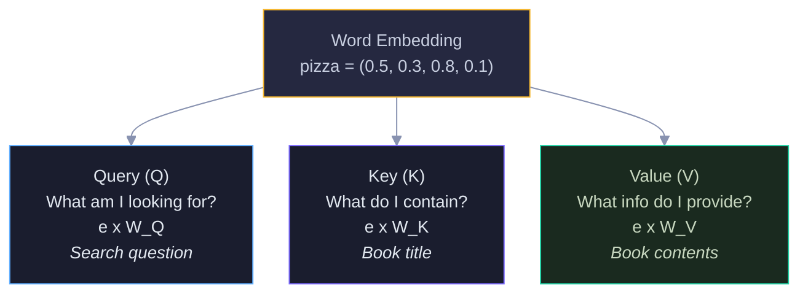

Yellow = the word embedding (starting point). Blue = Query (what this word is searching for). Purple = Key (what this word advertises about itself). Green = Value (the actual information this word carries). W_Q, W_K, W_V are learned weight matrices — the network learns what to query, what to advertise, and what to provide.

---

## 3. Attention Score Computation

The attention mechanism in four steps: (1) dot product of Query with all Keys to get raw scores, (2) scale by square root of dimension to prevent gradient issues, (3) softmax to convert to probabilities, (4) weighted sum of Values. The result: each word gets a new representation that blends information from the most relevant words.

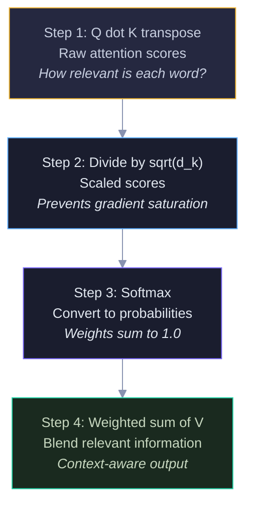

Yellow = raw dot products (measure similarity). Blue = scaling (numerical stability). Purple = softmax (normalize to probabilities). Green = weighted sum (the final context-aware output). The complete formula: Attention(Q,K,V) = softmax(Q x K_T / sqrt(d_k)) x V.

### Example: "great" Attending to Other Words

When computing attention for the word "great" in "pizza was great", these attention weights (0.395 for pizza, 0.241 for was, 0.363 for self) come from the softmax of the scaled dot products computed in the steps above. They sum to 1.0 and represent how much each word contributes to the output for 'great'. The model learned that 'pizza' is most relevant to 'great' (39.5%) because they have the highest dot product similarity. The scores show it pays most attention to "pizza" — it learned what was great.

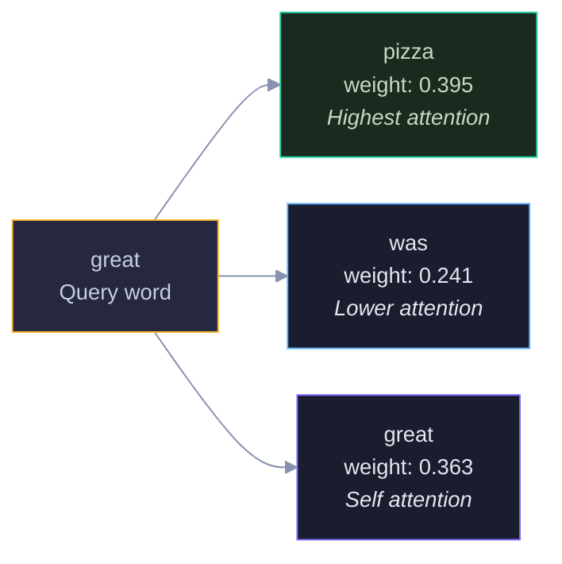

Yellow = the query word. Green = highest attention (pizza, 39.5%). Blue/Purple = lower attention words. The output for "great" becomes a blend: 39.5% pizza info, 24.1% was info, 36.3% self info. It absorbed context from "pizza" — now it knows what was great.

---

## 4. Multi-Head Attention

One attention head captures one type of relationship. But language has many simultaneous relationships — syntactic, semantic, positional. Multi-head attention runs several attention mechanisms in parallel, each with its own Q, K, V weights. The outputs are concatenated and projected. BERT uses 12 heads, GPT-3 uses 96.

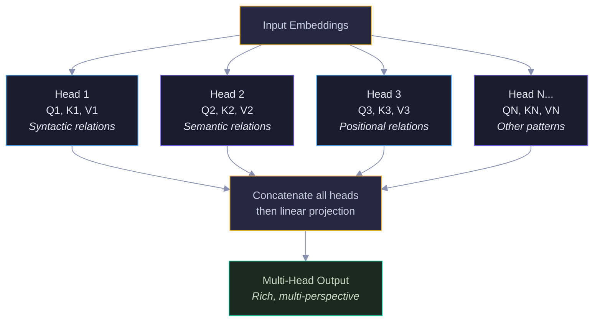

Yellow = input and concatenation. Blue/Purple = individual attention heads (each learns different relationships). Green = final multi-perspective output. Each head operates on a smaller dimension (BERT: 768/12 = 64 per head), so the total computation is similar to single-head attention but captures richer patterns.

---

## 5. Full Transformer Block

A Transformer block has four components: multi-head attention, add and normalize, feed-forward network, add and normalize again. The residual connections (add) prevent vanishing gradients — if a layer learns nothing useful, the signal passes through unchanged. Layer normalization keeps values stable. GPT-3 stacks 96 of these blocks.

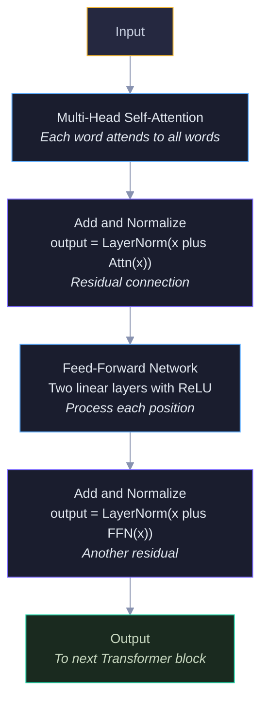

Yellow = input/output. Blue = the two main operations (attention and FFN). Purple = add and normalize (residual connections with layer norm). Green = output to next block. The residual connections are critical — without them, gradients would vanish through 96 layers. With them, gradients flow directly through the skip paths.

---

## 6. Positional Encoding — Why Word Order Matters

Self-attention is permutation-invariant — it treats "pizza was great" and "great was pizza" identically because it has no concept of position. Positional encoding fixes this by adding a unique position signal to each word embedding using sine and cosine functions. Now the model knows that "pizza" at position 1 is different from "pizza" at position 5.

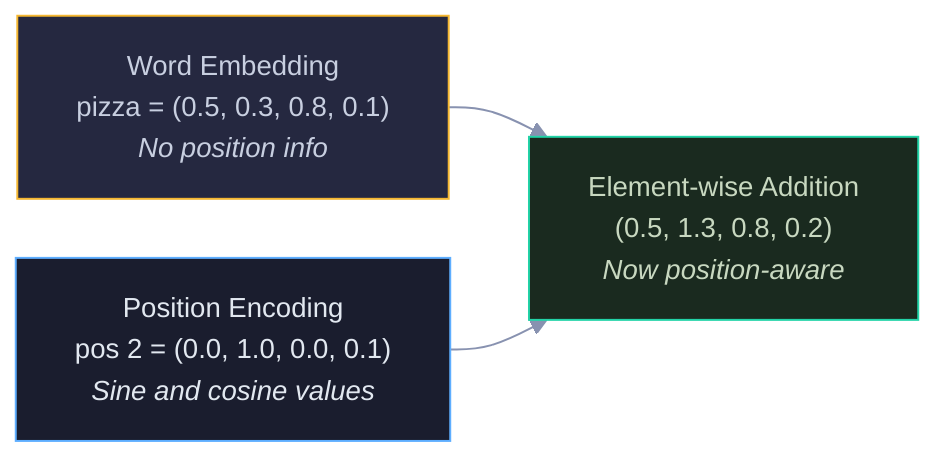

Yellow = word embedding (meaning only). Blue = positional encoding (position only). Green = the sum (meaning plus position). The sine/cosine formula gives three properties: (1) each position gets a unique encoding, (2) the model can learn relative positions, (3) it generalizes to any sequence length.

### Why Sine and Cosine?

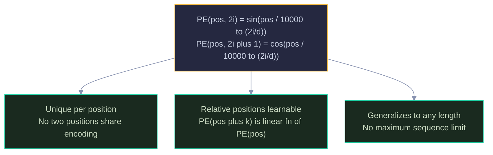

Yellow = the formula. Green = the three key properties. The different frequencies (controlled by the dimension index i) create a unique "fingerprint" for each position, similar to how binary numbers use different bit positions.

---

## 7. BERT vs GPT — Encoder vs Decoder

Both use Transformers but in opposite directions. BERT is an encoder — it sees all words bidirectionally and fills in blanks (masked language modeling). GPT is a decoder — it sees only left context and predicts the next word (autoregressive). BERT understands text. GPT generates text.

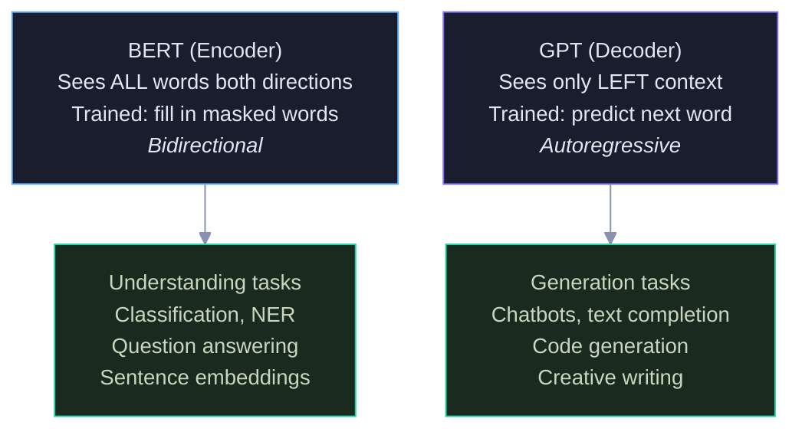

Blue = BERT (encoder, bidirectional). Purple = GPT (decoder, left-to-right). Green = their respective strengths.

### How They See Text

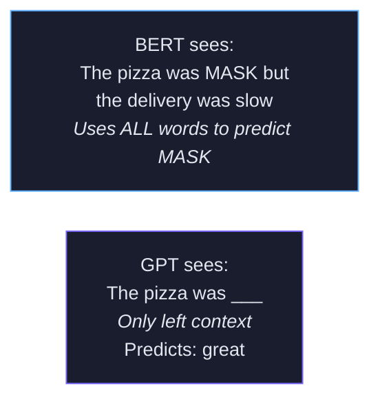

Blue = BERT reads the whole sentence including "slow" when predicting the masked word. Purple = GPT only sees "The pizza was" and must guess what comes next. BERT is like reading a book then answering questions. GPT is like writing a book one word at a time.

---

## 8. How LLMs Scale

Larger models with more parameters, more layers, more attention heads, and more training data consistently perform better. This is the scaling law — performance improves predictably with scale. GPT-3 has 175 billion parameters across 96 layers with 96 attention heads, trained on 570GB of text.

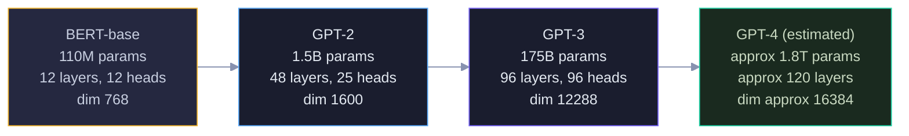

Yellow = small (BERT-base, 110M). Blue = medium (GPT-2, 1.5B). Purple = large (GPT-3, 175B). Green = massive (GPT-4, estimated 1.8T). The pattern: more layers, more heads, larger dimensions, more data. Each jump is roughly 100x more parameters.

### What Scales

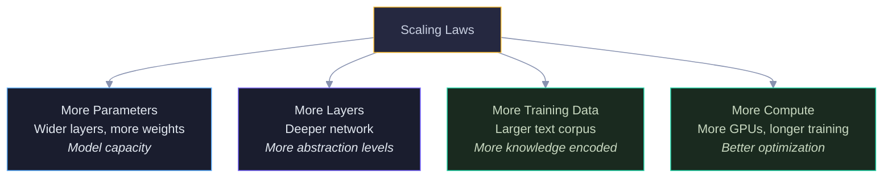

Yellow = the scaling principle. Blue/Purple = model architecture scaling. Green = data and compute scaling. All four dimensions must scale together — a huge model with little data overfits, and a small model with huge data plateaus.

---

## 9. Interview Decision Tree

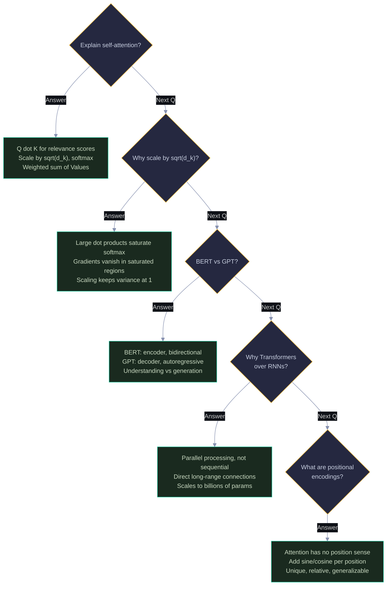

---

> 💡 **How to view:** GitHub (native), VS Code (Mermaid extension), Obsidian (built-in), or [mermaid.live](https://mermaid.live)
