# Bagging & Boosting: Visual Guide with Mermaid Diagrams

> This document mirrors the complete text guide but uses Mermaid diagrams to visualize every concept.
> Render this in any Markdown viewer that supports Mermaid (GitHub, VS Code with extension, Obsidian, etc.)

---

## 1. The Big Picture — Why Ensembles?

A single decision tree is unreliable — small changes in data produce completely different trees (high variance). Ensemble methods solve this by combining many trees. The diagram below shows the two main strategies: **Bagging** (train trees independently, then vote) and **Boosting** (train trees one after another, each fixing the previous one's mistakes). Every algorithm in this guide falls under one of these two branches.

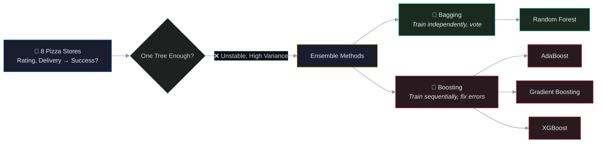

Read this left-to-right: we start with a prediction problem, realize one tree isn't enough, and branch into two families of solutions. Green = Bagging family, Red = Boosting family.

---

## 2. Our Pizza Store Data

### 2.1 The Data Table

| Store | Rating ⭐ | Delivery 🚚 | Successful? |
|:-----:|:---------:|:-----------:|:-----------:|
| S1    | 4.5       | 20 min      | ✅ Yes (1)  |
| S2    | 3.2       | 45 min      | ❌ No (0)   |
| S3    | 4.8       | 18 min      | ✅ Yes (1)  |
| S4    | 2.9       | 50 min      | ❌ No (0)   |
| S5    | 4.1       | 25 min      | ✅ Yes (1)  |
| S6    | 3.5       | 35 min      | ❌ No (0)   |
| S7    | 4.3       | 22 min      | ✅ Yes (1)  |
| S8    | 3.0       | 40 min      | ❌ No (0)   |

### 2.2 Scatter Plot — Where Each Store Lives

```
  Delivery (min)
  50 │                        S4 ❌
     │
  45 │              S2 ❌
     │
  40 │           S8 ❌
     │
  35 │             S6 ❌
     │
  30 │─ ─ ─ ─ ─ ─ ─ ─ ─ ─ ─ ─ ─ ─ ─ ─ ─ ─  ← boundary
     │
  25 │                    S5 ✅
     │
  22 │                       S7 ✅
  20 │                      S1 ✅
  18 │                        S3 ✅
     │
     └──────┬──────┬──────┬──────┬──────┬────→ Rating
           2.9    3.2    3.5    4.1   4.5  4.8

       ◀── Low Rating ──▶  ◀── High Rating ──▶
       ◀── Slow Delivery ─────── Fast Delivery ──▶

  ✅ = Successful (top-right cluster: high rating + fast delivery)
  ❌ = Not Successful (bottom-left cluster: low rating + slow delivery)
```

### 2.3 The Pattern — Two Clear Groups

```
                        ┌─────────────────────────────────┐
                        │  THE TWO CLUSTERS IN OUR DATA   │
                        └─────────────────────────────────┘

    Delivery
    (min)
     55 ┤
        │  ╔══════════════════╗
     50 ┤  ║  ❌ S4 (2.9,50)  ║
        │  ║                  ║
     45 ┤  ║  ❌ S2 (3.2,45)  ║
        │  ║                  ║    FAILURE ZONE
     40 ┤  ║  ❌ S8 (3.0,40)  ║    Rating < 3.8
        │  ║                  ║    Delivery > 30
     35 ┤  ║  ❌ S6 (3.5,35)  ║
        │  ╚══════════════════╝
     30 ┤ ─ ─ ─ ─ ─ ─ ─ ─ ─ ─ ─ ─ ─ ─ ─ ─ BOUNDARY ─ ─
        │                  ╔══════════════════╗
     25 ┤                  ║  ✅ S5 (4.1,25)  ║
        │                  ║                  ║
     22 ┤                  ║  ✅ S7 (4.3,22)  ║    SUCCESS ZONE
        │                  ║                  ║    Rating > 3.8
     20 ┤                  ║  ✅ S1 (4.5,20)  ║    Delivery < 30
        │                  ║                  ║
     18 ┤                  ║  ✅ S3 (4.8,18)  ║
        │                  ╚══════════════════╝
     15 ┤
        └──┬─────┬─────┬─────┬─────┬─────┬─────┬──→ Rating
          2.5   3.0   3.5   4.0   4.5   5.0

    Key insight: The two groups are clearly separated.
    A single split on Rating ≤ 3.8 OR Delivery ≤ 30 can separate them.
    But will that split hold up with new data? That's why we need ensembles.
```

### 2.4 Why One Tree Is Risky

The diagram below is the core motivation for ensembles. We train a decision tree on the same 8 stores three times — but each time we slightly change the data (remove one store). Watch how the tree picks a completely different split rule each time. This instability is called **high variance**, and it's the #1 weakness of decision trees.

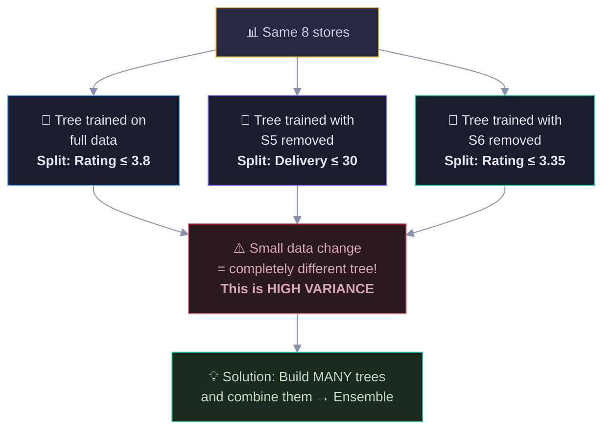

The takeaway: if removing a single store changes your entire model, you can't trust that model. Ensembles fix this by averaging out the instability across many trees.

---

## 3. PART A: BAGGING — Bootstrap Aggregating

### 3.1 Bootstrap Sampling Process

Bagging starts by creating multiple "bootstrap samples" from the original data. Each sample is the same size as the original (8 stores), but drawn **with replacement** — meaning some stores get picked multiple times and others get left out entirely. The left-out stores (called "Out-of-Bag" or OOB) become free test data. The diagram shows three such samples and which stores each one missed.

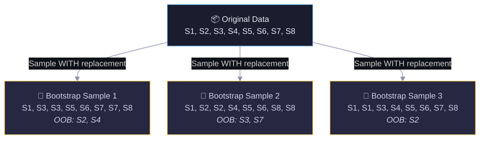

Notice how S3 appears twice in Sample 1 while S2 and S4 are missing. Each sample gives a slightly different "view" of the data — this diversity is what makes bagging work.

### 3.2 Why ~37% Left Out?

Here's the math behind why roughly a third of the data is missing from each bootstrap sample. For any single store, the chance of NOT being picked in one draw is 7/8. Over 8 draws, that compounds to about 34%. This "accident" turns out to be a gift — those left-out stores give us free validation data without needing a separate test set.

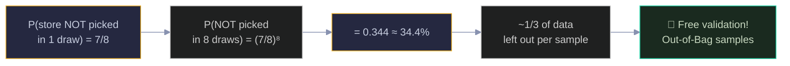

Read left-to-right: probability calculation → practical consequence → the OOB bonus.

### 3.3 Train Independent Trees

Each bootstrap sample produces a different decision tree. Because the training data differs, each tree learns different split rules — Tree 1 splits on Rating ≤ 3.25, Tree 2 on Rating ≤ 3.8, Tree 3 on Delivery ≤ 30. This diversity is intentional. The diagram shows the full tree structure for each, including which stores land in each leaf.

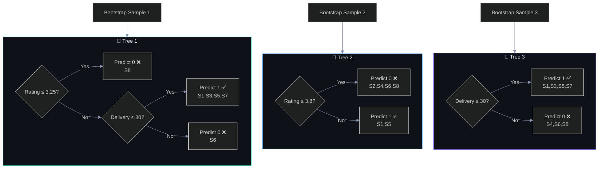

Key observation: Tree 1 is deeper (2 levels) while Trees 2 and 3 are stumps (1 level). Different data → different tree structures. When we combine them, the individual quirks cancel out.

### 3.4 Aggregation — Majority Vote

Now we see bagging's payoff: a new store arrives and we run it through all 3 trees. Each tree independently predicts 0 or 1, then we take the majority vote. This diagram traces a clear-cut case — Rating=3.6, Delivery=32 — where all 3 trees agree on "Not Successful." Unanimous agreement = high confidence.

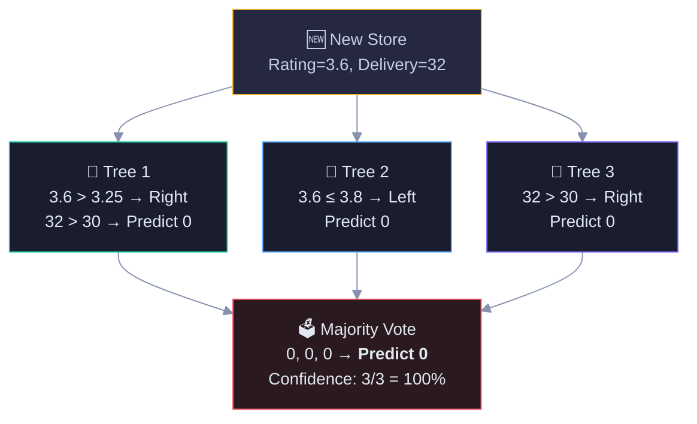

Follow the arrows: the new store enters at the top, each tree traces its own decision path, and the votes converge at the bottom. All three say 0 → strong prediction.

### 3.5 Another Prediction — Borderline Case

This is where ensembles really shine. Rating=3.9 is right on the edge — Tree 2 says "Successful" (because 3.9 > 3.8) while Trees 1 and 3 say "Not Successful." The majority wins 2-to-1. Notice the confidence drops to 67% — the ensemble is telling us "I'm less sure about this one." A single tree would give you a hard yes or no with no nuance.

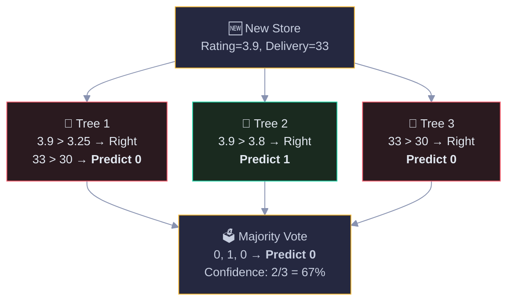

The color coding helps: red nodes voted 0, green voted 1. The disagreement between trees is visible at a glance — that's the ensemble expressing uncertainty.

---

## 4. Why Bagging Works — Variance Reduction

**Why variance reduction matters:** A single decision tree has high variance — train it on slightly different data and you get a completely different tree (we saw this in section 2.4). The mathematical insight behind bagging is elegant: if you average B independent estimates, each with variance σ², the average has variance σ²/B. More trees = lower variance. But there's a catch — bootstrap samples aren't fully independent. They share about 63% of their data, so the trees are correlated with some factor ρ. The true variance formula is: Var = ρσ² + (1-ρ)σ²/B. As B→∞, the second term vanishes and variance approaches ρσ² — you can never go below this floor no matter how many trees you add. This is exactly why Random Forest adds feature randomness on top of bagging: to reduce ρ (the correlation between trees), which lowers that variance floor.

Here's the mathematical reason bagging works. A single tree has high variance — its error formula includes a big "Variance" term. When you average B trees, that variance term gets divided by B. The catch: this only works perfectly if the trees are uncorrelated. In practice, trees trained on bootstrap samples are somewhat correlated (they see similar data), so variance reduction is limited by the correlation factor ρ.

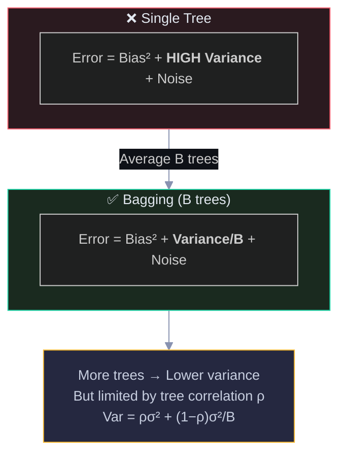

The arrow from red (bad) to green (good) shows the improvement. The yellow note at the bottom is the key formula — as B grows, variance shrinks, but it can never go below ρσ² because the trees share some correlation.

### 4.1 Bagging vs Random Forest

This is the natural next question: if correlation between trees limits variance reduction, how do we reduce that correlation? Random Forest's answer: at each split, only let the tree see a random subset of features (typically √p features). This forces trees to use different features, making them more diverse. The diagram shows this progression from Bagging → Random Forest → better generalization.

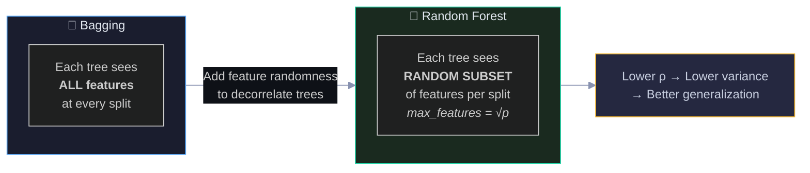

Read left-to-right: Bagging is good, but Random Forest is better because it adds one more layer of randomness to break the correlation between trees.

---

## 5. PART B: BOOSTING

### 5.1 Bagging vs Boosting — Architecture

This is the most important architectural difference to understand. Bagging trains all trees at the same time (parallel) — they don't know about each other. Boosting trains them one after another (sequential) — each new stump receives the errors from the previous one and specifically tries to fix them. The diagram shows these two patterns side by side.

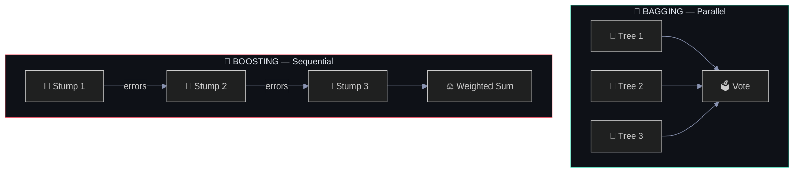

In bagging (top), all arrows point independently to the vote box. In boosting (bottom), arrows chain from one stump to the next — the "errors" labels on the arrows are the key: each model only sees what the previous one got wrong.

### 5.2 The Boosting Analogy

A real-world way to think about it. Bagging is like asking 3 independent tutors for advice and averaging their answers. Boosting is like a relay of tutors — Tutor 1 teaches you the basics, Tutor 2 focuses specifically on what you still don't understand, and Tutor 3 polishes the remaining gaps. Each tutor builds on the previous one's work.

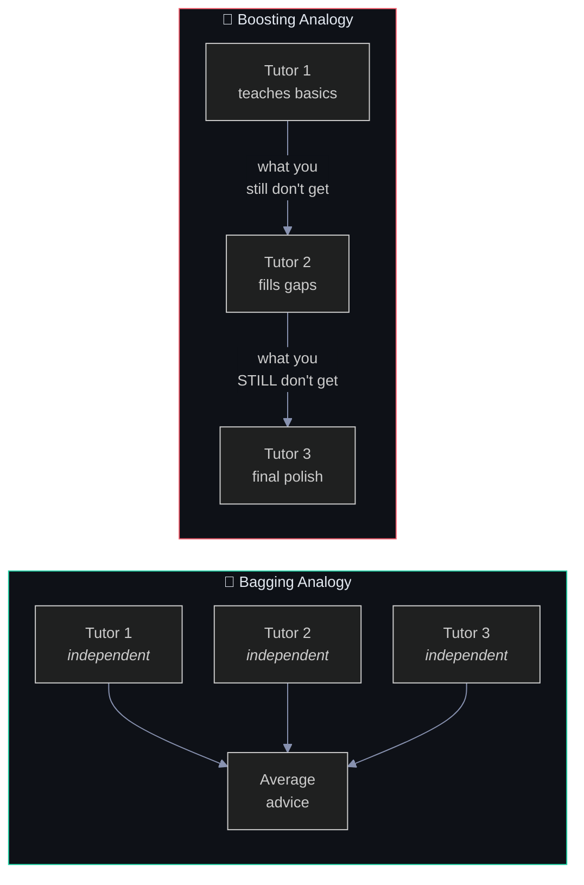

The arrow labels in the boosting analogy ("what you still don't get") are the residuals/errors being passed forward. This is the core mechanism that makes boosting progressively better.

---

## 6. AdaBoost — Step by Step

### 6.1 Initialize Equal Weights

AdaBoost starts by giving every data point equal importance. Each of our 8 stores gets weight = 1/8 = 0.125. The diagram shows all 8 stores with identical blue borders and identical weights — nobody is special yet. This changes dramatically after the first stump makes mistakes.

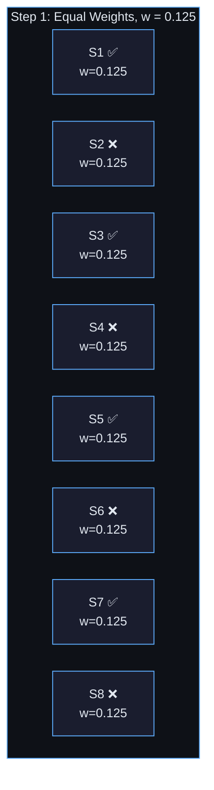

All nodes are the same size and color — equal weight means equal importance. Compare this to section 6.4 where S5 explodes in weight after being misclassified.

### 6.2 Train Stump 1 — With Modified S5 (Rating=3.7)

The first weak learner (a "stump" — a tree with just one split) tries to separate the data. To make this example interesting, we pretend S5 has Rating=3.7 instead of 4.1, making it a borderline case. The stump splits at Rating ≤ 3.8, which correctly classifies 7 stores but gets S5 wrong (it has Rating=3.7 so it falls on the "failure" side, but it's actually successful). The weighted error is just 0.125 (one store wrong × its weight).

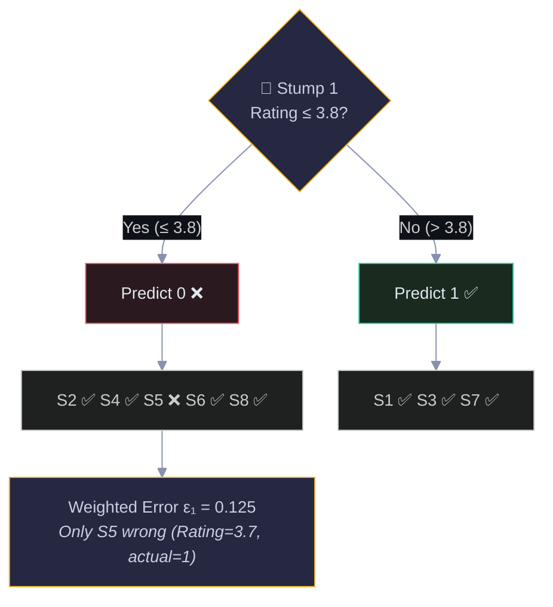

Follow the tree: the diamond is the split question, left branch = "yes" (predict failure), right branch = "no" (predict success). The ✅/❌ marks show which individual predictions were correct. S5 is the only mistake.

### 6.3 Compute Stump Weight α

**Why we need α:** In AdaBoost, not all stumps are equally good. A stump that's barely better than random guessing shouldn't have the same vote as one that's nearly perfect. The formula α = 0.5 × ln((1-ε)/ε) converts the error rate into a voting weight, and it comes from minimizing the exponential loss function. The mapping is elegant: when ε=0 (perfect classifier), α→∞ (infinite weight — trust it completely). When ε=0.5 (random guessing), α=0 (no weight — ignore it). When ε>0.5 (worse than random), α<0 (inverted vote — flip its predictions). This ensures better stumps automatically get more influence in the final ensemble, and truly bad stumps get their predictions reversed.

The error ε₁ = 0.125 comes from the previous step: Stump 1 misclassified 1 out of 8 stores (S5), and each store has weight 1/8 = 0.125. So the weighted error = 1 × 0.125 = 0.125 (one wrong store times its weight).

Now we calculate how much "say" this stump gets in the final vote. The formula α = 0.5 × ln((1-ε)/ε) converts the error rate into a weight. Lower error → higher α → more influence. Our stump had ε=0.125 (pretty good), so it gets α=0.973 (strong voice). A stump that's barely better than random (ε≈0.5) would get α≈0 (no voice).

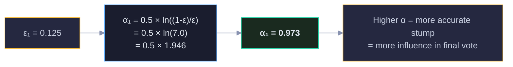

Read left-to-right: error rate → formula → result → interpretation. The green color on the result node signals "this is a good stump."

### 6.4 Update Sample Weights

This is the heart of AdaBoost. After Stump 1 misclassifies S5, we dramatically increase S5's weight (from 0.125 to 0.500) and decrease everyone else's. The diagram shows the before/after transformation. S5 now holds 50% of the total weight — it's screaming "PAY ATTENTION TO ME!" The next stump has no choice but to get S5 right, because getting it wrong would mean 50% error.

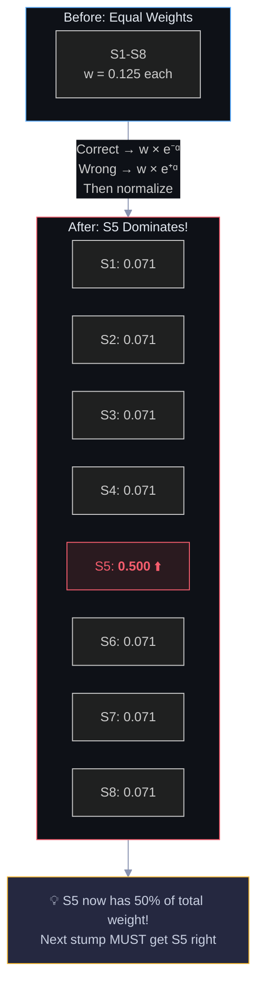

The visual contrast tells the story: the "Before" box is calm and uniform, the "After" box has S5 glowing red while everything else shrinks. The arrow label shows the exact update formulas (multiply by e⁻ᵅ for correct, e⁺ᵅ for wrong, then normalize).

### 6.5 Train Stump 2 — Focuses on S5

With S5 holding 50% of the weight, the algorithm finds a new split that gets S5 right. It picks Delivery ≤ 30 — S5 has Delivery=25, which falls on the "success" side. This stump uses a completely different feature than Stump 1 (Delivery instead of Rating), showing how boosting naturally explores different aspects of the data to fix specific mistakes.

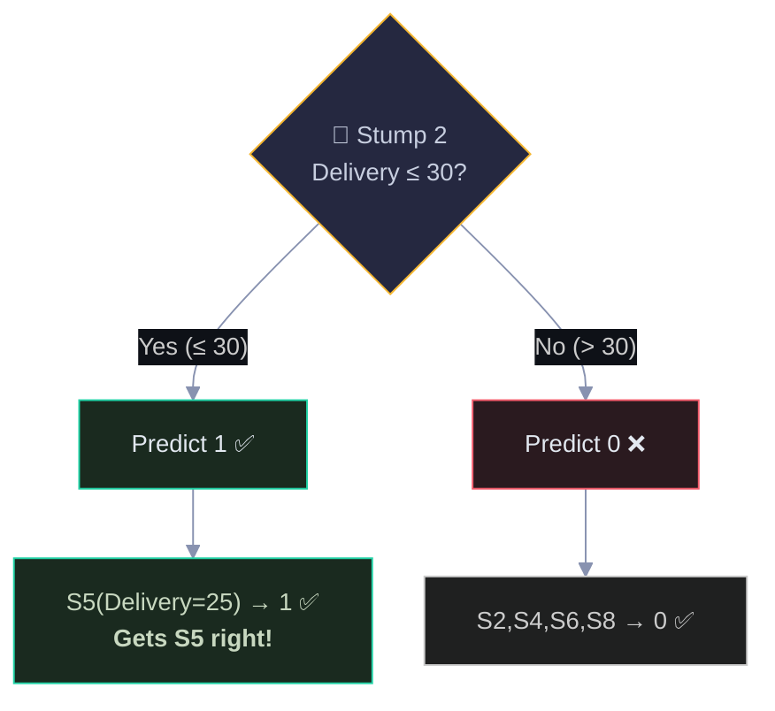

The green highlight on "Gets S5 right!" is the payoff — the weight update from 6.4 forced this stump to prioritize S5, and it succeeded.

### 6.6 Final AdaBoost Prediction

Now both stumps vote on a new store, but their votes are weighted by their α values (accuracy). Stump 1 says "Not Successful" (Rating=3.7 ≤ 3.8) with weight 0.973. Stump 2 says "Successful" (Delivery=22 ≤ 30) with weight α₂. If α₂ > 0.973, the positive vote wins. The final prediction is the sign of the weighted sum — this is how AdaBoost combines weak learners into a strong one.

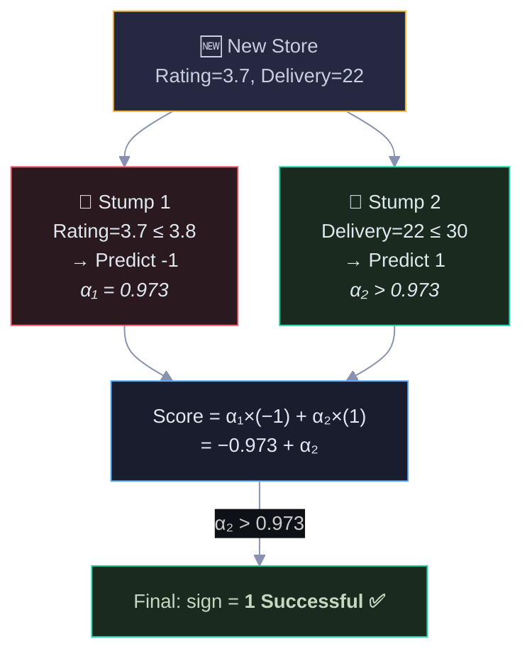

The two stumps disagree (red vs green), but the weighted combination resolves the conflict. The blue "Combine" node shows the math, and the green "Final" node shows the outcome. This is the power of boosting: individually weak models that together make strong predictions.

---

## 7. Gradient Boosting — Fit Residuals Sequentially

### 7.1 The Gradient Boosting Flow

Unlike AdaBoost (which reweights samples), Gradient Boosting works by fitting each new tree to the **residuals** (errors) of the current model. The diagram below shows the full loop: start with a simple prediction (the mean), compute how wrong it is for each store, train a tree to predict those errors, add a small fraction (η) of that tree's predictions to the model, then repeat. Each cycle shrinks the residuals until they approach zero.

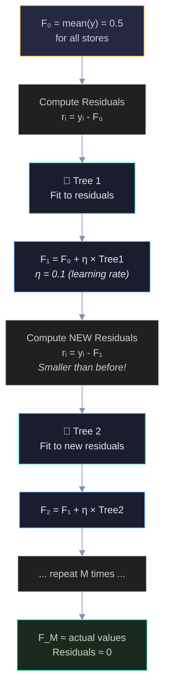

Follow the flow top-to-bottom: yellow = starting point, green = tree fitting, blue = model update, and the cycle repeats. The learning rate η=0.1 means we only add 10% of each tree's prediction — small steps prevent overfitting.

### 7.2 Residuals Shrinking Over Iterations

This diagram shows the key insight of gradient boosting: residuals get smaller with each iteration. We start with residuals of ±0.5 (the model is way off). After Tree 1, they shrink to ±0.45. After Tree 2, ±0.405. After 100 trees, they're essentially zero. The color progression from red → yellow → blue → green visually represents the model getting better.

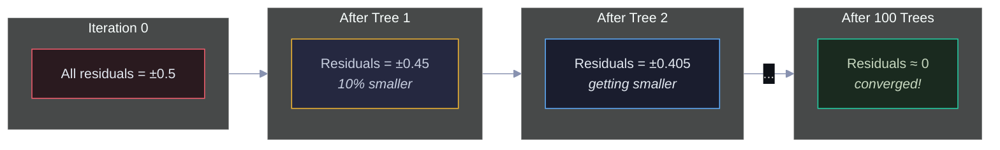

The "10% smaller" note on each step comes from the learning rate η=0.1. With η=0.3, residuals would shrink faster (30% per step) but risk overfitting. This is the bias-variance tradeoff in action.

### 7.3 Gradient Boosting — Detailed Data Flow (Iteration 1)

This zooms into one complete iteration. On the left, we see the residuals for all 8 stores — green for positive residuals (model underpredicts, actual=1) and red for negative (model overpredicts, actual=0). The tree learns to split these into two groups. Then we update predictions by adding η × tree output. The check at the bottom confirms all predictions moved in the right direction.

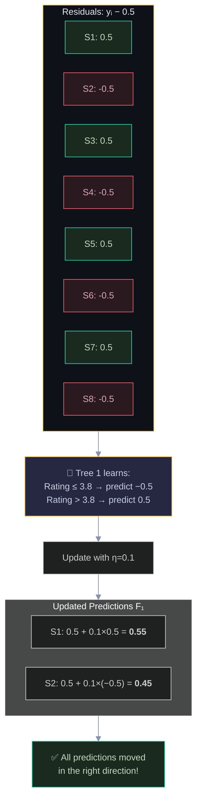

The color coding in the residuals box is important: green nodes (S1,S3,S5,S7) have positive residuals (need to go UP), red nodes (S2,S4,S6,S8) have negative residuals (need to go DOWN). The tree learns exactly this pattern. After the update, S1 moves from 0.5 → 0.55 (closer to 1) and S2 moves from 0.5 → 0.45 (closer to 0).

---

## 8. Bagging vs Boosting — Head to Head

This side-by-side comparison is the summary you'd draw on a whiteboard in an interview. The left box (green border) lists Bagging's characteristics, the right box (red border) lists Boosting's. The key contrast: Bagging reduces variance through parallel independent models, Boosting reduces bias through sequential error-correcting models. Bagging is safer (robust to noise), Boosting is more powerful (but can overfit).

```mermaid
%%{init: {'theme': 'dark', 'themeVariables': {'darkMode': true, 'background': '#0e1117', 'primaryColor': '#1a1d2e', 'primaryTextColor': '#e2e8f0', 'primaryBorderColor': '#2d3148', 'lineColor': '#8892b0', 'secondaryColor': '#252840', 'tertiaryColor': '#1a1d2e', 'fontSize': '14px', 'edgeLabelBackground': '#0e1117'}, 'flowchart': {'nodeSpacing': 30, 'rankSpacing': 40, 'padding': 15, 'htmlLabels': true}}}%%
graph TD
    subgraph COMPARE["⚔️ Bagging vs Boosting"]
        direction TB

        subgraph BAG_SIDE["🎒 BAGGING"]
            B1["Training: Parallel ⚡"]
            B2["Reduces: VARIANCE"]
            B3["Base learners: Full trees"]
            B4["Weights: Equal vote"]
            B5["Overfitting: Low risk"]
            B6["Noise: Robust 💪"]
        end

        subgraph BOOST_SIDE["🚀 BOOSTING"]
            O1["Training: Sequential 🔗"]
            O2["Reduces: BIAS"]
            O3["Base learners: Stumps/shallow"]
            O4["Weights: By accuracy"]
            O5["Overfitting: Higher risk ⚠️"]
            O6["Noise: Sensitive 🎯"]
        end
    end

    style BAG_SIDE fill:#0e1117,stroke:#22d3a7,color:#e2e8f0
    style BOOST_SIDE fill:#0e1117,stroke:#f45d6d,color:#e2e8f0
    style COMPARE fill:#0e1117,stroke:#f5b731,color:#e2e8f0
```

Read each row as a comparison pair: B1↔O1 (parallel vs sequential), B2↔O2 (variance vs bias), etc. This is the most common interview question about ensemble methods.

### 8.1 When to Use Which?

A practical decision flowchart. Start at the yellow diamond and follow the path that matches your situation. Noisy data with limited time? Go Bagging (Random Forest). Clean data where you need maximum accuracy? Go Boosting (XGBoost). Not sure? Start with Random Forest as a baseline, then try XGBoost and compare.

```mermaid
%%{init: {'theme': 'dark', 'themeVariables': {'darkMode': true, 'background': '#0e1117', 'primaryColor': '#1a1d2e', 'primaryTextColor': '#e2e8f0', 'primaryBorderColor': '#2d3148', 'lineColor': '#8892b0', 'secondaryColor': '#252840', 'tertiaryColor': '#1a1d2e', 'fontSize': '14px', 'edgeLabelBackground': '#0e1117'}, 'flowchart': {'nodeSpacing': 30, 'rankSpacing': 40, 'padding': 15, 'htmlLabels': true}}}%%
graph TD
    Q{"What's your<br/>situation?"} -->|"Noisy data<br/>Limited tuning time<br/>Need robustness"| BAG["🎒 Use Bagging<br/>(Random Forest)<br/><i>Set it and forget it</i>"]
    Q -->|"Clean data<br/>Max performance needed<br/>Time to tune"| BOOST["🚀 Use Boosting<br/>(XGBoost, LightGBM)<br/><i>Kaggle winner</i>"]
    Q -->|"Not sure"| START["Start with Random Forest<br/>Then try XGBoost<br/>Compare on validation set"]

    style Q fill:#252840,stroke:#f5b731,color:#c8cfe0
    style BAG fill:#1a2a1f,stroke:#22d3a7,color:#c8d8c0
    style BOOST fill:#2a1a1f,stroke:#f45d6d,color:#d8a8b8
    style START fill:#1a1d2e,stroke:#5eaeff,color:#e2e8f0
```

The "Not sure" path (blue) is the most practical advice for real-world projects — always start simple and compare.

---

## 9. Out-of-Bag (OOB) Error — Free Validation

Remember from section 3.2 that ~37% of data is left out of each bootstrap sample? Those left-out stores become free test data. This diagram shows how: Tree 1 never saw S2 and S4 during training, so we test it on them. Tree 2 never saw S3 and S7, so we test on those. Averaging the error across all these OOB predictions gives us a validation score without ever needing a separate test set. It's like getting cross-validation for free.

```mermaid
%%{init: {'theme': 'dark', 'themeVariables': {'darkMode': true, 'background': '#0e1117', 'primaryColor': '#1a1d2e', 'primaryTextColor': '#e2e8f0', 'primaryBorderColor': '#2d3148', 'lineColor': '#8892b0', 'secondaryColor': '#252840', 'tertiaryColor': '#1a1d2e', 'fontSize': '14px', 'edgeLabelBackground': '#0e1117'}, 'flowchart': {'nodeSpacing': 30, 'rankSpacing': 40, 'padding': 15, 'htmlLabels': true}}}%%
graph TD
    subgraph OOB_FLOW["🎁 OOB: Free Validation"]
        T1["🌳 Tree 1<br/>Trained on: S1,S3,S3,S5,S6,S7,S7,S8"] -->|"OOB: S2,S4"| P1["Predict S2→0 ✅<br/>Predict S4→0 ✅"]
        T2["🌳 Tree 2<br/>Trained on: S1,S2,S2,S4,S5,S6,S8,S8"] -->|"OOB: S3,S7"| P2["Predict S3→1 ✅<br/>Predict S7→1 ✅"]
    end

    P1 --> RESULT["OOB Error = 0/4 = 0%<br/><i>No separate test set needed!</i>"]
    P2 --> RESULT

    style OOB_FLOW fill:#0e1117,stroke:#22d3a7,color:#e2e8f0
    style RESULT fill:#1a2a1f,stroke:#22d3a7,color:#c8d8c0
```

The arrow labels ("OOB: S2,S4") show which stores each tree was tested on. All predictions are correct in this example (0% error), but with real data you'd see some mistakes — that error rate is your OOB estimate of generalization performance.

---

## 10. Complete Algorithm Flowcharts

These three flowcharts are the formal algorithms you'd implement in code. Each one follows the standard flowchart convention: rounded boxes = start/end, rectangles = operations, diamonds = decisions, arrows = flow direction.

### 10.1 Bagging Algorithm

The bagging loop: create B bootstrap samples, train a tree on each, then aggregate. The diamond at the bottom asks "classification or regression?" because the aggregation method differs — majority vote for classes, average for numbers. This is the algorithm behind `sklearn.ensemble.BaggingClassifier`.

```mermaid
%%{init: {'theme': 'dark', 'themeVariables': {'darkMode': true, 'background': '#0e1117', 'primaryColor': '#1a1d2e', 'primaryTextColor': '#e2e8f0', 'primaryBorderColor': '#2d3148', 'lineColor': '#8892b0', 'secondaryColor': '#252840', 'tertiaryColor': '#1a1d2e', 'fontSize': '14px', 'edgeLabelBackground': '#0e1117'}, 'flowchart': {'nodeSpacing': 30, 'rankSpacing': 40, 'padding': 15, 'htmlLabels': true}}}%%
flowchart TD
    START(["START"]) --> INPUT["Input: Dataset D, B trees"]
    INPUT --> LOOP["For b = 1 to B:"]
    LOOP --> BOOTSTRAP["Draw bootstrap sample Dᵇ<br/>(n samples with replacement)"]
    BOOTSTRAP --> TRAIN["Train tree Tᵇ on Dᵇ"]
    TRAIN --> CHECK{"b < B?"}
    CHECK -->|Yes| LOOP
    CHECK -->|No| PREDICT["New input x arrives"]
    PREDICT --> COLLECT["Get predictions from all B trees"]
    COLLECT --> AGG{"Classification<br/>or Regression?"}
    AGG -->|Classification| VOTE["Majority Vote<br/>ŷ = mode(T₁(x),...,Tᵦ(x))"]
    AGG -->|Regression| AVG["Average<br/>ŷ = mean(T₁(x),...,Tᵦ(x))"]
    VOTE --> DONE(["OUTPUT ŷ"])
    AVG --> DONE

    style START fill:#252840,stroke:#f5b731,color:#c8cfe0
    style DONE fill:#1a2a1f,stroke:#22d3a7,color:#c8d8c0
    style BOOTSTRAP fill:#1a1d2e,stroke:#5eaeff,color:#e2e8f0
    style TRAIN fill:#1a1d2e,stroke:#22d3a7,color:#e2e8f0
```

### 10.2 AdaBoost Algorithm

The AdaBoost loop has more steps: train a weak learner, measure its weighted error, compute its voting weight α, then update sample weights (upweight mistakes, downweight correct). The loop repeats T times. The final prediction is a weighted vote where better stumps get more say. This is the algorithm behind `sklearn.ensemble.AdaBoostClassifier`.

```mermaid
%%{init: {'theme': 'dark', 'themeVariables': {'darkMode': true, 'background': '#0e1117', 'primaryColor': '#1a1d2e', 'primaryTextColor': '#e2e8f0', 'primaryBorderColor': '#2d3148', 'lineColor': '#8892b0', 'secondaryColor': '#252840', 'tertiaryColor': '#1a1d2e', 'fontSize': '14px', 'edgeLabelBackground': '#0e1117'}, 'flowchart': {'nodeSpacing': 30, 'rankSpacing': 40, 'padding': 15, 'htmlLabels': true}}}%%
flowchart TD
    START(["START"]) --> INIT["Initialize weights<br/>wᵢ = 1/N for all i"]
    INIT --> LOOP["For t = 1 to T:"]
    LOOP --> TRAIN["Train weak learner hₜ<br/>using weighted data"]
    TRAIN --> ERROR["Compute weighted error<br/>εₜ = Σ wᵢ × I(hₜ(xᵢ) ≠ yᵢ)"]
    ERROR --> ALPHA["Compute learner weight<br/>αₜ = 0.5 × ln((1-εₜ)/εₜ)"]
    ALPHA --> UPDATE["Update sample weights<br/>Correct: wᵢ × e⁻ᵅ<br/>Wrong: wᵢ × e⁺ᵅ<br/>Normalize to sum=1"]
    UPDATE --> CHECK{"t < T?"}
    CHECK -->|Yes| LOOP
    CHECK -->|No| FINAL["Final prediction:<br/>F(x) = sign(Σ αₜ × hₜ(x))"]
    FINAL --> DONE(["OUTPUT ŷ"])

    style START fill:#252840,stroke:#f5b731,color:#c8cfe0
    style DONE fill:#1a2a1f,stroke:#22d3a7,color:#c8d8c0
    style INIT fill:#1a1d2e,stroke:#5eaeff,color:#e2e8f0
    style ALPHA fill:#252840,stroke:#f5b731,color:#c8cfe0
    style UPDATE fill:#2a1a1f,stroke:#f45d6d,color:#e2e8f0
```

Notice the red "Update" box — that's the key step where misclassified samples get amplified. The yellow "Alpha" box is where the stump's accuracy determines its voting power.

### 10.3 Gradient Boosting Algorithm

The simplest of the three loops: start with the mean, compute residuals, fit a tree to those residuals, add a fraction (η) of the tree to the model, repeat. No sample weights, no α computation — just residuals and learning rate. This is the algorithm behind `sklearn.ensemble.GradientBoostingClassifier` and the foundation for XGBoost.

```mermaid
%%{init: {'theme': 'dark', 'themeVariables': {'darkMode': true, 'background': '#0e1117', 'primaryColor': '#1a1d2e', 'primaryTextColor': '#e2e8f0', 'primaryBorderColor': '#2d3148', 'lineColor': '#8892b0', 'secondaryColor': '#252840', 'tertiaryColor': '#1a1d2e', 'fontSize': '14px', 'edgeLabelBackground': '#0e1117'}, 'flowchart': {'nodeSpacing': 30, 'rankSpacing': 40, 'padding': 15, 'htmlLabels': true}}}%%
flowchart TD
    START(["START"]) --> INIT["Initialize<br/>F₀(x) = mean(y)"]
    INIT --> LOOP["For m = 1 to M:"]
    LOOP --> RESID["Compute residuals<br/>rᵢ = yᵢ - Fₘ₋₁(xᵢ)"]
    RESID --> FIT["Fit tree hₘ to residuals"]
    FIT --> UPDATE["Update model<br/>Fₘ = Fₘ₋₁ + η × hₘ"]
    UPDATE --> CHECK{"m < M?"}
    CHECK -->|Yes| LOOP
    CHECK -->|No| FINAL["Final model: Fₘ(x)"]
    FINAL --> DONE(["OUTPUT ŷ"])

    style START fill:#252840,stroke:#f5b731,color:#c8cfe0
    style DONE fill:#1a2a1f,stroke:#22d3a7,color:#c8d8c0
    style RESID fill:#2a1a1f,stroke:#f45d6d,color:#e2e8f0
    style FIT fill:#1a1d2e,stroke:#22d3a7,color:#e2e8f0
    style UPDATE fill:#1a1d2e,stroke:#5eaeff,color:#e2e8f0
```

The red "Residuals" box is the error signal, the green "Fit" box is the correction, and the blue "Update" box applies the correction with shrinkage. Compare this to AdaBoost above — gradient boosting is conceptually simpler (no sample weights, no α).

---

## 11. Formula Summary — Visual

All the key formulas organized by algorithm. Each column is one method, and the steps flow top-to-bottom in the order you'd execute them. Use this as a quick-reference cheat sheet — if you can trace through each column, you understand the algorithm.

```mermaid
%%{init: {'theme': 'dark', 'themeVariables': {'darkMode': true, 'background': '#0e1117', 'primaryColor': '#1a1d2e', 'primaryTextColor': '#e2e8f0', 'primaryBorderColor': '#2d3148', 'lineColor': '#8892b0', 'secondaryColor': '#252840', 'tertiaryColor': '#1a1d2e', 'fontSize': '14px', 'edgeLabelBackground': '#0e1117'}, 'flowchart': {'nodeSpacing': 30, 'rankSpacing': 40, 'padding': 15, 'htmlLabels': true}}}%%
graph TD
    subgraph BAGGING_FORMULAS["🎒 Bagging Formulas"]
        BF1["1. Bootstrap: Draw n with replacement"]
        BF2["2. Train B independent trees"]
        BF3["3. Classification → majority vote"]
        BF4["4. Regression → average"]
        BF5["5. OOB: ~37% left out per tree"]
        BF1 --> BF2 --> BF3
        BF2 --> BF4
        BF2 --> BF5
    end

    subgraph ADABOOST_FORMULAS["🚀 AdaBoost Formulas"]
        AF1["1. wᵢ = 1/N"]
        AF2["2. εₜ = Σ wᵢ × I(wrong)"]
        AF3["3. αₜ = 0.5 × ln((1-ε)/ε)"]
        AF4["4. w_new = w × exp(±α)"]
        AF5["5. F(x) = sign(Σ αₜhₜ(x))"]
        AF1 --> AF2 --> AF3 --> AF4 --> AF5
    end

    subgraph GB_FORMULAS["📈 Gradient Boosting Formulas"]
        GF1["1. F₀ = mean(y)"]
        GF2["2. rᵢ = yᵢ - Fₘ₋₁(xᵢ)"]
        GF3["3. Fit hₘ to residuals"]
        GF4["4. Fₘ = Fₘ₋₁ + η × hₘ"]
        GF5["5. Repeat M times"]
        GF1 --> GF2 --> GF3 --> GF4 --> GF5
    end

    style BAGGING_FORMULAS fill:#0e1117,stroke:#22d3a7,color:#e2e8f0
    style ADABOOST_FORMULAS fill:#0e1117,stroke:#f45d6d,color:#e2e8f0
    style GB_FORMULAS fill:#0e1117,stroke:#5eaeff,color:#e2e8f0
```

Green = Bagging (simple, parallel), Red = AdaBoost (weight-based, sequential), Blue = Gradient Boosting (residual-based, sequential). Notice Bagging branches at step 2 (vote vs average), while AdaBoost and Gradient Boosting are strictly linear chains.

---

## 12. Interview Decision Tree 🎯

Use this as a quick lookup when preparing for ML interviews. Start at the top question and follow the "Yes" path to get a concise answer. Each green answer box contains the key points you'd say in an interview — short, precise, and formula-backed.

```mermaid
%%{init: {'theme': 'dark', 'themeVariables': {'darkMode': true, 'background': '#0e1117', 'primaryColor': '#1a1d2e', 'primaryTextColor': '#e2e8f0', 'primaryBorderColor': '#2d3148', 'lineColor': '#8892b0', 'secondaryColor': '#252840', 'tertiaryColor': '#1a1d2e', 'fontSize': '14px', 'edgeLabelBackground': '#0e1117'}, 'flowchart': {'nodeSpacing': 30, 'rankSpacing': 40, 'padding': 15, 'htmlLabels': true}}}%%
graph TD
    Q1{"Asked about<br/>Bagging vs Boosting?"} -->|Yes| A1["Bagging = parallel, reduces variance<br/>Boosting = sequential, reduces bias"]
    Q1 -->|No| Q2{"Asked about<br/>why bagging works?"}
    Q2 -->|Yes| A2["Averaging B trees: Var = σ²/B<br/>Bootstrap creates uncorrelated trees"]
    Q2 -->|No| Q3{"Asked about<br/>AdaBoost?"}
    Q3 -->|Yes| A3["Upweight misclassified samples<br/>w × e⁺ᵅ for wrong, w × e⁻ᵅ for correct<br/>α = 0.5 × ln((1-ε)/ε)"]
    Q3 -->|No| Q4{"Asked about<br/>learning rate?"}
    Q4 -->|Yes| A4["Shrinkage parameter 0 < η ≤ 1<br/>Smaller η = more trees needed<br/>but better generalization"]
    Q4 -->|No| A5["Review the formulas above! 📚"]

    style Q1 fill:#252840,stroke:#f5b731,color:#c8cfe0
    style Q2 fill:#252840,stroke:#f5b731,color:#c8cfe0
    style Q3 fill:#252840,stroke:#f5b731,color:#c8cfe0
    style Q4 fill:#252840,stroke:#f5b731,color:#c8cfe0
    style A1 fill:#1a2a1f,stroke:#22d3a7,color:#c8d8c0
    style A2 fill:#1a2a1f,stroke:#22d3a7,color:#c8d8c0
    style A3 fill:#1a2a1f,stroke:#22d3a7,color:#c8d8c0
    style A4 fill:#1a2a1f,stroke:#22d3a7,color:#c8d8c0
    style A5 fill:#1a1d2e,stroke:#5eaeff,color:#e2e8f0
```

Yellow diamonds = interview questions, green boxes = your answers. The "No" path cascades to the next question. If you reach the blue box at the bottom, it means you got an unusual question — go back to the formula summary in section 11.

---

> 💡 **How to view these diagrams:**
> - **GitHub**: Renders Mermaid natively — just push this file
> - **VS Code**: Install "Markdown Preview Mermaid Support" extension
> - **Obsidian**: Built-in Mermaid support
> - **Online**: Paste diagrams at [mermaid.live](https://mermaid.live)
