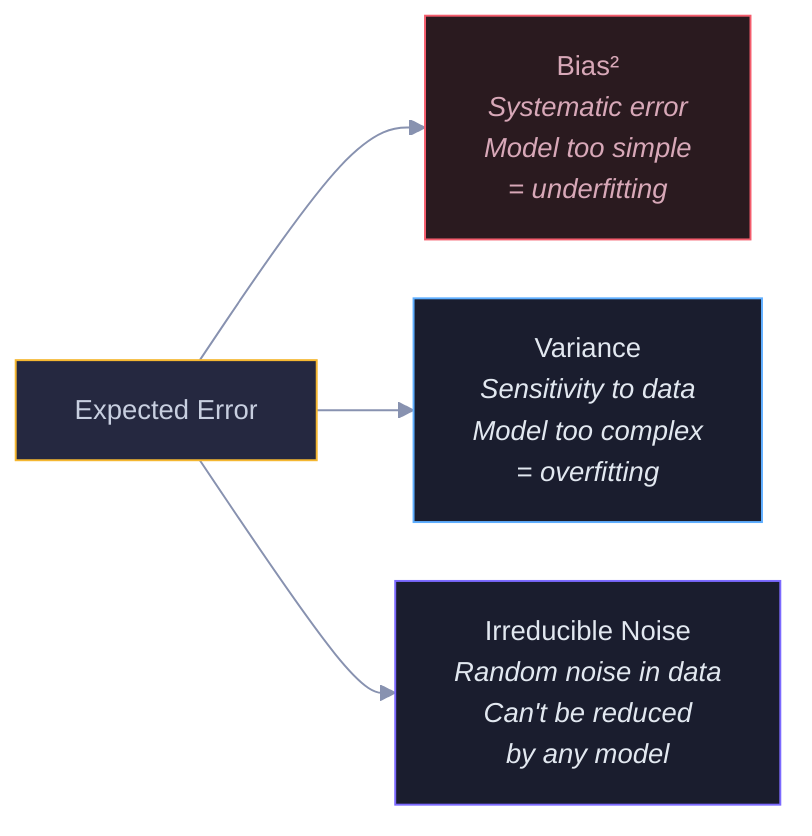
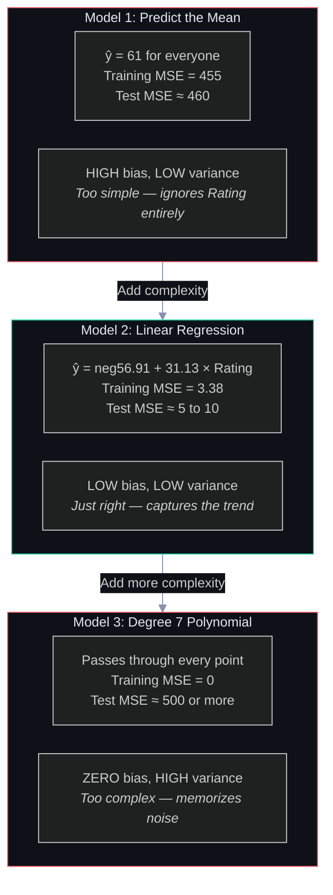
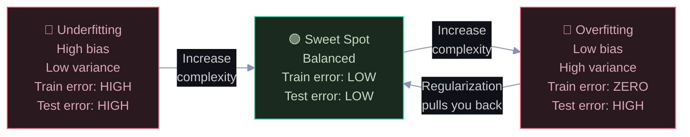
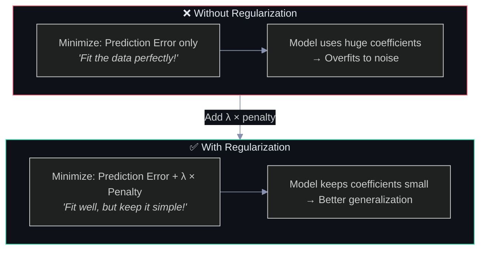
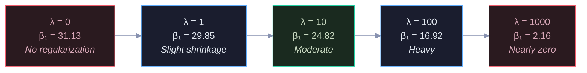
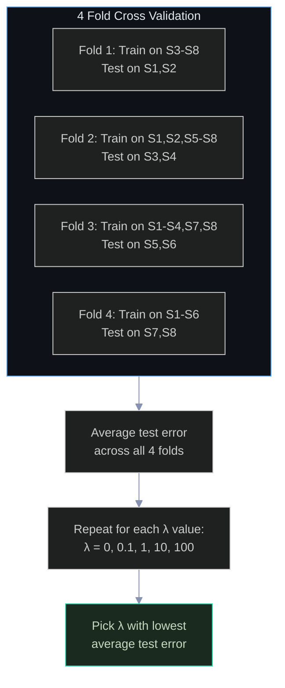
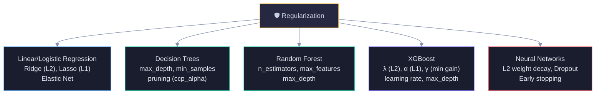
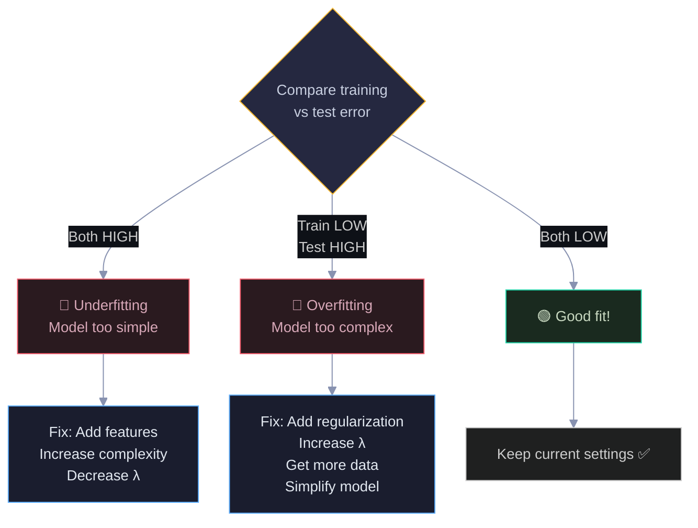
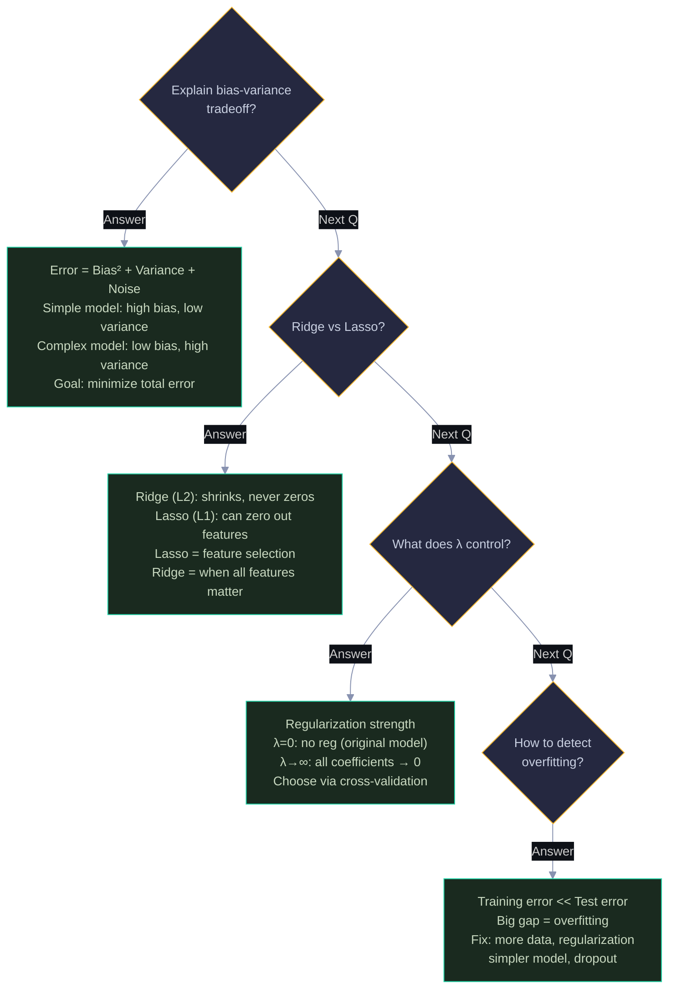

# Bias, Variance & Regularization: Visual Guide with Mermaid Diagrams

> Visual companion to `Documents/Bias_Variance_Regularization_Complete_Guide.md`.
> Every diagram has explanatory text — what it shows, why it matters, and how to read it.

---

## 1. The Dartboard Analogy

Bias and variance are best understood through the dartboard analogy. Each quadrant shows a different combination. The goal is bottom-left: low bias (on target) AND low variance (tight cluster).

```
  LOW VARIANCE              HIGH VARIANCE
  (consistent)              (scattered)

  ╭───────╮                 ╭───────╮
  │ ●●●   │                 │●     ●│
  │ ●●●   │                 │   ◎   │         ◎ = bullseye (true answer)
  │   ◎   │  HIGH BIAS      │ ●   ● │         ● = model predictions
  │       │                 │  ●  ● │
  ╰───────╯                 ╰───────╯
  Consistently wrong        Scattered around target

  ╭───────╮                 ╭───────╮
  │       │                 │●      │
  │  ●◎●  │                 │    ●  │
  │  ●●   │  LOW BIAS       │   ◎   │  HIGH BIAS
  │       │                 │ ●    ●│  HIGH VARIANCE
  ╰───────╯                 ╰───────╯
  THE GOAL! ✅               Worst case ❌
```

### 1.1 The Bias-Variance Decomposition

Every model's error can be broken into three parts. The diagram shows the formula and what each part means. You can reduce bias and variance through model choices, but irreducible noise is baked into the data.



Red = bias (fixable by making model more complex). Blue = variance (fixable by making model simpler or using ensembles). Purple = noise (unfixable). The tradeoff: reducing bias increases variance and vice versa.

---

## 2. Three Models — Underfitting to Overfitting

We fit three models to our pizza store revenue data to demonstrate the spectrum. The diagram shows each model's complexity, training error, and test error side by side.



Red borders = bad models (underfitting or overfitting). Green border = the sweet spot. Notice the pattern: training MSE always decreases with complexity (455 → 3.38 → 0), but test MSE first decreases then increases (460 → 5-10 → 500+). The gap between training and test error is the overfitting signal.

---

## 3. The Bias-Variance Tradeoff Curve

This is the most important visualization in all of ML. As model complexity increases, bias decreases but variance increases. Total error is U-shaped — the minimum is the sweet spot.

```
  Error
    │
    │╲                              ╱
    │ ╲  Bias²                     ╱ Variance
    │  ╲                          ╱
    │   ╲                        ╱
    │    ╲         ╭────╮       ╱
    │     ╲       ╱      ╲     ╱
    │      ╲     ╱  Total  ╲  ╱
    │       ╲   ╱   Error   ╲╱
    │        ╲ ╱     (U)    ╱╲
    │         ╳            ╱  ╲
    │        ╱ ╲──────────╱    ╲
    │       ╱
    └──────┬──────┬──────┬──────┬──→ Complexity
         Mean   Linear  Poly-3  Poly-7

    ◀── Underfitting ──▶◀── Sweet Spot ──▶◀── Overfitting ──▶
    ◀── High Bias ─────▶              ◀── High Variance ──▶
```



The bottom arrow is key: regularization moves you LEFT on the complexity spectrum, from overfitting back toward the sweet spot. That's its entire purpose.

---

## 4. What Is Regularization?

Regularization adds a penalty for complexity to the loss function. Without it, the model only cares about fitting the data. With it, the model balances fitting vs simplicity. The diagram shows the general formula.



The λ parameter controls the strength: λ=0 means no regularization (original model), λ=∞ means maximum regularization (all coefficients shrink to zero, predicting the mean). The sweet spot is somewhere in between, found via cross-validation.

---

## 5. Ridge vs Lasso vs Elastic Net

**Why three methods exist:** Ridge (L2) and Lasso (L1) solve different problems. Ridge shrinks all coefficients toward zero but never to exactly zero — it's good when you believe all features matter and just need to prevent any single one from dominating. Lasso can shrink coefficients to exactly zero — it performs automatic feature selection, effectively dropping irrelevant features from the model entirely. The geometric reason for this difference: L1's constraint region is a diamond shape (with corners sitting on the axes), while L2's is a circle (no corners). The loss function's contour lines are more likely to touch the diamond at a corner (where one coefficient = 0) than to touch the circle on an axis — hence Lasso produces sparse solutions. Elastic Net combines both penalties — it selects features like Lasso but handles groups of correlated features better like Ridge. Rule of thumb: use Lasso when you suspect many features are irrelevant, Ridge when most features matter, and Elastic Net when features are correlated with each other.

The three main regularization methods differ in their penalty term. The diagram shows each one's formula, behavior, and when to use it.

```mermaid
%%{init: {'theme': 'dark', 'themeVariables': {'darkMode': true, 'background': '#0e1117', 'primaryColor': '#1a1d2e', 'primaryTextColor': '#e2e8f0', 'primaryBorderColor': '#2d3148', 'lineColor': '#8892b0', 'secondaryColor': '#252840', 'tertiaryColor': '#1a1d2e', 'fontSize': '14px', 'edgeLabelBackground': '#0e1117'}, 'flowchart': {'nodeSpacing': 30, 'rankSpacing': 40, 'padding': 15, 'htmlLabels': true}}}%%
graph TD
    subgraph RIDGE["🔵 Ridge (L2)"]
        R["Penalty = λ × Σβⱼ²<br/><i>Squared coefficients</i>"]
        R --> RB["Shrinks toward 0<br/>but NEVER exactly 0<br/>Keeps all features"]
    end

    subgraph LASSO["🟢 Lasso (L1)"]
        L["Penalty = λ × Σ‖βⱼ‖<br/><i>Absolute coefficients</i>"]
        L --> LB["Can shrink to EXACTLY 0<br/>= Feature selection!<br/>Drops irrelevant features"]
    end

    subgraph ELASTIC["🟡 Elastic Net: L1 and L2"]
        E["Penalty = λ(α×Σ‖βⱼ‖ + (1−α)×Σβⱼ²)<br/><i>Mix of both</i>"]
        E --> EB["Feature selection (like Lasso)<br/>handles correlations (like Ridge)<br/>Best of both worlds"]
    end

    style RIDGE fill:#0e1117,stroke:#5eaeff,color:#e2e8f0
    style LASSO fill:#0e1117,stroke:#22d3a7,color:#e2e8f0
    style ELASTIC fill:#0e1117,stroke:#f5b731,color:#e2e8f0
```



Blue = Ridge (keeps all features, good when all matter). Green = Lasso (drops features, good for feature selection). Yellow = Elastic Net (combines both, good for correlated features). Choose based on whether you need feature selection.

### 5.1 Why L1 Produces Zeros But L2 Doesn't

This is a classic interview question. The geometric explanation: L1's constraint region is a diamond (with corners on axes), L2's is a circle. The loss function's contour lines are more likely to touch the diamond at a corner (where a coefficient = 0) than to touch the circle on an axis.

```
     β₂                    β₂
      │   ╱╲                │   ╭╮
      │  ╱  ╲               │  ╭╯╰╮
      │ ╱ ●  ╲              │ ╭╯ ● ╰╮
  ────╱──────╲────      ────╰╮──────╭╯────
      ╲      ╱              ╰╮    ╭╯
       ╲    ╱                ╰╮  ╭╯
        ╲╱                    ╰╯
   L1 (Diamond)           L2 (Circle)
   ● touches corner       ● touches side
   → β₁ = 0 (sparse!)    → both β ≠ 0 (dense)
```

---

## 6. Effect of λ on Coefficients

As λ increases, coefficients shrink. The diagram shows the progression for our Rating coefficient (β₁) under Ridge regularization — from the full value at λ=0 to nearly zero at λ=1000.



Red at both extremes = bad (no regularization or too much). Green in the middle = sweet spot. The coefficient shrinks from 31.13 → 2.16 as λ goes from 0 to 1000. Cross-validation finds the optimal λ.

---

## 7. Cross-Validation — Choosing λ

**Why cross-validation is necessary:** Training error always prefers λ=0 (no regularization) because regularization intentionally makes the training fit worse in order to improve generalization. So training error is a biased judge — it will always tell you "don't regularize." We need an honest estimate of how the model performs on unseen data. Cross-validation simulates "new data" by holding out part of the training set, training on the rest, and measuring error on the held-out part. By rotating which part is held out (K folds), every data point gets a turn as "unseen" data. The average error across all folds gives an honest estimate of generalization performance. The λ that minimizes this cross-validated error is the one that best balances fitting the data vs keeping the model simple — it's the principled way to choose regularization strength.

You can't use training error to choose λ (it always prefers λ=0). Instead, use K-fold cross-validation: split data into K folds, train on K-1, test on the held-out fold, rotate, and average. The diagram shows the process.



Each fold gets a turn as the test set. This gives an honest estimate of how well the model generalizes. The λ that minimizes average test error is the winner.

---

## 8. Regularization Across ML Models

Regularization isn't just for linear regression — it appears in every ML model. The diagram shows how each model implements it.



The common theme: every method adds a penalty for complexity. The specific mechanism differs (coefficient shrinkage, tree depth limits, dropout), but the goal is always the same — prevent memorization, encourage generalization.

---

## 9. Diagnostic Framework

How to diagnose and fix your model. This decision flowchart tells you what to do based on your training and test errors.



This is the first thing to check after training any model. The gap between training and test error tells you everything: no gap = underfitting or good fit, big gap = overfitting.

---

## 10. Interview Decision Tree 🎯



---

> 💡 **How to view:** GitHub (native), VS Code (Mermaid extension), Obsidian (built-in), or [mermaid.live](https://mermaid.live)
