# Decision Trees: Visual Guide with Mermaid Diagrams

> Visual companion to `Documents/Decision_Trees_Complete_Guide.md`.
> Every diagram has explanatory text — what it shows, why it matters, and how to read it.

---

## 1. What Is a Decision Tree?

A decision tree is a flowchart of yes/no questions that splits data into pure groups. Unlike logistic regression (which draws a single line), a tree creates rectangular regions by asking one question at a time. The diagram below shows the core idea: start at the top, answer a question, follow the branch, repeat until you reach a prediction.

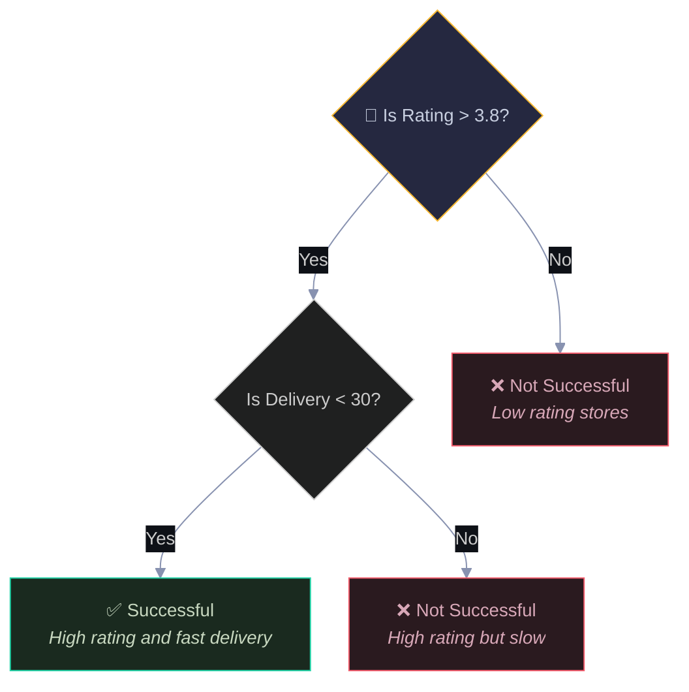

Diamonds = questions (split nodes). Rectangles = predictions (leaf nodes). Green = success, Red = failure. Every data point starts at the top and follows exactly one path down to a leaf.

Why 3.8? The tree algorithm tried every possible threshold (2.95, 3.1, 3.35, 3.8, 4.2, etc.) and found that 3.8 gives the best split — it perfectly separates all successful stores (Rating > 3.8) from all failures (Rating ≤ 3.8). The algorithm discovered this automatically by computing the Gini gain for each candidate.

---

## 2. Our Pizza Store Data

### 2.1 The Data Table

| Store | Rating ⭐ | Delivery 🚚 | Successful? |
|:-----:|:---------:|:-----------:|:-----------:|
| S1    | 4.5       | 20 min      | ✅ Yes (1)  |
| S2    | 3.2       | 45 min      | ❌ No (0)   |
| S3    | 4.8       | 18 min      | ✅ Yes (1)  |
| S4    | 2.9       | 50 min      | ❌ No (0)   |
| S5    | 4.1       | 25 min      | ✅ Yes (1)  |
| S6    | 3.5       | 35 min      | ❌ No (0)   |
| S7    | 4.3       | 22 min      | ✅ Yes (1)  |
| S8    | 3.0       | 40 min      | ❌ No (0)   |

### 2.2 Scatter Plot — The Two Groups

```
  Delivery
  (min)
     55 ┤
        │  ╔══════════════════╗
     50 ┤  ║  ❌ S4 (2.9,50)  ║
     45 ┤  ║  ❌ S2 (3.2,45)  ║    FAILURE ZONE
     40 ┤  ║  ❌ S8 (3.0,40)  ║    Rating < 3.8
     35 ┤  ║  ❌ S6 (3.5,35)  ║
        │  ╚══════════════════╝
     30 ┤ ─ ─ ─ ─ ─ ─ ─ ─ ─ ─ ─ ─ ─ SPLIT BOUNDARY ─ ─
        │                  ╔══════════════════╗
     25 ┤                  ║  ✅ S5 (4.1,25)  ║
     22 ┤                  ║  ✅ S7 (4.3,22)  ║    SUCCESS ZONE
     20 ┤                  ║  ✅ S1 (4.5,20)  ║    Rating > 3.8
     18 ┤                  ║  ✅ S3 (4.8,18)  ║
        │                  ╚══════════════════╝
        └──┬─────┬─────┬─────┬─────┬─────┬──→ Rating
          2.5   3.0   3.5   4.0   4.5   5.0

  A single split at Rating = 3.8 perfectly separates the two groups.
  The tree's job is to FIND this boundary automatically.
```

---

## 3. Measuring Impurity — Gini vs Entropy

**Why we need impurity measures:** The tree needs to decide "is this split good?" To answer that, it needs a number that says "how mixed is this group?" A pure group (all same class) should score 0. A maximally mixed group (50/50) should score the highest. Gini and Entropy are two different ways to compute this number — they measure the same concept (disorder) from different angles.

**Where the formulas come from:** Gini Impurity = 1 - Σpᵢ² comes from probability theory: if you randomly pick two items from a group, what's the chance they're different classes? When all items are the same class, pᵢ² = 1 and Gini = 0 (no chance of a mismatch). When it's 50/50, Gini = 0.5 (maximum chance of mismatch). Entropy = -Σpᵢ log₂(pᵢ) comes from information theory: how many bits of information do you need to describe which class a random item belongs to? A pure group needs 0 bits (you already know), a 50/50 group needs 1 bit (one yes/no question). In practice, both give nearly identical split decisions — sklearn uses Gini by default because it's slightly faster to compute (no logarithm).

The tree needs a way to measure how "mixed" a group is. Two methods exist: Gini Impurity and Entropy. Both equal 0 for pure nodes and reach their maximum for 50/50 splits. The diagram below shows how they compare across different class proportions.

```
  Impurity
  1.0 │          ╱╲  ← Entropy
      │         ╱  ╲
      │        ╱    ╲
  0.5 │───────╱──────╲──── ← Gini (max = 0.5)
      │      ╱   ╲    ╲
      │     ╱     ╲    ╲
      │    ╱       ╲    ╲
  0.0 │───╱─────────╲────╲───
      └───┬─────┬─────┬───→ P(success)
         0.0   0.5   1.0

  Both are 0 at the edges (pure) and max in the middle (50/50).
  Entropy peaks at 1.0, Gini peaks at 0.5.
  In practice, they give nearly identical split decisions.
```

### 3.1 Computing Gini and Entropy for Our Data

Before any split, our data is 4 success + 4 failure = 50/50. This is maximum impurity. The diagram shows the calculation flowing from class proportions to the final impurity score.

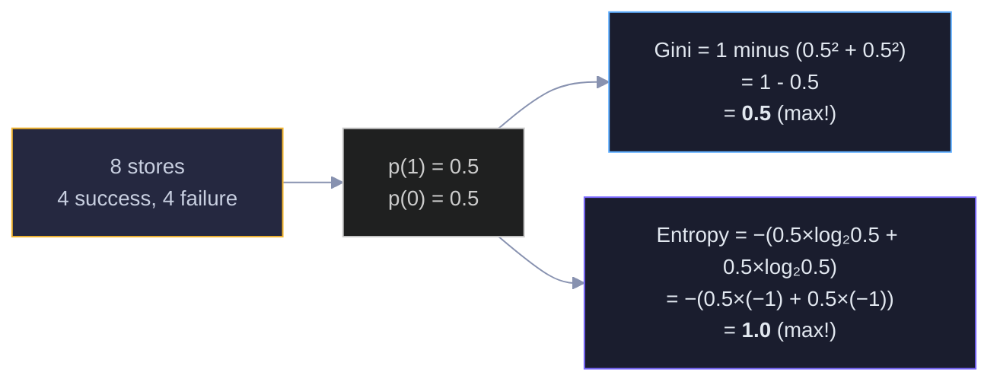

Both metrics confirm: our unsplit data is maximally impure. Any good split should reduce these numbers toward 0.

---

## 4. Finding the Best Split

The tree tries every possible split on every feature and picks the one with the highest "gain" (biggest impurity reduction). This diagram shows three candidate splits and their resulting Gini values. The algorithm compares them all and picks the winner.

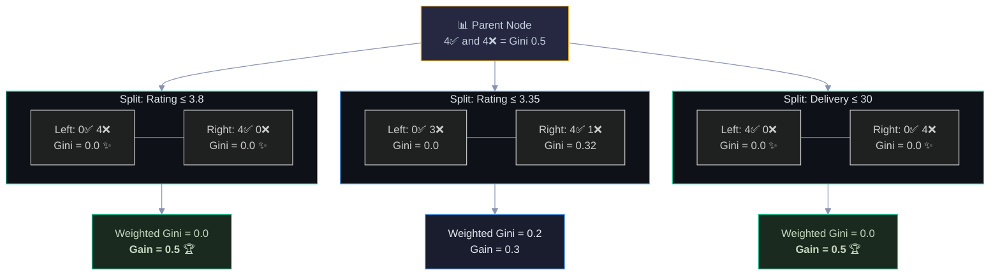

The 🏆 marks the winners. Both "Rating ≤ 3.8" and "Delivery ≤ 30" achieve perfect separation (Gain = 0.5). "Rating ≤ 3.35" is decent (Gain = 0.3) but leaves one failure store (S6) mixed in with the successes. The algorithm picks the first perfect split it finds.

---

## 5. Information Gain — The Selection Criterion

**Why Information Gain:** We need a way to compare splits. A split is good if it reduces impurity — but we need to be precise about how we measure that reduction. Information Gain = parent impurity minus the weighted average of children's impurity. The weighting by child size is critical — a split that puts 7 items left and 1 right should weight the left child more heavily than the right. Without this weighting, the tree could game the metric by creating tiny pure leaves with just one data point (a form of overfitting). The weighted average ensures the tree considers the overall quality of the split, not just whether it can isolate a single point.

Information Gain is simply: how much did impurity decrease after the split? The diagram shows the formula and the calculation for our best split. Parent impurity minus weighted child impurity = the gain.

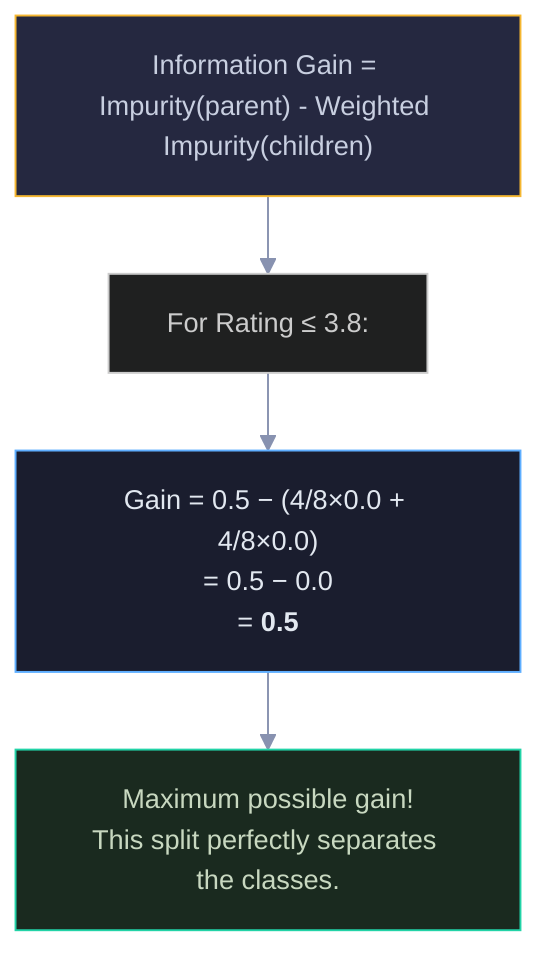

The weighted average accounts for the size of each child. A split that puts 7 stores left and 1 right is weighted differently than a 4/4 split. This prevents the tree from creating tiny pure leaves with just one data point.

---

## 6. The Final Tree

Our data is perfectly separable with just one split. The resulting tree is a "stump" (depth 1). The diagram shows the complete tree with the data flowing through it — left branch catches all failures, right branch catches all successes.

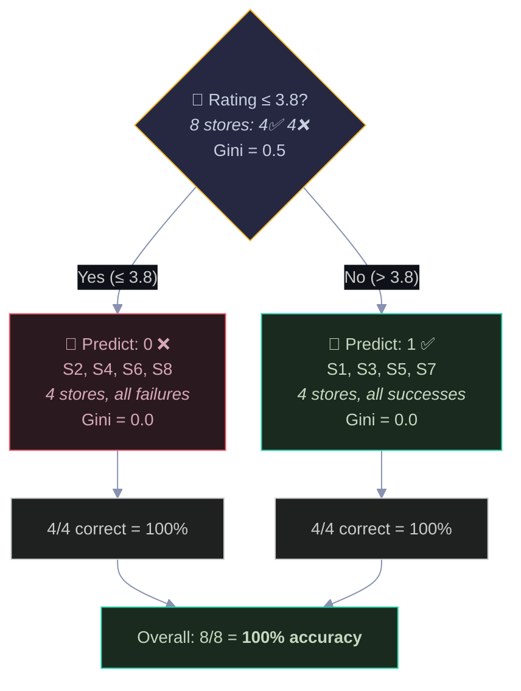

The root node (yellow) shows the split question and the data distribution. Each leaf (red/green) shows the prediction, which stores landed there, and the Gini score (0.0 = pure). Perfect accuracy on training data — but would this hold on new data?

---

## 7. Making Predictions — Walking the Tree

To predict a new store, start at the root and follow the branches. The diagram traces three different stores through the tree, showing how each one takes a different path to reach its prediction.

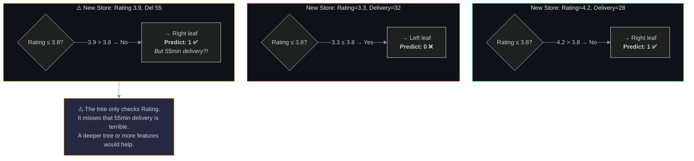

The first two predictions make sense. The third one exposes a limitation: our stump only uses Rating, so a store with great rating but terrible delivery still gets predicted as successful. This is why deeper trees (or ensembles) are often needed.

---

## 8. Overfitting — The Danger of Deep Trees

This is the most important concept in decision trees. A deep tree memorizes the training data perfectly but fails on new data. The diagram shows the progression from underfitting (too simple) to the sweet spot to overfitting (too complex).

```
  Error
    │
    │╲                              ╱
    │ ╲  Training Error            ╱ Test Error
    │  ╲                          ╱
    │   ╲                        ╱
    │    ╲         ╭────╮       ╱
    │     ╲       ╱      ╲     ╱
    │      ╲     ╱        ╲   ╱
    │       ╲   ╱          ╲ ╱
    │        ╲ ╱            ╳
    │         ╳            ╱ ╲
    │        ╱ ╲          ╱   ╲
    │       ╱   ╲────────╱     ╲── Training (→ 0)
    │      ╱
    └──────┬──────┬──────┬──────┬──→ Tree Depth
          1      3      5      10

    ◀─ Underfitting ─▶◀─ Sweet Spot ─▶◀─ Overfitting ─▶
```

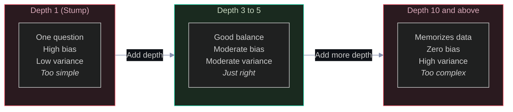

The green "sweet spot" in the middle is what we aim for. The error curve above shows training error always decreasing (the tree fits training data better), but test error first decreases then increases (overfitting kicks in).

---

## 9. Preventing Overfitting — Pruning Controls

These are the hyperparameters you tune to keep a tree from going too deep. Each one limits complexity in a different way. The diagram shows them as a control panel with their effects.

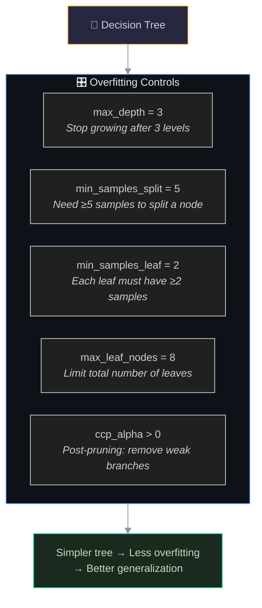

Each control attacks overfitting differently: max_depth limits vertical growth, min_samples prevents splits on tiny groups, max_leaf_nodes limits horizontal spread, and ccp_alpha prunes after the tree is built. In practice, max_depth and min_samples_leaf are the most commonly tuned.

---

## 10. Classification vs Regression Trees

Decision trees work for both classification (predict a category) and regression (predict a number). The split criterion and leaf prediction differ. This diagram shows the two variants side by side.

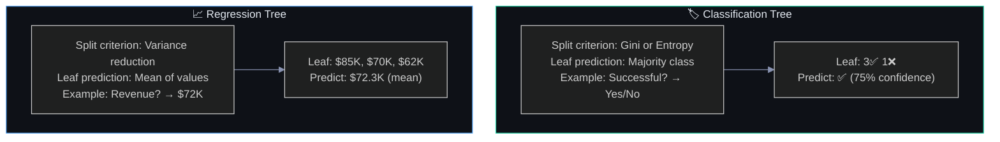

Green = classification (uses Gini/Entropy, predicts the most common class). Blue = regression (uses variance, predicts the average value). Same tree structure, different math inside.

---

## 11. Decision Tree Algorithm Flowchart

The complete algorithm in one flowchart. This is what happens inside `sklearn.tree.DecisionTreeClassifier.fit()`. Start at the top, and the recursive loop builds the tree one split at a time until a stopping condition is met.

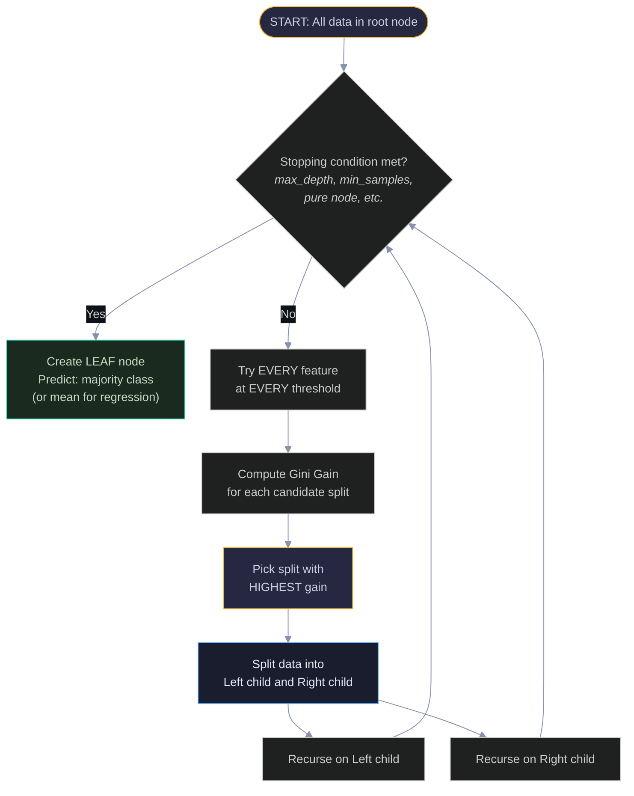

The key insight: this is a greedy recursive algorithm. At each node, it picks the locally best split without considering future splits. This greedy nature is why a single tree can be suboptimal — and why ensembles (Random Forest, XGBoost) improve on it.

---

## 12. Pros, Cons, and When to Use

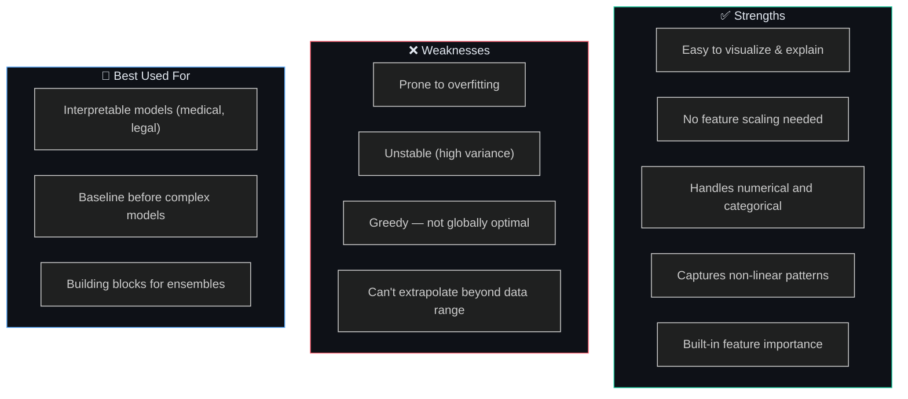

Green = reasons to use trees, Red = reasons to be cautious, Blue = ideal use cases. The biggest weakness (instability/high variance) is exactly what ensemble methods fix — which is why trees are rarely used alone in production.

---

## 13. Formula Summary

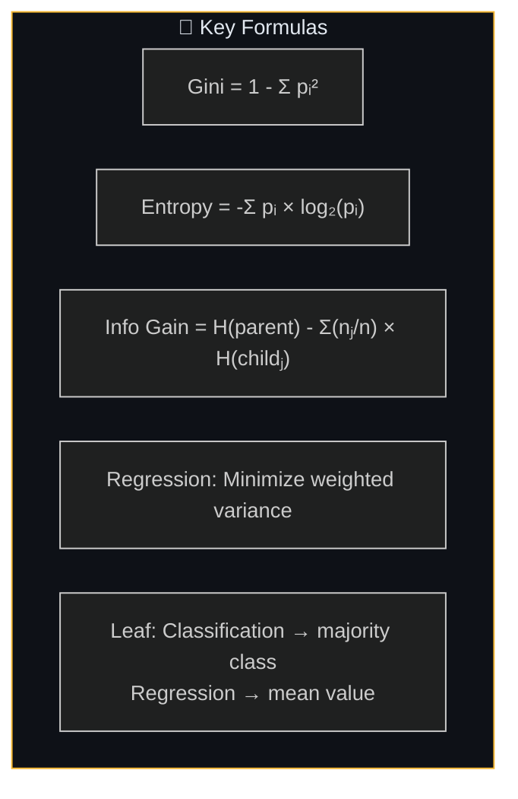

---

## 14. Interview Decision Tree 🎯

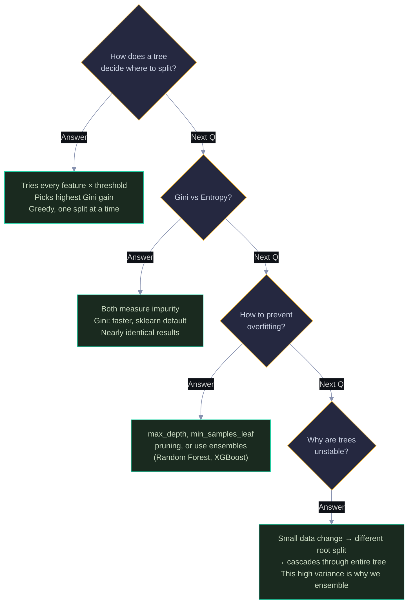

Yellow = interview questions, Green = your answers. Follow the chain for a complete decision tree interview prep.

---

> 💡 **How to view:** GitHub (native), VS Code (Mermaid extension), Obsidian (built-in), or [mermaid.live](https://mermaid.live)
