# K-Means Clustering: Visual Guide with Mermaid Diagrams

> Visual companion to `Documents/KMeans_Clustering_Complete_Guide.md`.
> Every diagram has explanatory text — what it shows, why it matters, and how to read it.

---

## 1. What Is K-Means?

K-Means is an unsupervised algorithm — there are no labels. It discovers natural groups in data by iteratively assigning points to the nearest centroid and updating centroids to the mean of their assigned points. The diagram shows the core loop.

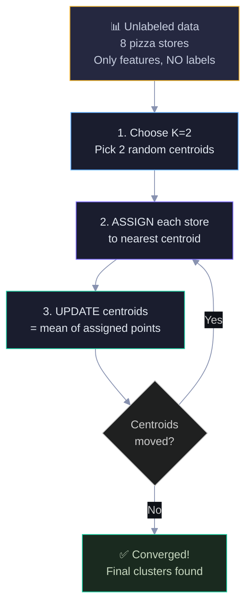

The loop between ASSIGN and UPDATE is the heart of K-Means. It typically converges in 5-20 iterations. The key difference from supervised learning: we never use labels — the algorithm finds structure purely from feature patterns.

---

## 2. Our Data — No Labels This Time

Unlike the supervised learning guides, we only have features. No "Successful" column. The scatter plot shows the stores in feature space — the two natural clusters are visible to us, but the algorithm has to discover them.

```
  Delivery
  (min)
     55 ┤
        │  ╔══════════════════╗
     50 ┤  ║  S4 (2.9, 50)    ║
     45 ┤  ║  S2 (3.2, 45)    ║    Cluster ?
     40 ┤  ║  S8 (3.0, 40)    ║    (low rating, slow)
     35 ┤  ║  S6 (3.5, 35)    ║
        │  ╚══════════════════╝
     30 ┤
        │                  ╔══════════════════╗
     25 ┤                  ║  S5 (4.1, 25)    ║
     22 ┤                  ║  S7 (4.3, 22)    ║    Cluster ?
     20 ┤                  ║  S1 (4.5, 20)    ║    (high rating, fast)
     18 ┤                  ║  S3 (4.8, 18)    ║
        │                  ╚══════════════════╝
        └──┬─────┬─────┬─────┬─────┬─────┬──→ Rating
          2.5   3.0   3.5   4.0   4.5   5.0

  We can SEE two groups. K-Means must FIND them using only distances.
```

---

## 3. Initialization — Pick Random Centroids

We randomly pick S1 (4.5, 20) and S4 (2.9, 50) as initial centroids. Why these two? They're just random choices — in practice, K-Means picks K random data points as starting centroids. Different random picks can lead to different final clusters, which is why we run K-Means multiple times (sklearn uses n_init=10 by default) and keep the best result. K-Means++ is a smarter initialization that spreads centroids apart, reducing the chance of a bad start. The diagram shows the starting positions. These are just starting guesses — the algorithm will move them to the true cluster centers.

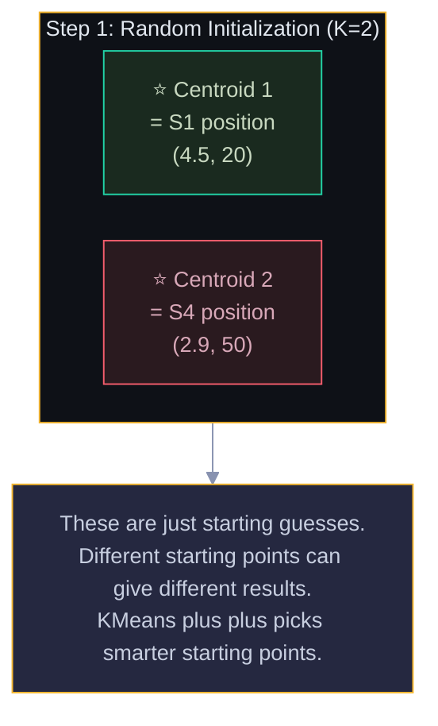

Green centroid = will attract the "good" stores. Red centroid = will attract the "struggling" stores. But the algorithm doesn't know this yet — it just picked two random points.

---

## 4. Iteration 1 — Assign to Nearest Centroid

For each store, we compute the Euclidean distance to both centroids and assign it to the closer one. The diagram shows the assignment results — all high-rating stores go to C1, all low-rating stores go to C2.

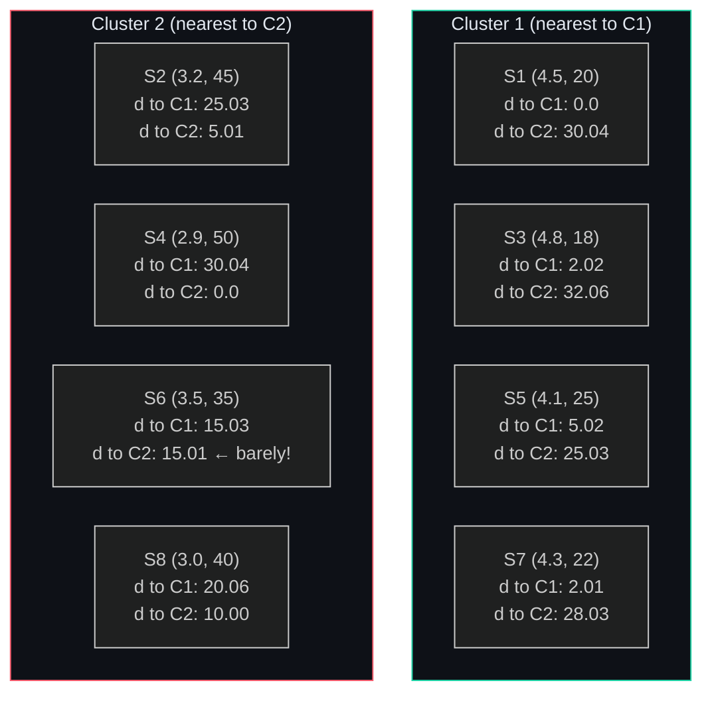

Notice S6 — it's almost equidistant from both centroids (15.03 vs 15.01). It barely goes to Cluster 2. Borderline points like this can flip between clusters depending on initialization. The distance values show exactly why each store was assigned where it was.

---

## 5. Update Centroids

New centroid = mean of all points in the cluster. The diagram shows the calculation and how much each centroid moved from its starting position.

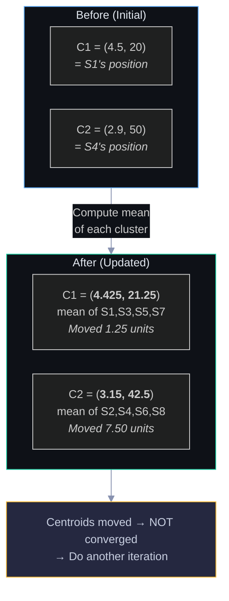

C2 moved much more (7.50 units) because it started at S4's extreme position and got pulled toward the center of its cluster. C1 barely moved (1.25 units) because S1 was already close to the cluster center. When centroids stop moving, the algorithm has converged.

---

## 6. Iteration 2 — Convergence

We reassign all stores using the updated centroids. Nobody changes clusters → centroids don't move → converged! The diagram shows the final stable state.

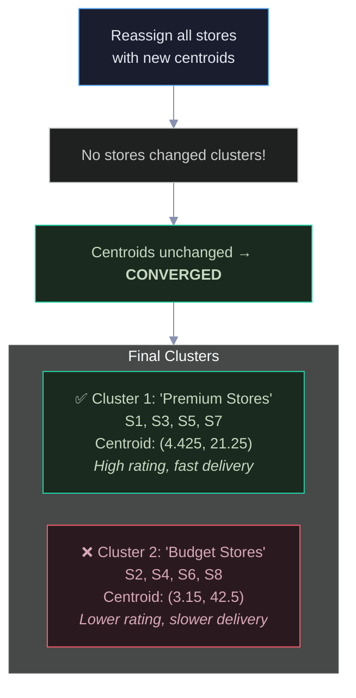

The algorithm discovered the same two groups we could see visually — without any labels. The cluster names ("Premium" and "Budget") are our interpretation; the algorithm only knows them as Cluster 1 and Cluster 2.

---

## 7. The Elbow Method — Choosing K

**Why we need the Elbow Method:** K-Means requires you to specify K (number of clusters) upfront, but you usually don't know the right K. WCSS (Within-Cluster Sum of Squares) measures how tight the clusters are — lower WCSS means points are closer to their centroids, which sounds like "lower = better." But WCSS *always* decreases as K increases — at the extreme, K=N (every point is its own cluster) gives WCSS=0, which is useless. The Elbow Method looks for the K where adding more clusters stops giving meaningful improvement — the "elbow" in the WCSS-vs-K curve. It's a tradeoff between cluster tightness and model simplicity: you want the fewest clusters that still capture the real structure in your data.

How do we know K=2 is right? Run K-Means for K=1,2,3,4,5 and plot the WCSS (within-cluster sum of squares). Look for the "elbow" — the point where adding more clusters gives diminishing returns.

```
  WCSS
  1058 ●
       │╲
       │ ╲
       │  ╲
       │   ╲
   152 │    ● ← ELBOW (K=2)
       │     ╲
    50 │      ●
    20 │       ●
    10 │        ●
       └──┬──┬──┬──┬──┬──→ K
          1  2  3  4  5

  K=1: Everything in one cluster (WCSS=1058, terrible)
  K=2: Two clusters (WCSS=152, big improvement!)
  K=3: Three clusters (WCSS≈50, diminishing returns)
  K=4+: Marginal improvement, risk overfitting
```

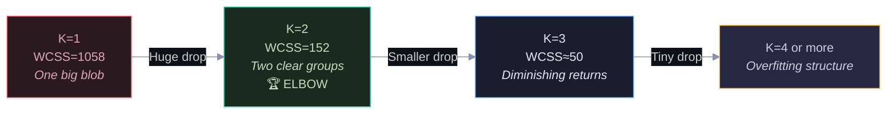

The biggest drop happens from K=1 to K=2 — that's where the real structure is. After K=2, improvements are marginal. The elbow tells us: 2 clusters capture the main pattern; more would be splitting hairs.

---

## 8. Feature Scaling — Why It's Critical

K-Means uses Euclidean distance, which is dominated by features with larger ranges. Without scaling, Delivery (range 18-50) overpowers Rating (range 2.9-4.8). The diagram shows the problem and the fix.

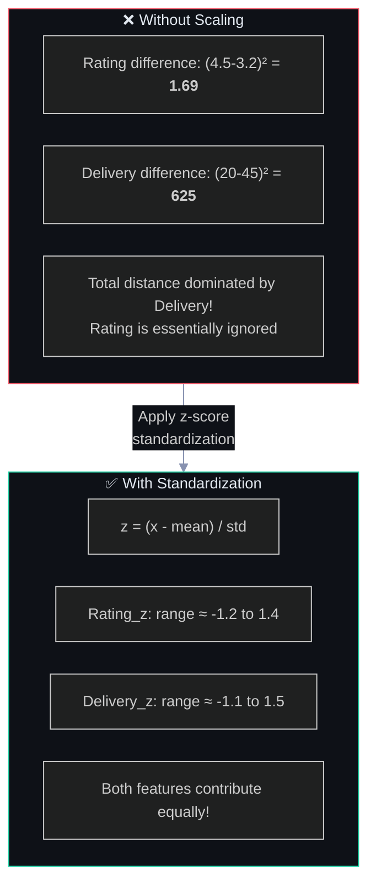

The numbers tell the story: 625 vs 1.69 — Delivery is 370× more influential than Rating. After standardization, both features have similar ranges and contribute equally to distance calculations. Always scale before K-Means.

---

## 9. Silhouette Score — Measuring Cluster Quality

**Why we need the Silhouette Score:** The Elbow Method only looks at within-cluster distance (how tight each cluster is). But a good clustering should also have well-separated clusters — points should be much closer to their own cluster than to any other cluster. The Silhouette Score captures both dimensions: it asks "is this point closer to its own cluster or to the nearest other cluster?" A point with silhouette near +1 is well-clustered (tight within its cluster and far from others). Near 0 means it sits on the boundary between two clusters. Near -1 means it's probably assigned to the wrong cluster entirely. Unlike WCSS (which gives one global number), the Silhouette Score gives a per-point quality measure — you can identify exactly which points are well-placed and which are problematic.

For each point, the silhouette score measures how well it fits its own cluster vs the nearest other cluster. The diagram explains the formula and what the values mean.

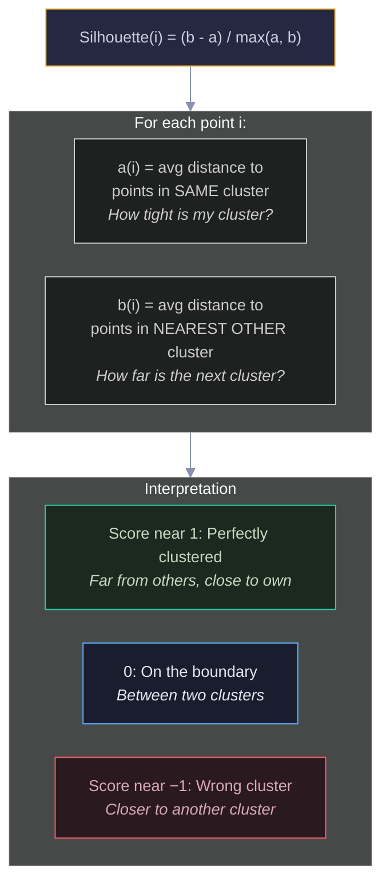

For our S1: a=3.02 (close to cluster mates), b=22.54 (far from other cluster), silhouette=0.866 (excellent). Average silhouette across all points gives the overall clustering quality — use it alongside the Elbow Method to choose K.

---

## 10. K-Means Limitations

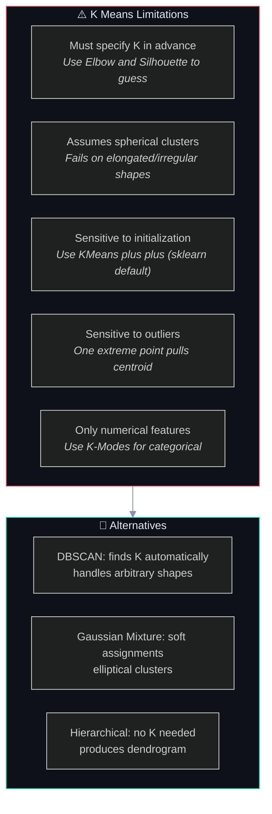

Red = limitations to be aware of. Green = alternatives that address specific limitations. K-Means is the go-to first choice for clustering, but knowing when to switch to DBSCAN or GMM is important.

---

## 11. Complete Algorithm Flowchart

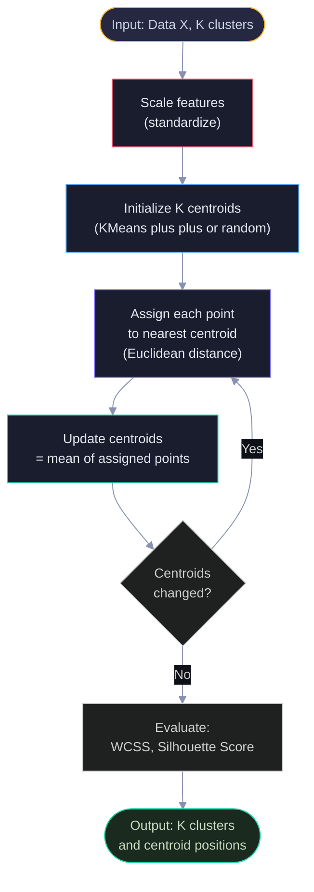

The red "Scale" step at the top is critical and often forgotten. The purple-green loop (assign → update) is the core algorithm. The evaluation step at the end tells you if K was a good choice.

---

## 12. Interview Decision Tree 🎯

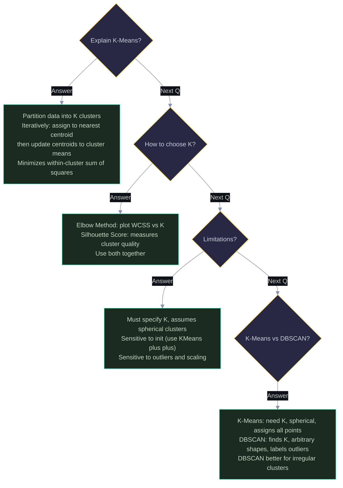

---

> 💡 **How to view:** GitHub (native), VS Code (Mermaid extension), Obsidian (built-in), or [mermaid.live](https://mermaid.live)
