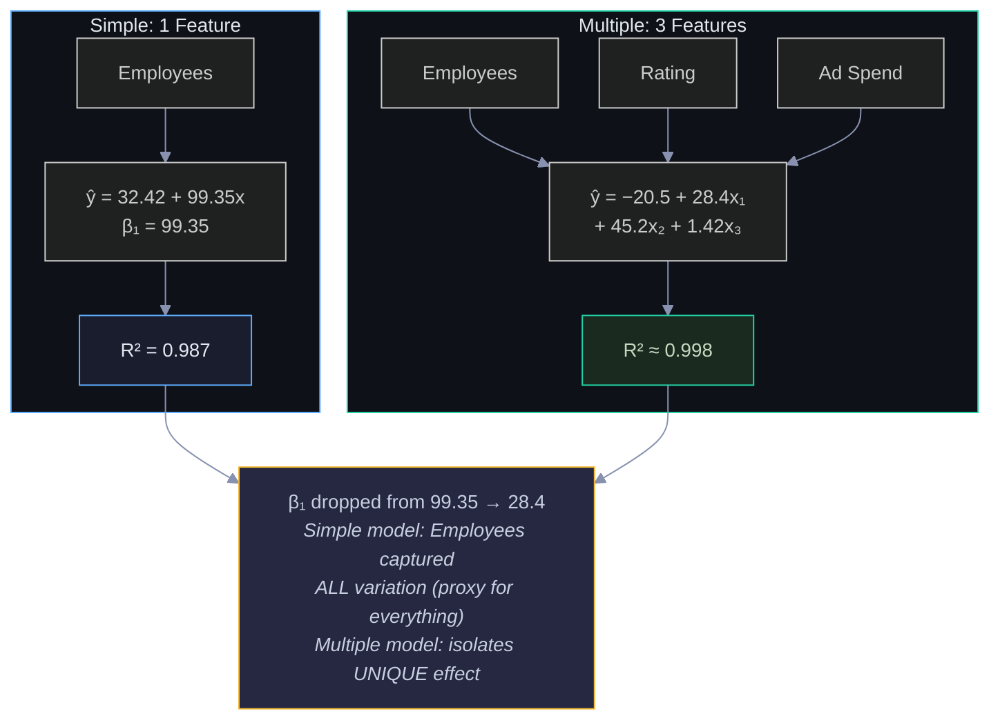
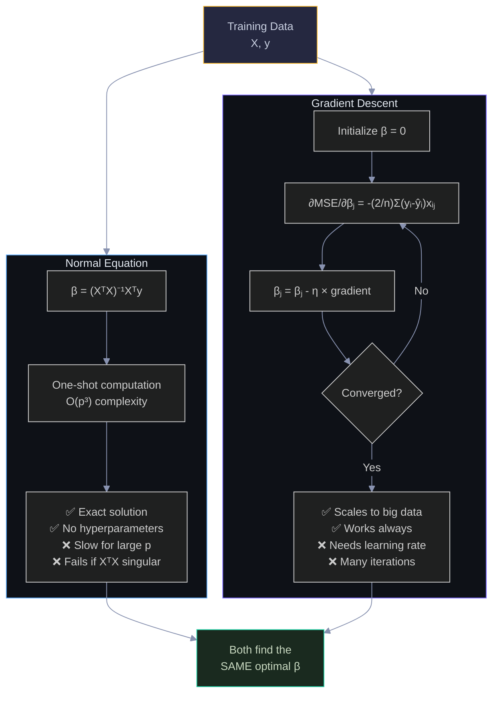
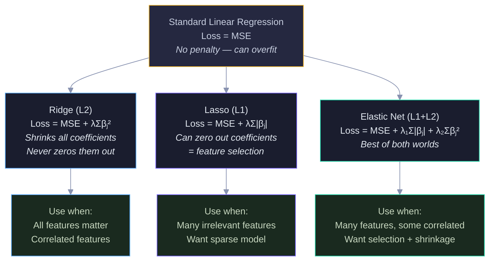
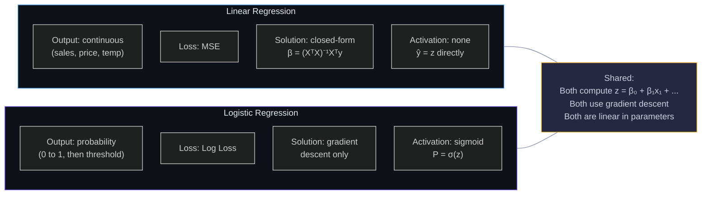
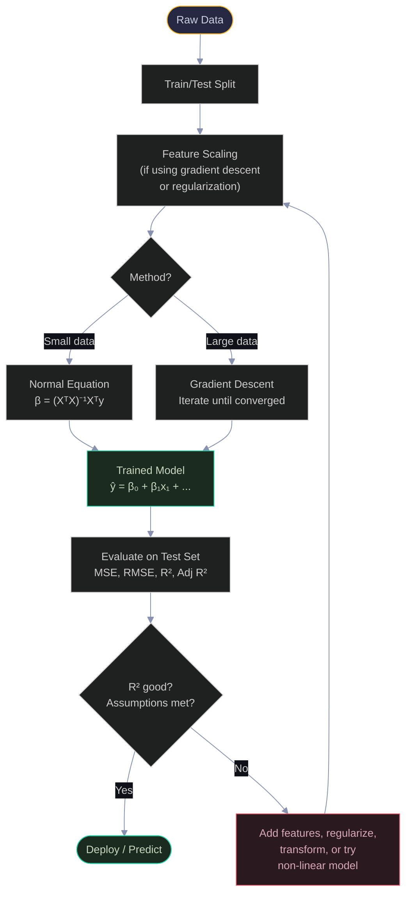
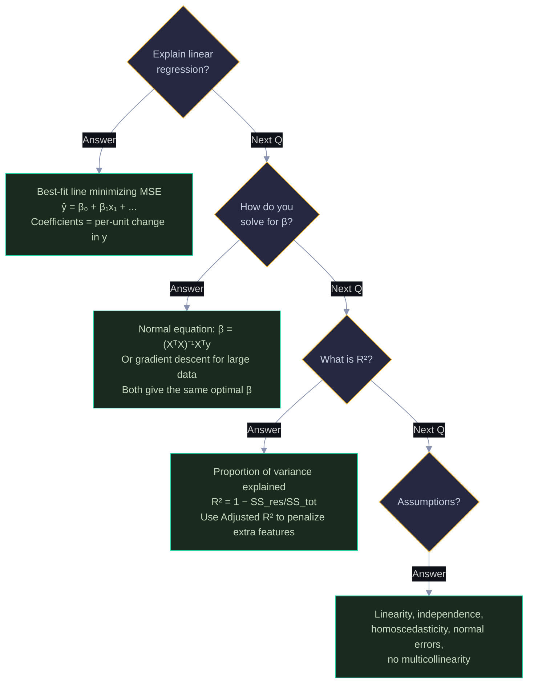

# Linear Regression: Visual Guide with Mermaid Diagrams

> Visual companion to `Documents/ML_Concepts/Basic/Linear_Regression_Complete_Guide.md`.
> Every diagram has explanatory text — what it shows, why it matters, and how to read it.

---

## 1. The Big Idea — Finding the Best Line

Linear regression finds the line (or hyperplane) that minimizes the total squared distance between the data points and the line. The diagram shows the full pipeline: features go in, a linear combination is computed, and a continuous prediction comes out.


Read left-to-right: raw features (yellow) → linear combination (blue) → continuous prediction (green). Unlike logistic regression, there's no sigmoid — the output can be any real number.

---

## 2. Simple vs. Multiple Linear Regression

Simple regression uses one feature and fits a line. Multiple regression uses several features and fits a hyperplane. The diagram contrasts the two approaches and shows how adding features changes the model.



The key insight is in the yellow box: when you add more features, each coefficient shrinks because it now represents only that feature's unique contribution, not a proxy for everything else.

---

## 3. The Best-Fit Line — Residuals

The best-fit line minimizes the sum of squared residuals (vertical distances from points to the line). The ASCII plot shows the line through our data with residuals marked.

```
  Daily Sales ($)
  650 │                              ● S3 ($620)
      │                            ╱ ↕ residual
  550 │                     ● S7 ╱($540)
      │                   ● S1 ╱($520)
  450 │              ● S5╱($450)
      │                ╱
  350 │         ● S6 ╱($340)
      │        ● S2╱($310)
  250 │     ● S8╱($250)
      │   ● S4╱($210)
      │     ╱
  150 │   ╱  ŷ = 32.42 + 99.35x
      │ ╱
      └──┬────┬────┬────┬────┬────┬──→ Employees
         1    2    3    4    5    6

  Residuals (vertical distances):
  S1: +$9    S3: +$9    S5: -$20   S7: -$11
  S2: +$20   S4: +$21   S6: -$10   S8: -$19
```

The line passes through the center of the data. Points above the line have positive residuals (overpredicted), points below have negative residuals (underpredicted). The model minimizes the sum of these squared distances.

---

## 4. Loss Functions Compared

Linear regression typically uses MSE, but there are alternatives. This diagram shows how MSE, MAE, and Huber loss respond differently to errors — especially outliers.

```
  Loss
  100│ ●                              MSE = error²
     │  ╲                             (penalizes large errors heavily)
  80 │   ╲
     │    ╲
  60 │     ╲
     │      ╲
  40 │       ╲
     │        ╲
  20 │         ╲    ╱ MAE = |error|
     │          ╲  ╱  (linear penalty)
   0 │───────────●───────────→ Error
    -10  -8  -6  -4  -2  0  2  4  6  8  10

  Error = 2:   MSE = 4,    MAE = 2
  Error = 10:  MSE = 100,  MAE = 10

  MSE cares 25× more about the big error.
  MAE treats them proportionally (5× more).
```

---

## 5. Two Ways to Solve — Normal Equation vs. Gradient Descent

Linear regression is unique among ML models: it has both a closed-form solution and an iterative one. The diagram compares the two approaches.



Both paths lead to the same answer (green box). The normal equation is a direct computation (blue) — plug in data, get weights. Gradient descent is iterative (purple) — start somewhere, improve step by step. Choose based on dataset size and feature count.

---

## 6. Gradient Descent — Walking Downhill

The MSE loss surface for linear regression is a convex bowl — there's exactly one minimum. Gradient descent starts at a random point and follows the slope downhill. The ASCII plot shows the loss decreasing over iterations.

```
  MSE Loss
  800 │●
      │ ╲
  600 │  ╲
      │   ╲
  400 │    ╲
      │     ╲
  200 │      ╲──────────────────
      │                         ●  converged
    0 │
      └────┬────┬────┬────┬────┬──→ Iterations
           0   200  400  600  800

  Iteration 0:   β₀=0, β₁=0       MSE = 164,025
  Iteration 100: β₀=15, β₁=60     MSE = 1,200
  Iteration 500: β₀=31, β₁=97     MSE = 260
  Iteration 800: β₀=32.4, β₁=99.3 MSE = 249  ← converged!
```

The curve drops steeply at first (big improvements) then flattens (fine-tuning). This is typical of convex optimization — you make fast progress early, then slow down near the minimum.

---

## 7. The Four Assumptions — Visual Diagnostics

Each assumption of linear regression can be checked with a specific plot. The diagram maps assumptions to their diagnostic plots and what violations look like.

```mermaid
%%{init: {'theme': 'dark', 'themeVariables': {'darkMode': true, 'background': '#0e1117', 'primaryColor': '#1a1d2e', 'primaryTextColor': '#e2e8f0', 'primaryBorderColor': '#2d3148', 'lineColor': '#8892b0', 'secondaryColor': '#252840', 'tertiaryColor': '#1a1d2e', 'fontSize': '14px', 'edgeLabelBackground': '#0e1117'}, 'flowchart': {'nodeSpacing': 30, 'rankSpacing': 40, 'padding': 15, 'htmlLabels': true}}}%%
graph TD
    A1["1. Linearity<br/><i>Residuals vs. Predicted</i>"] --> A1G["✅ Random scatter<br/>around zero"]
    A1 --> A1B["❌ Curved pattern<br/>→ Add polynomial terms"]

    A2["2. Independence<br/><i>Durbin-Watson test</i>"] --> A2G["✅ DW ≈ 2.0"]
    A2 --> A2B["❌ DW far from 2<br/>→ Autocorrelation"]

    A3["3. Homoscedasticity<br/><i>Residuals vs. Predicted</i>"] --> A3G["✅ Uniform band"]
    A3 --> A3B["❌ Cone/fan shape<br/>→ Log-transform y"]

    A4["4. Normality of Errors<br/><i>Q-Q Plot</i>"] --> A4G["✅ Points on diagonal"]
    A4 --> A4B["❌ S-curve or tails<br/>→ Transform y"]

    style A1 fill:#252840,stroke:#f5b731,color:#c8cfe0
    style A2 fill:#252840,stroke:#f5b731,color:#c8cfe0
    style A3 fill:#252840,stroke:#f5b731,color:#c8cfe0
    style A4 fill:#252840,stroke:#f5b731,color:#c8cfe0
    style A1G fill:#1a2a1f,stroke:#22d3a7,color:#c8d8c0
    style A2G fill:#1a2a1f,stroke:#22d3a7,color:#c8d8c0
    style A3G fill:#1a2a1f,stroke:#22d3a7,color:#c8d8c0
    style A4G fill:#1a2a1f,stroke:#22d3a7,color:#c8d8c0
    style A1B fill:#2a1a1f,stroke:#f45d6d,color:#d8a8b8
    style A2B fill:#2a1a1f,stroke:#f45d6d,color:#d8a8b8
    style A3B fill:#2a1a1f,stroke:#f45d6d,color:#d8a8b8
    style A4B fill:#2a1a1f,stroke:#f45d6d,color:#d8a8b8
```



Yellow boxes = assumptions. Green = what "good" looks like. Red = violations and fixes. Always check these plots after fitting a model — they tell you whether to trust your results.

---

## 8. R² — What It Means Visually

R² measures how much of the total variance your model explains. The diagram shows the decomposition: total variance = explained variance + unexplained variance.

```
  Total Variance (SS_tot)
  ┌─────────────────────────────────────────────────┐
  │                                                 │
  │   Explained by model (SS_reg)     Unexplained   │
  │   ████████████████████████████    ░░ (SS_res)   │
  │   ████████████████████████████    ░░            │
  │                                                 │
  └─────────────────────────────────────────────────┘

  R² = SS_reg / SS_tot = 1 - SS_res / SS_tot

  Our model: R² = 0.987
  ┌─────────────────────────────────────────────────┐
  │ ██████████████████████████████████████████████░░│
  │ 98.7% explained                          1.3%  │
  └─────────────────────────────────────────────────┘

  Employees explains 98.7% of sales variation!
```

---

## 9. Regularization — Ridge vs. Lasso vs. Elastic Net

Regularization adds a penalty to prevent overfitting. The diagram shows how each method constrains the coefficients differently.



Top (yellow) = standard regression with no penalty. Middle row = three regularization methods with their loss functions. Bottom row = when to use each. The key difference: Lasso can eliminate features entirely (sparse), Ridge just shrinks them (dense).

---

## 10. Linear Regression vs. Logistic Regression

A common interview question. The diagram highlights the key differences between the two models.



Blue = linear regression. Purple = logistic regression. Yellow = what they share. The core difference: linear regression outputs z directly, logistic regression wraps z in a sigmoid to get a probability.

---

## 11. Complete Pipeline Flowchart

The end-to-end linear regression pipeline from raw data to prediction.



Follow top-to-bottom: data → split → scale → solve → evaluate → deploy or iterate. The red box is the feedback loop — if the model isn't good enough, you go back and improve it.

---

## 12. Interview Decision Tree 🎯



---

> 💡 **How to view:** GitHub (native), VS Code (Mermaid extension), Obsidian (built-in), or [mermaid.live](https://mermaid.live)
