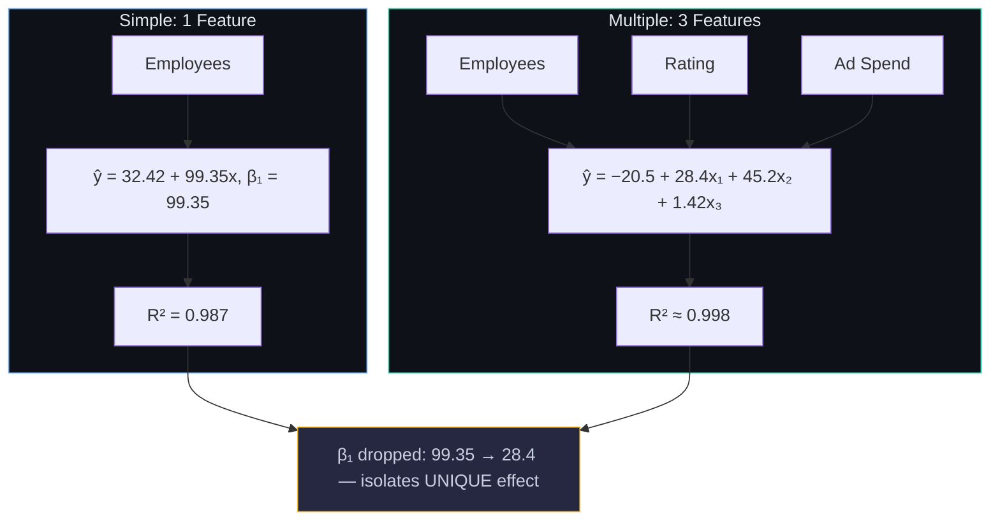
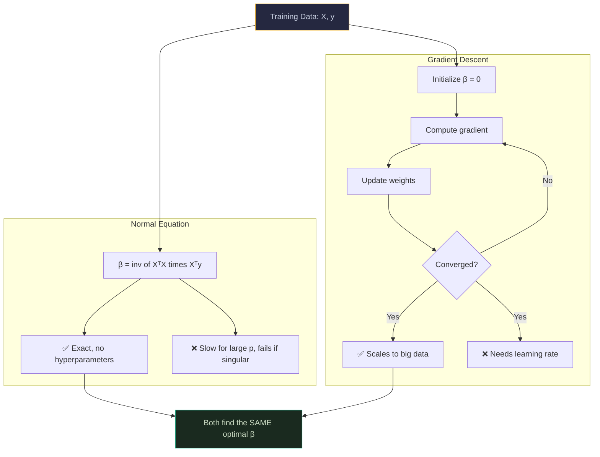
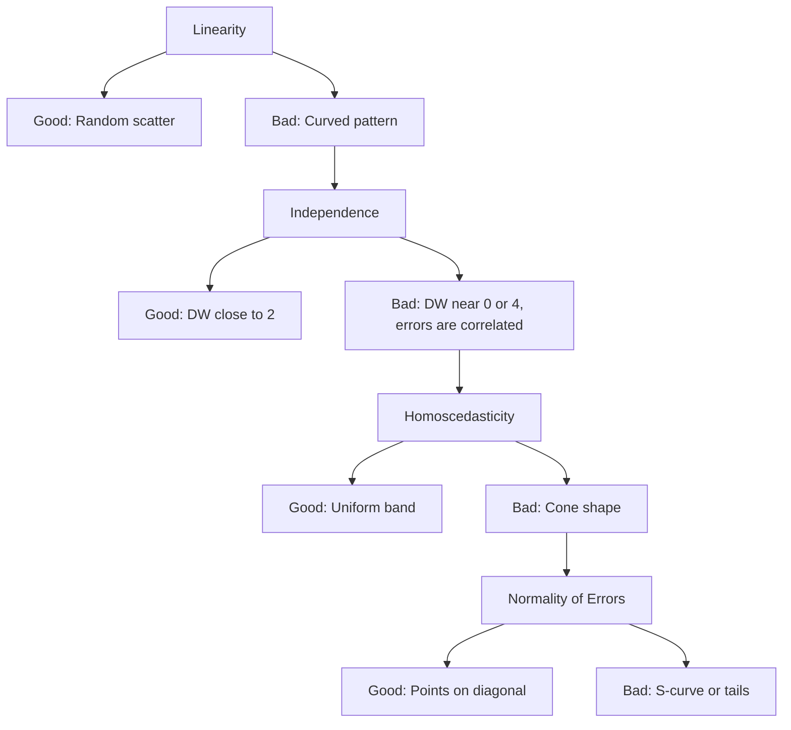
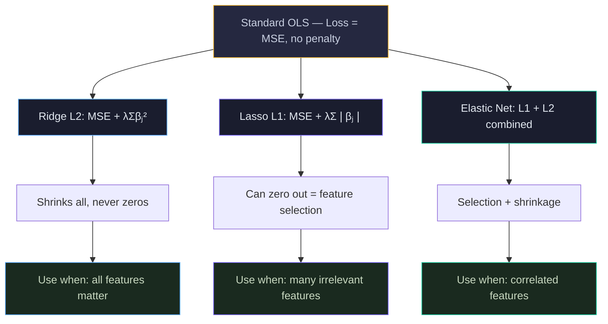
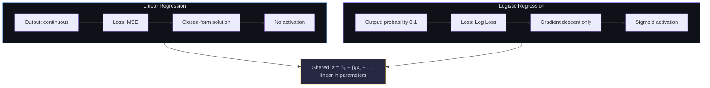
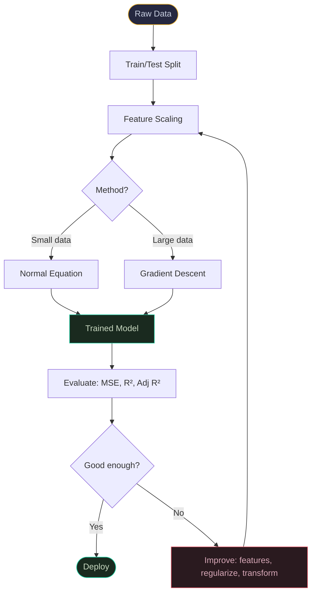
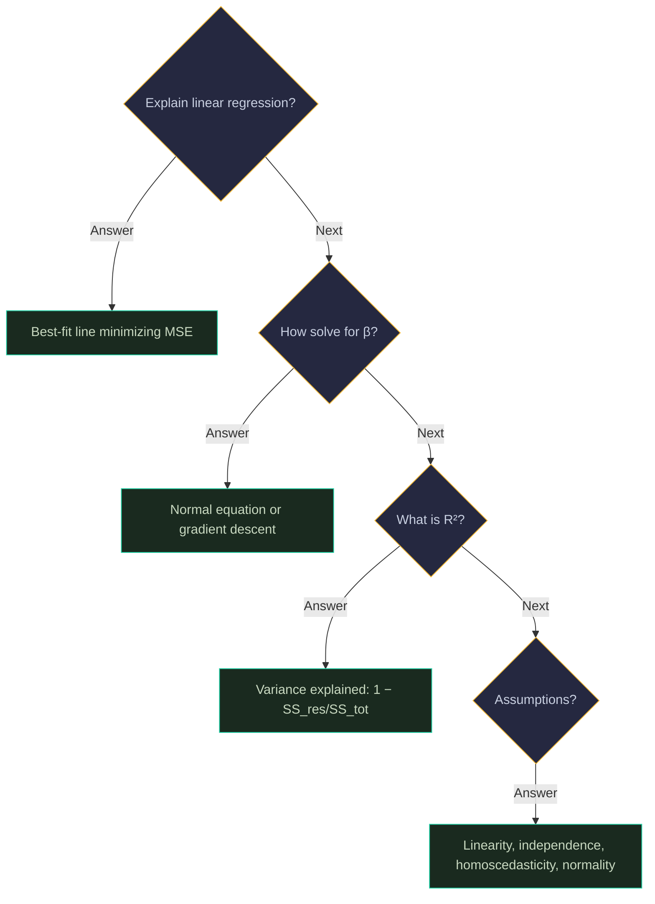

# Linear Regression: Visual Guide

> Visual companion to `Documents/ML_Concepts/Basic/Linear_Regression_Complete_Guide.md`.

---

## 1. The Big Idea — Finding the Best Line


Features (yellow) → weighted sum (blue) → continuous prediction (green).

---

## 2. Simple vs. Multiple Linear Regression



---

## 3. The Best-Fit Line — Residuals

```
  Daily Sales ($)
  650 │                              ● S3 ($620)
      │                            ╱ ↕ residual
  550 │                     ● S7 ╱($540)
      │                   ● S1 ╱($520)
  450 │              ● S5╱($450)
  350 │         ● S6 ╱($340)
      │        ● S2╱($310)
  250 │     ● S8╱($250)
      │   ● S4╱($210)
  150 │   ╱  ŷ = 32.42 + 99.35x
      └──┬────┬────┬────┬────┬────┬──→ Employees
         1    2    3    4    5    6
```

---

## 4. Loss Functions Compared

```
  Loss
  100│ ●                              MSE = error²
  80 │   ╲
  60 │     ╲
  40 │       ╲
  20 │         ╲    ╱ MAE = |error|
   0 │───────────●───────────→ Error
    -10     -5     0     5     10
```

---

## 5. Normal Equation vs. Gradient Descent



---

## 6. Gradient Descent — Walking Downhill

```
  MSE Loss
  800 │●
  600 │  ╲
  400 │    ╲
  200 │      ╲──────────────────
      │                         ●  converged
    0 └────┬────┬────┬────┬────┬──→ Iterations
           0   200  400  600  800
```

---

## 7. The Four Assumptions — Visual Diagnostics



Yellow = assumptions. Green = good. Red = violations and fixes.

---

## 8. R² — What It Means Visually

```
  R² = 1 − SS_res / SS_tot

  Our model: R² = 0.987
  ┌─────────────────────────────────────────────────┐
  │ ██████████████████████████████████████████████░░│
  │ 98.7% explained                          1.3%  │
  └─────────────────────────────────────────────────┘
```

---

## 9. Regularization — Ridge vs. Lasso vs. Elastic Net



---

## 10. Linear vs. Logistic Regression



---

## 11. Complete Pipeline



---

## 12. Interview Decision Tree 🎯


