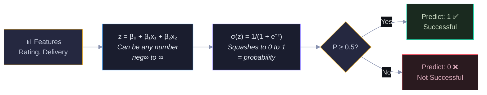
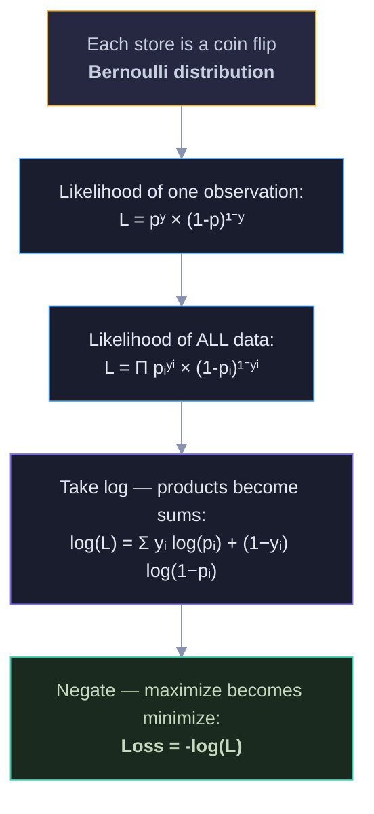
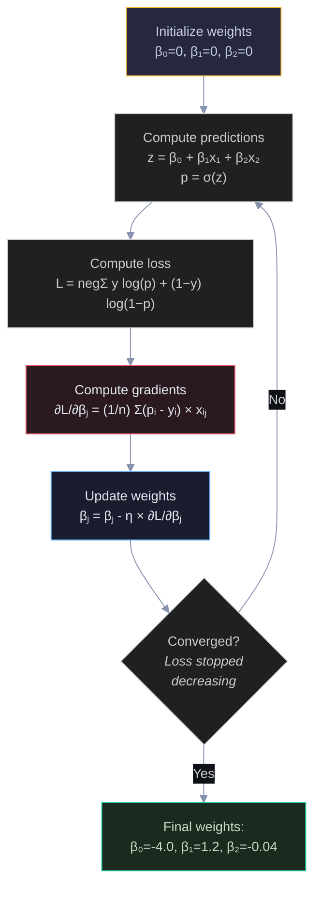
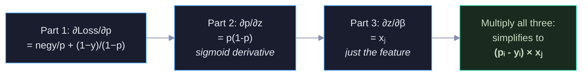
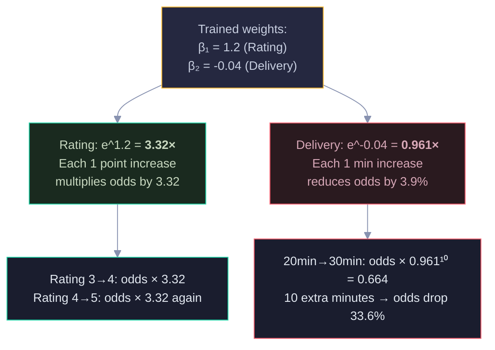
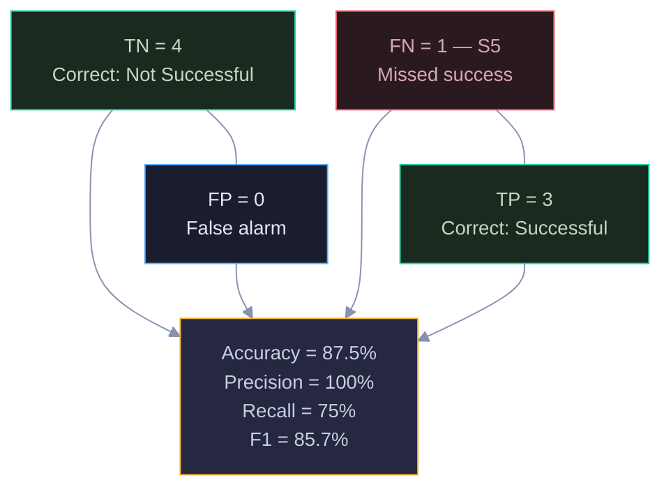
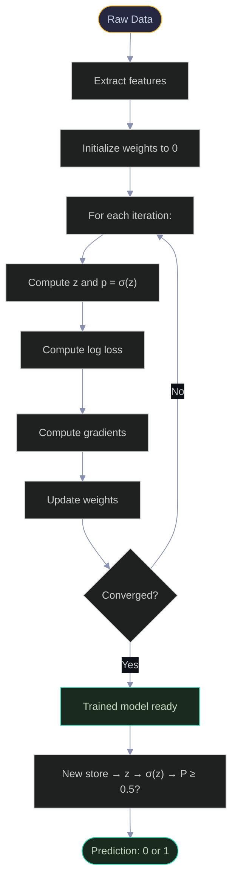
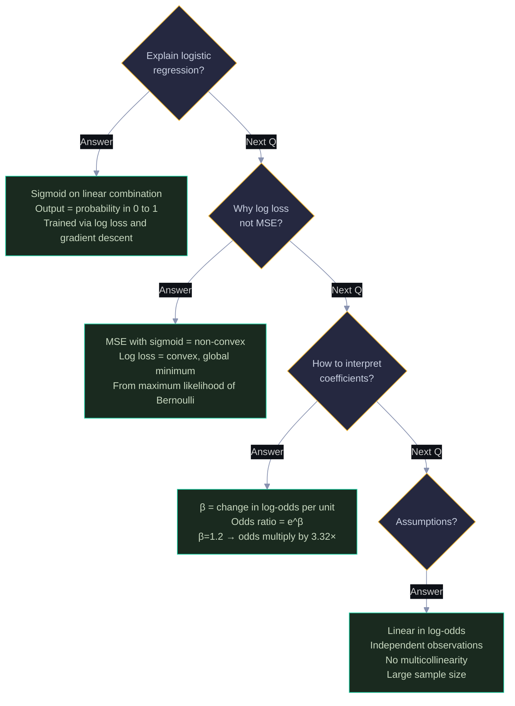

# Logistic Regression: Visual Guide with Mermaid Diagrams

> Visual companion to `Documents/Logistic_Regression_Complete_Guide.md`.
> Every diagram has explanatory text — what it shows, why it matters, and how to read it.

---

## 1. The Big Idea — Why Not Linear Regression?

Linear regression can predict values outside [0, 1], which makes no sense for probabilities. Logistic regression fixes this by wrapping a linear equation inside the sigmoid function. The diagram shows the full pipeline: features go in, a linear combination is computed, sigmoid squashes it to [0,1], and a threshold gives the final class.



Read left-to-right: raw features → linear combination (blue) → sigmoid squeeze (purple) → threshold decision (yellow) → final prediction (green/red). The sigmoid is the key innovation — it turns any number into a valid probability.

---

## 2. The Sigmoid Function

The sigmoid is the heart of logistic regression. It maps any real number to a probability between 0 and 1. The ASCII plot below shows its S-shaped curve — negative inputs map near 0, positive inputs map near 1, and z=0 maps to exactly 0.5.

```
  P(success)
  1.0 │                          ●────────
      │                        ╱
      │                      ╱
      │                    ╱
  0.5 │─ ─ ─ ─ ─ ─ ─ ─ ●─ ─ ─ ─ ─ ─ ─ ─  ← z=0 → P=0.5
      │                ╱
      │              ╱
      │            ╱
  0.0 │──────────●
      └────┬────┬────┬────┬────┬────┬────→ z
          -3   -2   -1    0   +1   +2   +3

  z = -3 → P = 0.047 (almost certainly NO)
  z =  0 → P = 0.500 (coin flip)
  z = +3 → P = 0.953 (almost certainly YES)
```

### 2.1 Sigmoid Values for Our Stores

After training on our 8 pizza stores using gradient descent (section 4), the model found the weights that minimize log loss: β₀=−4.0 (baseline — without features, stores are unlikely to succeed), β₁=+1.2 (higher rating strongly helps), and β₂=−0.04 (longer delivery slightly hurts). These aren't random — they're the optimal values the algorithm converged to. This diagram shows how two stores flow through the model — one successful, one not — and how the sigmoid separates them.

```mermaid
%%{init: {'theme': 'dark', 'themeVariables': {'darkMode': true, 'background': '#0e1117', 'primaryColor': '#1a1d2e', 'primaryTextColor': '#e2e8f0', 'primaryBorderColor': '#2d3148', 'lineColor': '#8892b0', 'secondaryColor': '#252840', 'tertiaryColor': '#1a1d2e', 'fontSize': '14px', 'edgeLabelBackground': '#0e1117'}, 'flowchart': {'nodeSpacing': 30, 'rankSpacing': 40, 'padding': 15, 'htmlLabels': true}}}%%
graph TD
    subgraph STORE1["S1: Rating=4.5, Delivery=20"]
        Z1["z = neg4.0 + 1.2(4.5) + (neg0.04)(20)<br/>= neg4.0 + 5.4 minus 0.8 = <b>0.6</b>"]
        Z1 --> P1["P = σ(0.6) = <b>0.646</b> = 64.6%"]
        P1 --> C1["0.646 ≥ 0.5 → Predict 1 ✅"]
    end

    subgraph STORE2["S2: Rating=3.2, Delivery=45"]
        Z2["z = neg4.0 + 1.2(3.2) + (neg0.04)(45)<br/>= neg4.0 + 3.84 minus 1.8 = <b>neg1.96</b>"]
        Z2 --> P2["P = σ(-1.96) = <b>0.123</b> = 12.3%"]
        P2 --> C2["0.123 < 0.5 → Predict 0 ❌"]
    end

    style STORE1 fill:#0e1117,stroke:#22d3a7,color:#e2e8f0
    style STORE2 fill:#0e1117,stroke:#f45d6d,color:#e2e8f0
    style C1 fill:#1a2a1f,stroke:#22d3a7,color:#c8d8c0
    style C2 fill:#2a1a1f,stroke:#f45d6d,color:#d8a8b8
```



S1 gets a positive z (+0.6) → sigmoid outputs 64.6% → predicted successful. S2 gets a negative z (-1.96) → sigmoid outputs 12.3% → predicted failure. The sign of z determines which side of 0.5 you land on.

---

## 3. The Loss Function — Log Loss

The model needs to know "how wrong am I?" Log loss penalizes confident wrong predictions heavily. The diagram shows how loss behaves for actual=1: if you predict P=0.9 (confident and correct), loss is tiny. If you predict P=0.1 (confident and wrong), loss is huge.

```
  Loss
  5.0 │●
      │ ╲
  4.0 │  ╲
      │   ╲
  3.0 │    ╲
      │     ╲
  2.0 │      ╲
      │       ╲
  1.0 │        ╲
      │         ╲
  0.0 │──────────╲●
      └────┬────┬────┬────┬────→ Predicted P
          0.0  0.25 0.50 0.75 1.0

  When actual = 1:
    P = 0.9 → Loss = 0.105 (good prediction, low loss)
    P = 0.5 → Loss = 0.693 (uncertain, moderate loss)
    P = 0.1 → Loss = 2.303 (bad prediction, HIGH loss!)
```

### 3.1 Where Log Loss Comes From

**Why we need log loss (not MSE):** You might wonder — why not just use Mean Squared Error like in linear regression? The problem is that MSE combined with the sigmoid function creates a non-convex loss surface riddled with local minima. Gradient descent could get stuck in one of these valleys and never find the best weights. Log loss is convex — it has a single global minimum, so gradient descent is guaranteed to find it. Beyond the optimization advantage, log loss is also the *natural* loss function for binary outcomes because it comes directly from maximum likelihood estimation of the Bernoulli distribution. It's not an arbitrary choice — it's what probability theory tells us to use.

**The derivation chain:** The path from intuition to formula follows four steps, each with a practical reason. (1) We model each store's outcome as a Bernoulli trial — it either succeeds or fails with some probability p. (2) We write the likelihood of observing our entire dataset — the probability of seeing exactly the successes and failures we got. (3) We take the logarithm to turn products into sums, which is numerically stable and mathematically convenient. (4) We negate it because optimizers minimize functions, but we want to maximize likelihood — negating flips the problem.

The derivation flows from probability theory to optimization. This diagram traces the logical chain: we start with the Bernoulli distribution, build the likelihood, take the log, and negate it to get a loss we can minimize.



Follow top-to-bottom: intuition → math → simplification → final formula. The green box at the bottom is the log loss formula you'd implement in code.

---

## 4. Gradient Descent — How the Model Learns

**Why gradient descent:** Unlike linear regression, which has a closed-form solution (β = (XᵀX)⁻¹Xᵀy where you just plug in the data and get the answer), logistic regression has no closed-form solution. The sigmoid function makes the equation non-linear, so there's no way to algebraically solve for the optimal weights. We need an iterative approach — start somewhere, figure out which direction improves the loss, take a step, and repeat.

**The gradient has a beautiful interpretation:** The gradient ∂L/∂βⱼ = (1/n)Σ(pᵢ - yᵢ)×xᵢⱼ looks like a formula, but it reads like a sentence: it's the average of (prediction error × feature value). If the model overpredicts for a store (p > y), the gradient is positive, so we decrease β to bring the prediction down. If it underpredicts (p < y), the gradient is negative, so we increase β. The feature value xᵢⱼ scales the update — features with larger values get proportionally larger corrections, which makes intuitive sense: a feature that's numerically large has more leverage on the prediction.

The model starts with random weights and iteratively adjusts them to minimize loss. Each step: compute predictions, measure error, calculate gradients (which direction to move), and update weights. The diagram shows this loop.



The loop runs hundreds or thousands of times. The red "Gradient" box is the key step — it tells each weight which direction to move and by how much. The gradient formula (pᵢ - yᵢ) × xᵢⱼ is beautifully simple: prediction error × feature value.

### 4.1 The Chain Rule — Why the Gradient Is So Clean

**Why the chain rule matters here:** In logistic regression, the prediction goes through 3 nested stages: weights → linear combination z → sigmoid probability p → loss. We need to know how changing a single weight affects the final loss, but these stages are composed functions — the loss depends on p, which depends on z, which depends on the weights. The chain rule lets us decompose this into three simple derivatives and multiply them together, rather than trying to differentiate the entire nested expression at once. Each individual derivative is easy; the chain rule connects them.

The gradient passes through three stages via the chain rule. Each stage is simple on its own; multiplying them together gives the elegant final result.



The magic: three complex-looking derivatives multiply together and cancel out to give (p - y) × x. This isn't a coincidence — log loss and sigmoid were designed to work together.

---

## 5. Interpreting Coefficients — Odds Ratios

The trained weights have real-world meaning. β₁ = +1.2 for Rating means each +1 point in rating multiplies the odds of success by e^1.2 = 3.32×. The diagram shows how to convert coefficients to business insights.



Green = positive effect (higher rating helps). Red = negative effect (longer delivery hurts). The odds ratio e^β is the key number for business interpretation — it tells stakeholders exactly how much each factor matters.

---

## 6. Decision Boundary

The decision boundary is where P = 0.5, which means z = 0. It's a straight line in feature space.

```
  Delivery (min)
  50 │  ❌ S4                    ╱
     │                          ╱
  45 │     ❌ S2               ╱
     │                        ╱
  40 │  ❌ S8                ╱
     │                      ╱  Decision Boundary:
  35 │    ❌ S6            ╱   Delivery = -100 + 30 × Rating
     │                    ╱
  30 │                   ╱
     │                  ╱
  25 │              ✅ S5
     │                ╱
  22 │            ✅ S7
  20 │           ✅ S1
  18 │          ✅ S3
     │
     └──┬─────┬─────┬─────┬─────┬──→ Rating
       2.5   3.0   3.5   4.0   4.5

  Above the line = Predict 0 (Not Successful)
  Below the line = Predict 1 (Successful)
```

---

## 7. Model Evaluation — Confusion Matrix

After predictions, we evaluate using the confusion matrix. The diagram shows how the 4 cells map to the evaluation metrics.



Green cells (TN, TP) = correct predictions. Red cell (FN) = the one mistake (S5 was borderline at 48%). Blue cell (FP) = false alarms (none here). The metrics below translate the matrix into single numbers for comparison.

---

## 8. Complete Pipeline Flowchart

The end-to-end logistic regression pipeline from raw data to prediction.



The top half (yellow → loop) is training. The bottom half (green → output) is prediction. Training runs the loop many times; prediction is a single forward pass.

---

## 9. Interview Decision Tree 🎯



---

> 💡 **How to view:** GitHub (native), VS Code (Mermaid extension), Obsidian (built-in), or [mermaid.live](https://mermaid.live)
