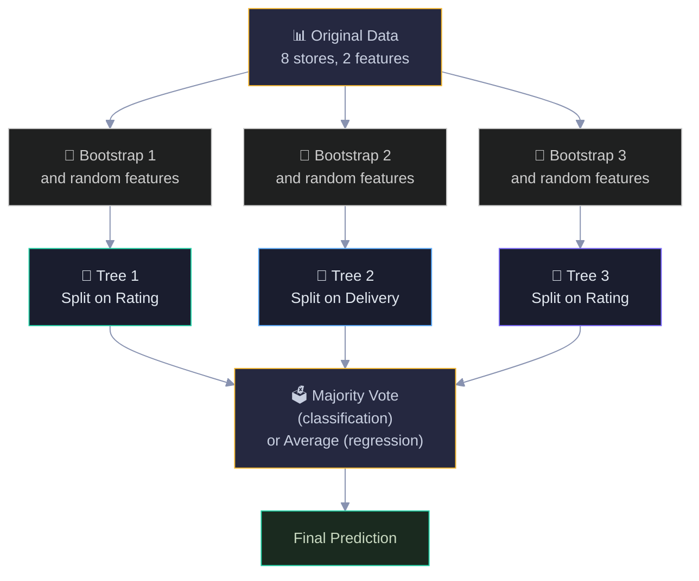
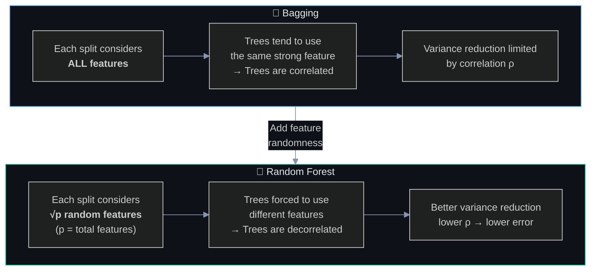
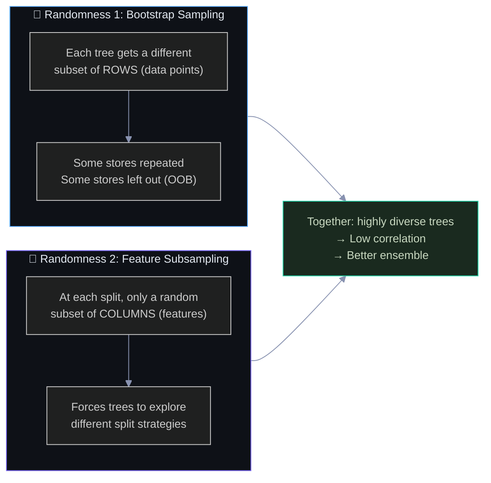
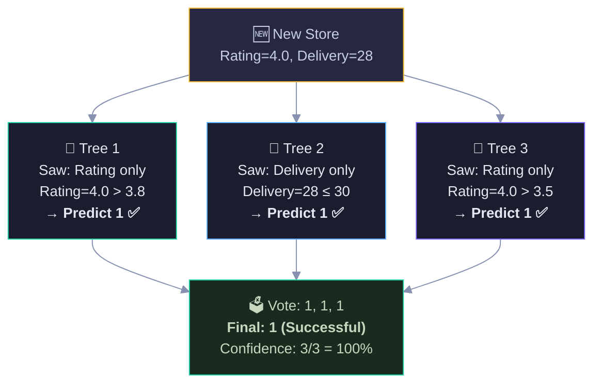
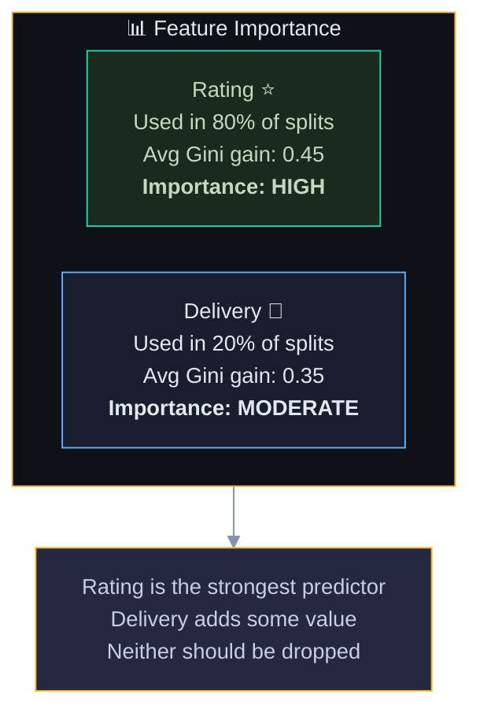
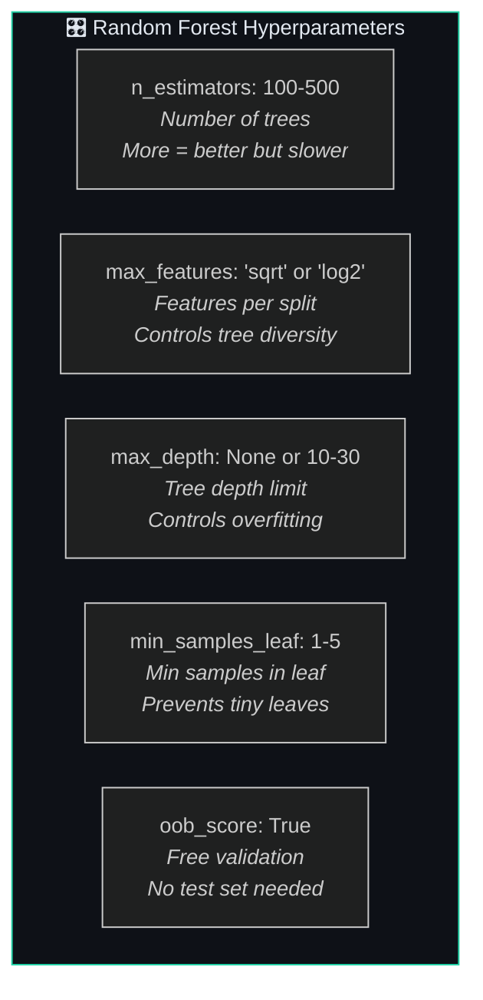
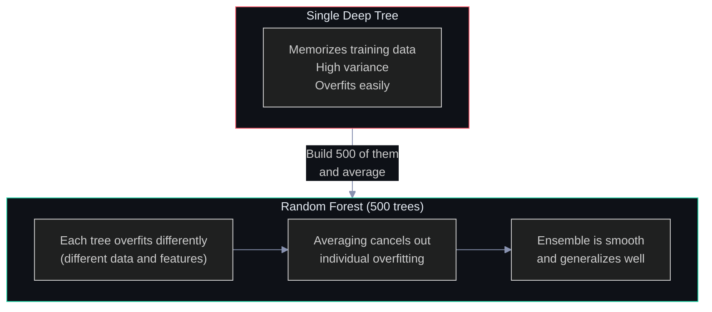
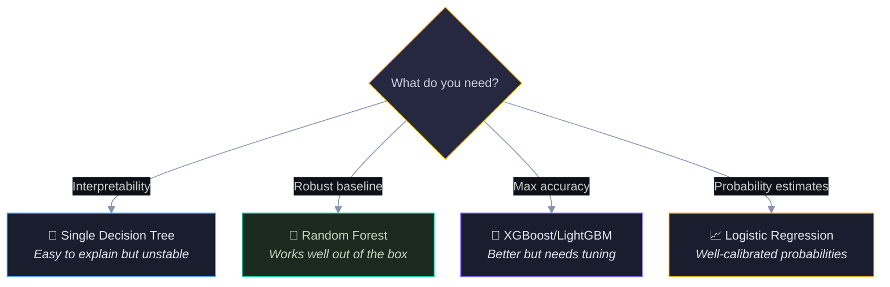
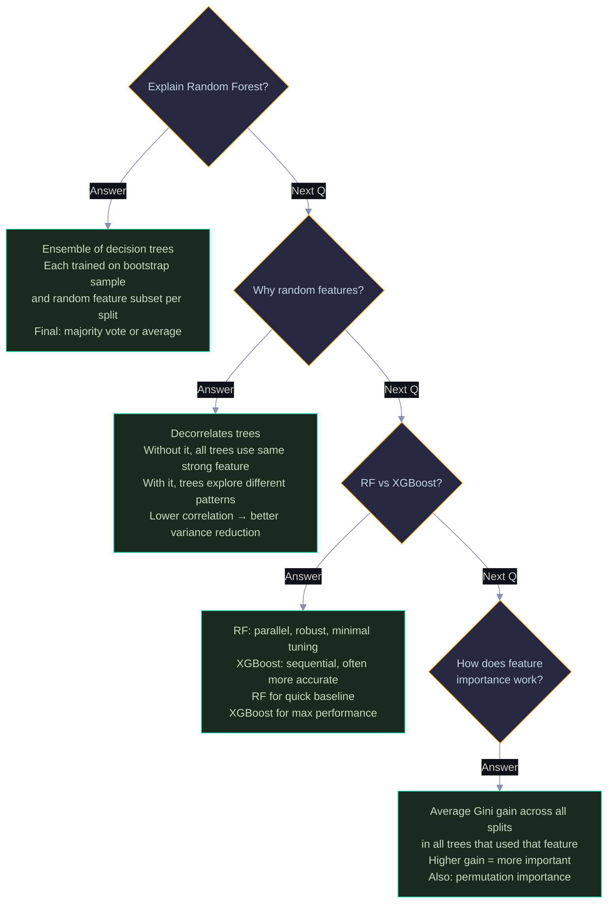

# Random Forest: Visual Guide with Mermaid Diagrams

> Visual companion to `Documents/Random_Forest_Explained.md`.
> Every diagram has explanatory text — what it shows, why it matters, and how to read it.

---

## 1. What Is Random Forest?

Random Forest = Bagging + Random Feature Selection. It builds many decision trees, each trained on a different bootstrap sample AND restricted to a random subset of features at each split. This double randomness makes trees diverse, which reduces variance when we average them. The diagram shows the full pipeline.

Each tree (different color) sees different data AND different features. Tree 1 might split on Rating, Tree 2 on Delivery, Tree 3 on Rating again but with different data. This diversity is what makes the ensemble stronger than any individual tree.

---

## 2. Bagging vs Random Forest — The Key Difference

**Why random feature selection:** In standard bagging, all trees see all features at every split. If one feature is very strong (like Rating in our pizza data), every tree will split on it first — making all trees look similar (highly correlated). Correlated trees don't reduce variance well when averaged (recall the formula Var = ρσ² + (1-ρ)σ²/B — high ρ means a high variance floor). Random Forest forces each split to only consider a random subset of features (typically √p for classification, where p is the total number of features). This means some trees are forced to use weaker features at the root, creating more diverse trees. The diversity is the key insight — diverse trees make different mistakes on different data points, and when you average their predictions, those individual mistakes cancel out. The "random" in Random Forest isn't a weakness; it's the entire mechanism that makes it work better than plain bagging.

Both use bootstrap sampling, but Random Forest adds one more layer of randomness: at each split, only a random subset of features is considered. This forces trees to be more diverse, reducing the correlation between them.

With 2 features, √2 ≈ 1.4, so each split might only see 1 feature. With 100 features, √100 = 10, so each split sees 10 out of 100. This is the "random" in Random Forest.

---

## 3. The Double Randomness

Random Forest has two sources of randomness. The diagram shows how they work together to create diverse trees.

Blue = row randomness (which stores each tree sees). Purple = column randomness (which features each split considers). Together they ensure no two trees are the same.

---

## 4. How Prediction Works

A new store arrives. Each tree independently makes a prediction by walking its own decision path. Then we take the majority vote. The diagram traces a prediction through 3 trees.

Each tree used a different feature (because of random feature selection) but arrived at the same answer. When trees agree, confidence is high. When they disagree, the majority wins and the vote ratio gives you a confidence measure.

---

## 5. Feature Importance

Random Forest naturally measures feature importance: for each feature, average the Gini gain across all splits in all trees that used that feature. Higher average gain = more important feature.

This is one of Random Forest's biggest practical advantages — you get feature importance for free, without any extra computation. Use it to understand your data and potentially drop irrelevant features.

---

## 6. Key Hyperparameters

The most important parameter is n_estimators (more trees = better, with diminishing returns after ~200-500). max_features controls the randomness level — 'sqrt' is the default for classification. Unlike boosting, Random Forest is relatively insensitive to hyperparameters — it works well out of the box.

---

## 7. Why Random Forest Is Hard to Overfit

Each individual tree overfits, but they overfit to different things (different bootstrap samples, different feature subsets). When you average 500 different overfitting patterns, the noise cancels out and the signal remains. This is why Random Forest is often called a "set it and forget it" model.

---

## 8. Random Forest vs Other Models

Random Forest (green) is the safe default choice. It rarely fails badly, requires minimal tuning, and gives you feature importance for free. Start here, then try XGBoost if you need more accuracy.

---

## 9. Interview Decision Tree 🎯

---

> 💡 **How to view:** GitHub (native), VS Code (Mermaid extension), Obsidian (built-in), or [mermaid.live](https://mermaid.live)
