# XGBoost: Visual Guide with Mermaid Diagrams

> Visual companion to `Documents/XGBoost_Complete_Guide.md`.
> Every diagram has explanatory text — what it shows, why it matters, and how to read it.

---

## 1. What Is XGBoost?

XGBoost is gradient boosting with engineering and mathematical upgrades. The diagram below shows what it adds on top of basic gradient boosting: regularization to prevent overfitting, second-order gradients for faster convergence, and several speed optimizations.

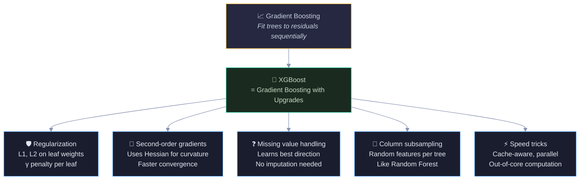

Think of gradient boosting as a reliable sedan and XGBoost as a tuned sports car — same engine concept, way more engineering. Each upgrade box addresses a specific weakness of basic gradient boosting.

---

## 2. The XGBoost Objective Function

XGBoost's secret sauce: it optimizes prediction accuracy AND model simplicity simultaneously. The diagram shows the two-part objective — the loss function (how well it fits) plus a regularization term (how complex the trees are). The λ and γ parameters control the tradeoff.

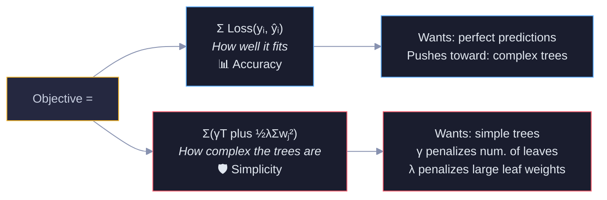

Blue = accuracy term (wants complex trees to fit data). Red = regularization term (wants simple trees to generalize). The balance between them is what makes XGBoost powerful — it finds the sweet spot automatically.

---

## 3. First vs Second Order Gradients

This is XGBoost's key mathematical insight. Basic gradient boosting only uses the first derivative (gradient = slope). XGBoost also uses the second derivative (Hessian = curvature). The analogy: walking downhill blindfolded, you can feel the slope (gradient), but knowing the curvature (Hessian) tells you how far to step.

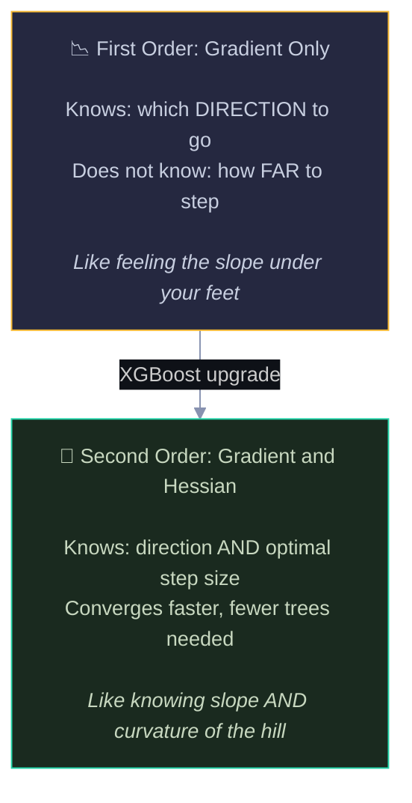

### 3.1 Gradient and Hessian for Log Loss

For binary classification with log loss, the gradient and Hessian have clean formulas. The initial prediction starts at p=0.5 for all stores because the model begins with ŷ₀ = log(odds) = log(4/4) = log(1) = 0, and sigmoid(0) = 0.5. With equal numbers of successes and failures, the model's best initial guess is 50/50. The diagram shows the computation for our pizza stores at the initial prediction (p=0.5 for all).

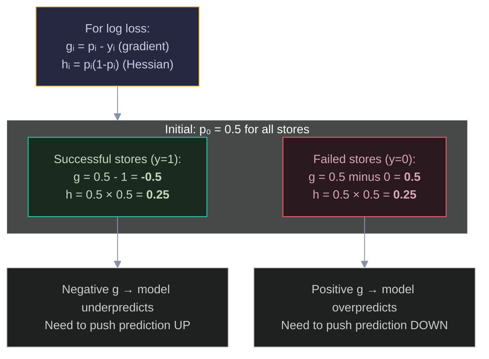

The gradient tells the tree which direction to correct (negative = push up, positive = push down). The Hessian tells it how confident to be in that correction (higher h = more confident = bigger step).

---

## 4. The XGBoost Split Gain Formula

This is how XGBoost decides where to split. Unlike basic decision trees (which use Gini/Entropy), XGBoost uses a gain formula based on the sum of gradients and Hessians. The diagram shows the formula and a worked example.

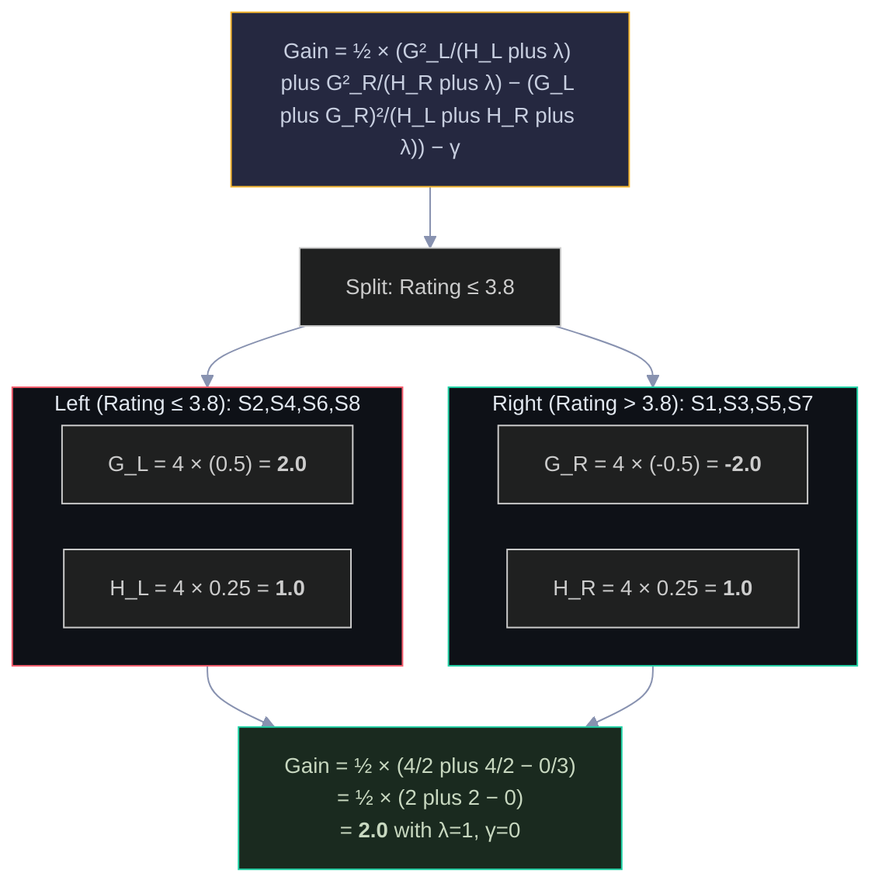

The gain formula has three terms: left child score + right child score - parent score (before split). If the sum of the children is better than the parent, the gain is positive and the split is worth making. The γ parameter sets a minimum threshold — if gain < γ, don't split (pruning).

---

## 5. Leaf Weight Calculation

After finding the best split, XGBoost computes the optimal prediction value for each leaf. The formula w* = -G/(H+λ) balances the gradient signal against the regularization. The diagram shows how λ controls the aggressiveness of predictions.

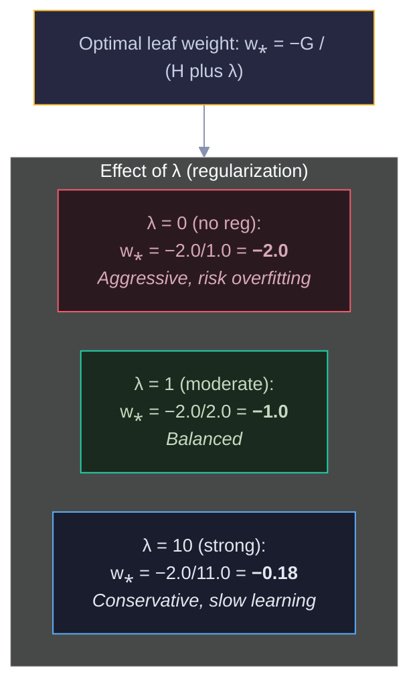

Red = no regularization (big jumps, overfitting risk). Green = moderate λ (balanced). Blue = strong regularization (tiny steps, needs many more trees). The λ parameter in the denominator shrinks the leaf weight toward zero — this is L2 regularization in action.

---

## 6. One Complete XGBoost Iteration

This diagram traces one full iteration: compute gradients → find best split → compute leaf weights → update predictions. The color progression shows the model improving.

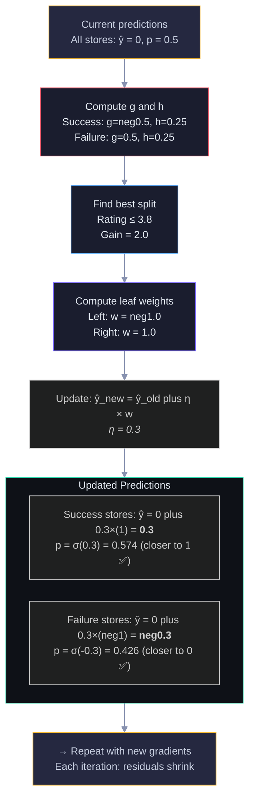

Follow top-to-bottom: yellow start → red gradients → blue split → purple leaf weights → green results. After this iteration, success stores moved from p=0.5 to p=0.574, and failure stores from p=0.5 to p=0.426. Small steps (η=0.3) prevent overfitting.

---

## 7. Regularization — The Three Controls

XGBoost has three regularization knobs that work together. The diagram shows what each one does and how they interact.

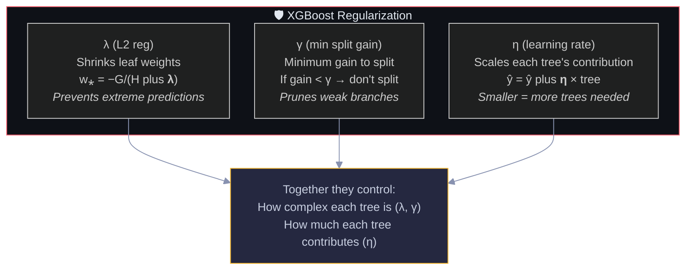

λ controls individual leaf predictions, γ controls tree structure (number of splits), η controls the ensemble (how many trees you need). Tuning these three together is the art of XGBoost.

---

## 8. Key Hyperparameters

The most important XGBoost hyperparameters organized by what they control. The diagram groups them into tree structure, randomness, and regularization.

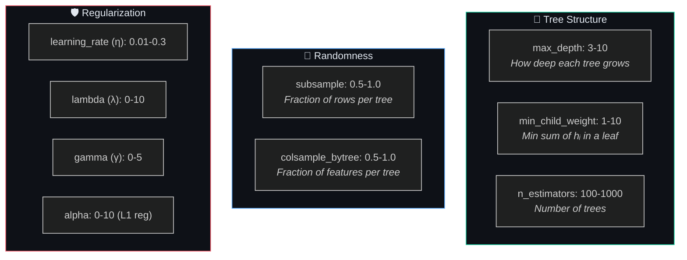

Green = tree shape, Blue = randomness (like Random Forest), Red = regularization. Start tuning with the green parameters, then add randomness, then fine-tune regularization.

---

## 9. XGBoost vs Other Boosting Methods

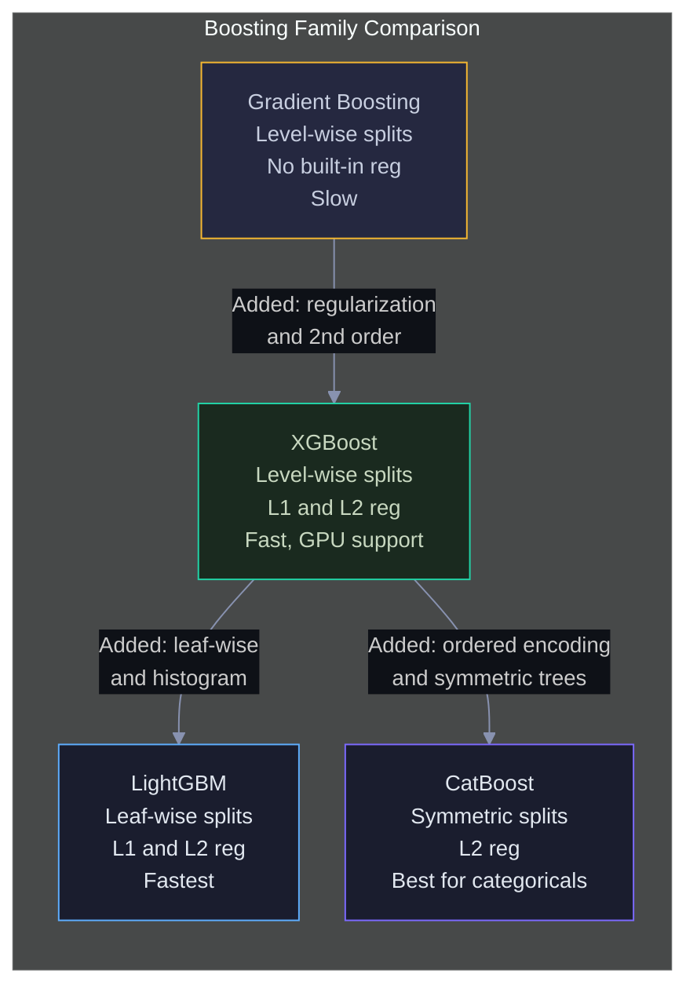

The arrows show the evolutionary path. XGBoost improved on basic gradient boosting. LightGBM and CatBoost then improved on XGBoost in different directions — LightGBM for speed, CatBoost for categorical data.

---

## 10. Interview Decision Tree 🎯

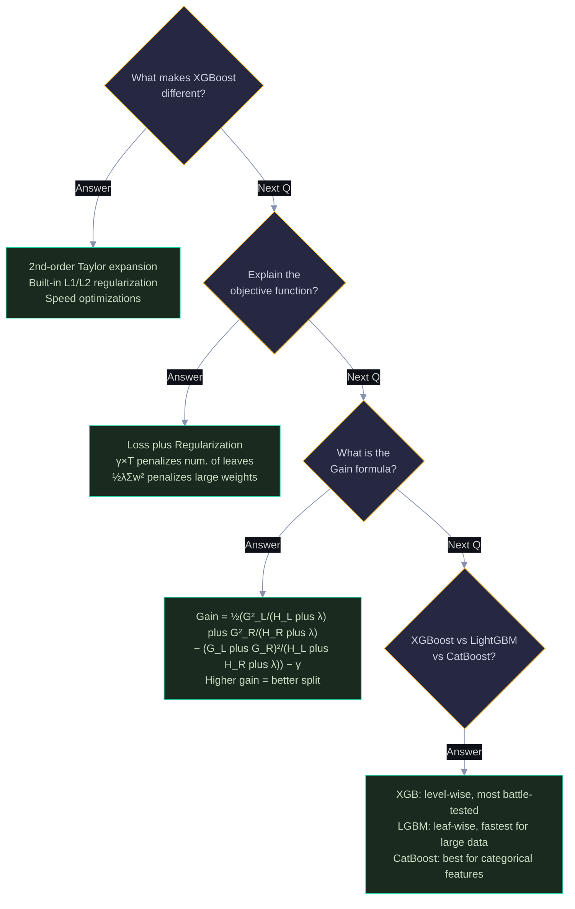

---

> 💡 **How to view:** GitHub (native), VS Code (Mermaid extension), Obsidian (built-in), or [mermaid.live](https://mermaid.live)
