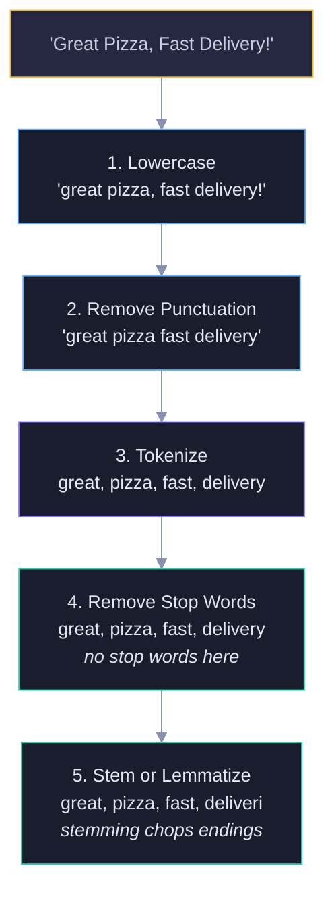
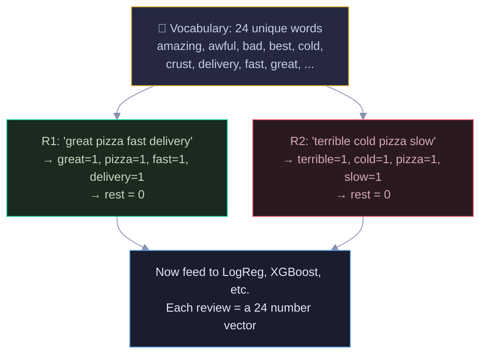
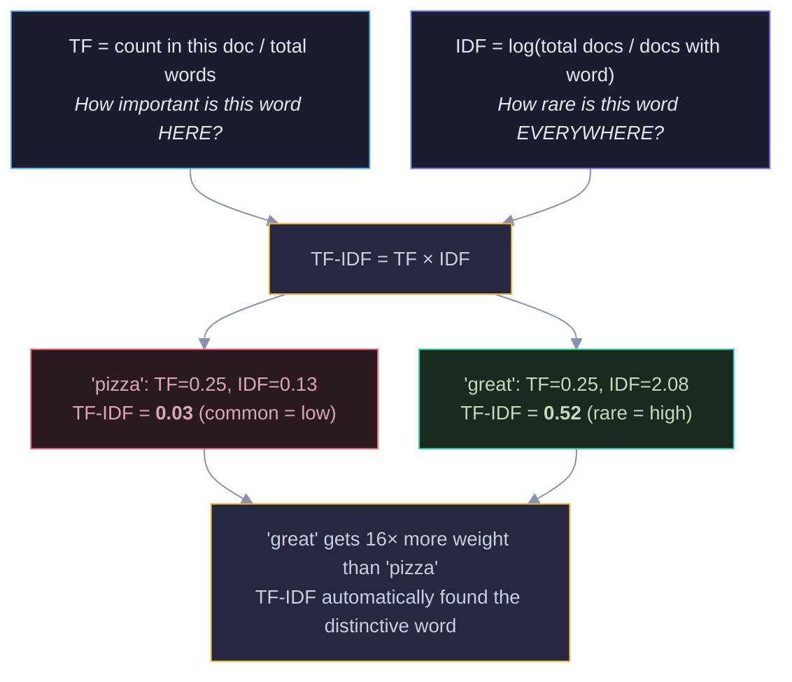
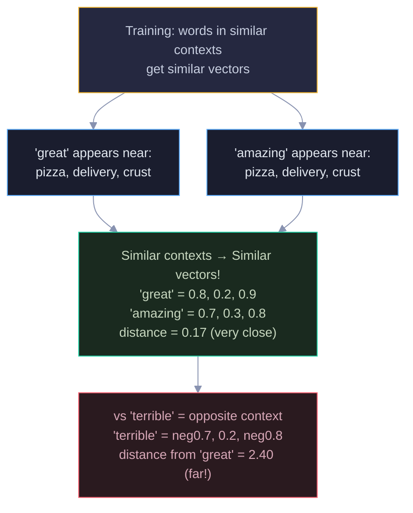
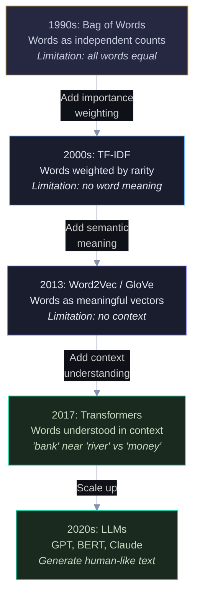
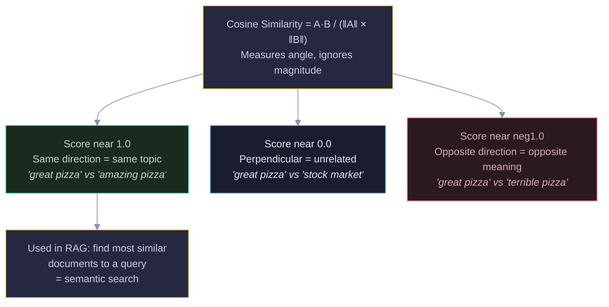
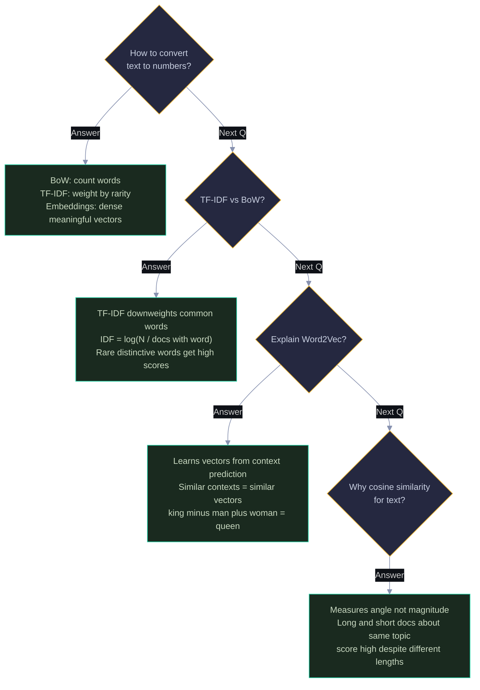

# NLP Text Processing: Visual Guide with Mermaid Diagrams

> Visual companion to `Documents/NLP/Basic/Phase4_NLP_Text_Processing_Complete_Guide.md`.
> Every diagram has explanatory text — what it shows, why it matters, and how to read it.

---

## 1. The Core Problem — Text to Numbers

ML models only understand numbers. Text is words. This diagram shows the fundamental NLP pipeline: raw text goes through preprocessing, then vectorization converts it to numbers, and finally any ML model can make predictions. Everything in NLP is about making this pipeline better.

```mermaid
%%{init: {'theme': 'dark', 'themeVariables': {'darkMode': true, 'background': '#0e1117', 'primaryColor': '#1a1d2e', 'primaryTextColor': '#e2e8f0', 'primaryBorderColor': '#2d3148', 'lineColor': '#8892b0', 'secondaryColor': '#252840', 'tertiaryColor': '#1a1d2e', 'fontSize': '14px', 'edgeLabelBackground': '#0e1117'}, 'flowchart': {'nodeSpacing': 30, 'rankSpacing': 40, 'padding': 15, 'htmlLabels': true}}}%%
graph LR
    RAW["📝 Raw Text<br/>'Great pizza, fast delivery!'"] --> CLEAN["🧹 Preprocess<br/>lowercase, tokenize,<br/>remove stop words"]
    CLEAN --> VEC["🔢 Vectorize<br/>BoW, TF-IDF,<br/>or Embeddings"]
    VEC --> MODEL["🤖 ML Model<br/>LogReg, XGBoost,<br/>Neural Network"]
    MODEL --> PRED["✅ Prediction<br/>Positive or Negative"]

    style RAW fill:#252840,stroke:#f5b731,color:#c8cfe0
    style CLEAN fill:#1a1d2e,stroke:#5eaeff,color:#e2e8f0
    style VEC fill:#1a1d2e,stroke:#7c6aff,color:#e2e8f0
    style MODEL fill:#1a1d2e,stroke:#22d3a7,color:#e2e8f0
    style PRED fill:#1a2a1f,stroke:#22d3a7,color:#c8d8c0
```

Read left to right: yellow = raw input, blue = cleaning, purple = the key step (text to numbers), green = model and output. The purple "Vectorize" step is where all the NLP magic happens.

---

## 2. Text Preprocessing Pipeline

Raw text is messy — mixed case, punctuation, filler words. Each preprocessing step removes noise while keeping meaning. The diagram shows the pipeline applied to one review, with the output of each step feeding into the next.

Each step is simple on its own. Together they transform messy human text into clean tokens ready for vectorization. Tokenization (purple) is the most important step — it defines what a "word" is.

---

## 3. Bag of Words — The Simplest Vectorization

### Why we need it

ML models need fixed-length numerical vectors. Bag of Words creates a vocabulary of all unique words, then represents each document as a count vector. It's the simplest way to go from words to numbers.

### How it works

Build a vocabulary from all reviews, then count each word per review. The diagram shows how two reviews become numerical vectors using the same vocabulary.

Green = positive review, Red = negative review. Both become 24-number vectors. The limitation: "pizza" (appears everywhere) gets the same weight as "great" (appears once). TF-IDF fixes this.

---

## 4. TF-IDF — Smart Word Weighting

### Why we need it

In Bag of Words, "pizza" (in 7/8 reviews) gets the same count as "amazing" (in 1/8 reviews). But "amazing" is far more informative for classification. TF-IDF automatically downweights common words and upweights rare distinctive ones.

### How the formula works

TF-IDF multiplies two things: how frequent a word is in THIS document (TF) and how rare it is across ALL documents (IDF). The specific numbers: TF('great' in R1) = 1/4 = 0.25 (1 occurrence out of 4 words). IDF('great') = log(8/1) = 2.08 (appears in only 1 of 8 reviews — very rare). TF-IDF = 0.25 × 2.08 = 0.52. For 'pizza': TF = 1/4 = 0.25, IDF = log(8/7) = 0.13 (appears in 7 of 8 reviews — very common). TF-IDF = 0.25 × 0.13 = 0.03. The 16× difference (0.52 vs 0.03) shows TF-IDF's power: it automatically identified 'great' as the distinctive word. A word that's frequent locally but rare globally gets the highest score — it's the most distinctive feature of that document.

Blue = TF (local importance), Purple = IDF (global rarity). Red = common word (low score), Green = rare word (high score). The yellow insight box shows the practical result.

---

## 5. Word Embeddings — Words as Meaningful Vectors

### Why we need them

BoW and TF-IDF treat every word as independent — "great" and "amazing" are completely unrelated features. But we know they mean similar things. Word embeddings represent words as dense vectors where similar words are close together in vector space.

### How Word2Vec learns

The core principle: "You know a word by the company it keeps." Words appearing in similar contexts get similar vectors. The diagram shows how this works.

Green = similar words cluster together. Red = opposite words are far apart. The network learns this structure automatically from reading millions of sentences.

---

## 6. The Evolution — BoW to Transformers

Each generation of NLP solved a limitation of the previous one. This diagram shows the progression and what each step added.

Each arrow label tells you what problem was solved. Follow top to bottom: each generation is strictly better than the previous one, but also more complex and data-hungry.

---

## 7. Cosine Similarity — Measuring Text Similarity

### Why we need it

Once text is a vector, we need to measure "how similar are two texts?" Euclidean distance fails because it's affected by document length — a long review and a short review about the same topic would seem far apart. Cosine similarity measures the angle between vectors, ignoring length.

Green = similar, Blue = unrelated, Red = opposite. This is the foundation of semantic search in RAG systems (Phase 5).

---

## 8. Interview Decision Tree 🎯

---

> 💡 **How to view:** GitHub (native), VS Code (Mermaid extension), Obsidian (built-in), or [mermaid.live](https://mermaid.live)
